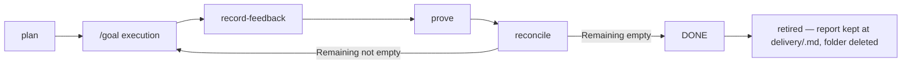

# AGENTS.md

This repository publishes **tailrocks-skills**: a cross-agent collection of
reusable engineering skills over a shared `skills/` tree, packaged as native
plugins for Claude Code (`.claude-plugin/plugin.json` +
`.claude-plugin/marketplace.json`, the self-listing marketplace that Claude
Code, Codex, and Grok all consume), Codex (`.codex-plugin/plugin.json`), Kimi
Code (`.kimi-plugin/plugin.json`), and the Antigravity CLI (root
`plugin.json`).

One `skills/<name>/SKILL.md` source serves every supported agent — Claude
Code, Codex CLI, OpenCode, Grok Build, Kimi Code, Antigravity CLI, and Amp.
Keep skills source-neutral — no agent-specific instructions in `SKILL.md`
bodies. Installation, the verified per-client compatibility matrix, and the
duplicate-avoidance rules live in `INSTALL.md`.

The house stack is fixed: Rust 2024 with Axum/Tokio/Tower — tracing through
OpenTelemetry, PostgreSQL as the storage layer (tokio-postgres pooled by
deadpool-postgres, a decided choice) — TypeScript 7 with Bun,
TanStack Start, React, shadcn/ui, Tailwind CSS v4, and Oxc, and native macOS with
Swift, SwiftUI-first app and UI architecture, narrow capability-only AppKit
bridges, and Liquid Glass. Existing AppKit apps migrate toward that architecture.
The renderer for a Swift macOS or iOS app is always Apple's modern,
Apple-recommended one; GPUI and similar non-Apple UI frameworks are never
used in a native Swift app, and high-performance custom regions are drawn
with Apple's own rendering. An app that pairs Rust with a native interface
uses a thin SwiftUI shell over a Rust-owned application runtime; that shell
is an Apple *platform* shell, not only a UI layer — Apple-only capabilities
(StoreKit, notifications, background tasks, Keychain, security-scoped
files, widgets, intents) get narrow Swift adapters whose mechanism lives in
Swift while every product decision around them stays in Rust.

**The language and protocol doctrine, in five rules.** (1) Rust for
backends, terminal applications, and business logic — always. (2) Swift
with Liquid Glass for the native macOS and iOS experience, as UI only; the
business logic behind it stays in Rust. (3) Strict TypeScript with React
and TanStack for the website experience, as UI only; the business logic
stays in Rust on the backend. (4) GraphQL is the public API of public
backend services. (5) gRPC is the protocol for cross-service communication
between Rust services. UI layers are thin shells over Rust-owned behavior,
and neither protocol crosses into the other's role.
Skills deepen this stack; they do not offer alternative frameworks, package managers, test
runners, or component systems. Every setup targets the latest stable release and
latest stable major available at execution time; older majors are unsupported.
Documentation sites are Fumadocs on TanStack Start with Bun — no other
documentation framework, runtime, or package manager.

Invocation class is registry-owned. `MANUAL_ONLY` skills use
`disable-model-invocation: true`, `user-invocable: true`, Codex
`policy.allow_implicit_invocation: false`, and the exact explicit-request guard
at the start of the description. `MODEL_POLICY` skills omit the Claude disable
flag, retain `user-invocable: true`, set Codex implicit invocation true, and use
an exact content/intent trigger; selection grants no authority beyond the
active task. Clients that ignore these fields rely on the description, and
OpenCode users may additionally enforce `permission.skill` config.

The confirmed `MODEL_POLICY` set is exact: `tailrocks-agents-md`, the Axum,
GraphQL, gRPC, Rust, Swift, and TypeScript best-practice owners,
`tailrocks-grilling`, and the macOS, web, and terminal design owners. Every
other skill is `MANUAL_ONLY`; new skills and split descendants default manual
until an exact trigger is separately confirmed.

**Token usage is a design criterion.** Skills stay lean: scale effort (subagents,
depth) to the task, prefer pointers (`file:line`/URL) over copied blocks, skip
stages that add no value, and never produce an artifact that will not be read.

**External work is extracted, never referenced.** Shipped content — skills,
instruction files, documentation — never names an external project, skill
collection, or author as a source, and never links one. Distill the
knowledge, rephrase it, make it part of this project; surveys stay internal
under `plans/`. Provenance lives in git and pull-request history. The
validator gates forge URLs in skill content; this rule carries what no gate
can judge.

## Available Skills

### tailrocks-rust-best-practices

Write new Rust behavior. Covers ownership and borrowing, public API design,
error and panic policy, tests and doc tests, unsafe contracts, measured
performance, and readability.

Skill definition: `skills/tailrocks-rust-best-practices/SKILL.md`

### tailrocks-rust-review

Review Rust source, APIs, unsafe code, tests, and performance evidence without
mutation; report only verified, actionable findings.

Skill definition: `skills/tailrocks-rust-review/SKILL.md`

### tailrocks-rust-refactor

Restructure Rust code under an explicit preservation oracle, keeping observable
behavior and public contracts unchanged.

Skill definition: `skills/tailrocks-rust-refactor/SKILL.md`

### tailrocks-rust-project-setup

Scaffold and enforce a strict, modern Rust project: edition 2024, `resolver = 3`,
`crates/` workspace layout, the strict `[workspace.lints]` tables, `clippy.toml`,
rustfmt, `rust-toolchain.toml`, mise-managed tooling, and the cargo-deny / audit
/ shear / hack / nextest gates. Ships copy-ready config under
`skills/tailrocks-rust-project-setup/templates/`.

Skill definition: `skills/tailrocks-rust-project-setup/SKILL.md`

### tailrocks-rust-project-audit

Audit an existing Rust workspace against the strict project baseline and report
exact layout, policy, toolchain, dependency, and gate gaps without changing
files or installing tools.

Skill definition: `skills/tailrocks-rust-project-audit/SKILL.md`

### tailrocks-rust-project-remediate

Close explicitly approved Rust workspace baseline gaps in coherent, reversible,
verified slices while preserving stronger compatible local policy.

Skill definition: `skills/tailrocks-rust-project-remediate/SKILL.md`

### tailrocks-axum-best-practices

Build or change production Axum HTTP behavior with typed state and extractors,
stable errors, ordered Tower policy, security limits, tracing, graceful
shutdown, owned tasks, and transport contract tests.

Skill definition: `skills/tailrocks-axum-best-practices/SKILL.md`

### tailrocks-axum-review

Review Axum adapters, extractors, Tower policy, lifecycle, and transport tests
without mutation; report only verified HTTP-boundary findings.

Skill definition: `skills/tailrocks-axum-review/SKILL.md`

### tailrocks-axum-refactor

Restructure Axum adapters or Tower composition under an independent oracle while
preserving observable HTTP behavior and lifecycle contracts.

Skill definition: `skills/tailrocks-axum-refactor/SKILL.md`

### tailrocks-graphql-best-practices

Evolve the GraphQL public API of public backend services —
the only public API surface in the doctrine. Contract-first: Juniper on Axum
serves it (Juniper is the only sanctioned GraphQL library for Rust), the
committed SDL snapshot is the contract, a breaking-change gate blocks silent
breakage, evolution is additive with dated deprecations, and the TanStack web
client consumes it through generated types. Never for cross-service
communication — that is gRPC.

Skill definition: `skills/tailrocks-graphql-best-practices/SKILL.md`

### tailrocks-graphql-review

Review a GraphQL diff or audit a whole public API surface without mutation,
covering schema shape, Juniper boundaries, SDL gates, and generated clients.

Skill definition: `skills/tailrocks-graphql-review/SKILL.md`

### tailrocks-grpc-best-practices

Evolve gRPC contracts and services for cross-service
communication between Rust services — the only cross-service protocol in the
doctrine. Contract-first: `.proto` files under buf lint and breaking gates,
tonic and prost adapters that keep generated types out of the domain, canonical
status-code mapping, mandatory deadlines, health and reflection wiring, and
wire-level contract tests. Never the public API surface — that is GraphQL.

Skill definition: `skills/tailrocks-grpc-best-practices/SKILL.md`

### tailrocks-grpc-review

Review a gRPC diff or audit a whole cross-service surface without mutation,
covering proto compatibility, tonic/prost boundaries, operations, and wire proof.

Skill definition: `skills/tailrocks-grpc-review/SKILL.md`

### tailrocks-typescript-best-practices

Write strict Rust-inspired TypeScript 7 and React behavior: exhaustive state,
typed failure, runtime validation, domain values, readonly mutation boundaries,
async correctness, React rules, and tests. Project tooling stays with the
TanStack project family.

Skill definition: `skills/tailrocks-typescript-best-practices/SKILL.md`

### tailrocks-typescript-review

Review TypeScript 7 and React code read-only for verified language-contract,
React ownership, async, trust-boundary, and Rust-domain-duplication defects.

Skill definition: `skills/tailrocks-typescript-review/SKILL.md`

### tailrocks-typescript-refactor

Restructure TypeScript/React code under an explicit preservation oracle without
changing public types, serialized behavior, rendering, effects, or errors.

Skill definition: `skills/tailrocks-typescript-refactor/SKILL.md`

### tailrocks-typescript-migrate

Migrate JavaScript/TypeScript source semantics to strict TypeScript 7 contracts
after the TanStack project baseline exists. Never owns project configuration.

Skill definition: `skills/tailrocks-typescript-migrate/SKILL.md`

### tailrocks-tanstack-project-setup

Scaffold new strict Bun-only TanStack Start applications with TypeScript 7,
Vite, Oxc, React, Router, Query, shadcn/ui, Tailwind CSS v4, validated
server/client boundaries, Bun tests, exact versions, and CI gates. Refuses
existing applications. Copy-ready configuration lives under
`skills/tailrocks-tanstack-project-setup/templates/`.

Skill definition: `skills/tailrocks-tanstack-project-setup/SKILL.md`

### tailrocks-tanstack-project-audit

Audit an existing TanStack application against the same baseline without
mutation. Emits the fixed TANSTACK gap ledger; never installs or edits.

Skill definition: `skills/tailrocks-tanstack-project-audit/SKILL.md`

### tailrocks-tanstack-project-migrate

Migrate a foreign or materially older frontend to the Bun/TanStack baseline in
never-broken slices while preserving behavior and accessibility.

Skill definition: `skills/tailrocks-tanstack-project-migrate/SKILL.md`

### tailrocks-tanstack-project-remediate

Close exact approved TANSTACK audit gaps in an existing house-stack application.
Refuses scaffolding, discovery, and broad stack migration.

Skill definition: `skills/tailrocks-tanstack-project-remediate/SKILL.md`

### The macOS family — the Swift implementation stack

Two skills take a blessed macOS design into production code. The design and
verification of macOS interfaces live in the design family below:
`tailrocks-macos-design` owns taste, the runnable prototype, and the Liquid
Glass material authority; `tailrocks-macos-visual-qa` owns capture and
verification.

- **tailrocks-swift-best-practices** — write-only code policy. Actor isolation as
  a design decision, state ownership and view identity, work kept out of `body`,
  narrow AppKit interop, typed failure, guarded availability, accessibility.
  Definition:
  `skills/tailrocks-swift-best-practices/SKILL.md`
- **tailrocks-swift-review** — read-only verified Swift/SwiftUI code findings.
  Definition: `skills/tailrocks-swift-review/SKILL.md`
- **tailrocks-swift-refactor** — preservation-oracle Swift/SwiftUI restructuring.
  Definition: `skills/tailrocks-swift-refactor/SKILL.md`
- **tailrocks-swift-rust-core-boundary** — the thin SwiftUI platform shell over
  the Rust application runtime, generated FFI, one store, and durable Apple
  effect protocol. Definition:
  `skills/tailrocks-swift-rust-core-boundary/SKILL.md`
- **tailrocks-swift-project-setup** — scaffold-only native macOS baseline:
  synchronized declarative generation, exact toolchain/SDK lanes, signing,
  strict gates, non-vacuous tests, and mise command parity. Definition:
  `skills/tailrocks-swift-project-setup/SKILL.md`
- **tailrocks-swift-project-audit** — read-only fixed-ledger inspection of an
  existing Swift/Xcode baseline. Definition:
  `skills/tailrocks-swift-project-audit/SKILL.md`
- **tailrocks-swift-project-remediate** — transactional closure of exact
  approved Swift project audit rows. Definition:
  `skills/tailrocks-swift-project-remediate/SKILL.md`
- **tailrocks-swift-agent-integration** — Xcode bridge, pinned read-only agent
  knowledge, and one-owner-per-responsibility wiring. Definition:
  `skills/tailrocks-swift-agent-integration/SKILL.md`
- **tailrocks-swift-rust-core-setup** — project-level generated bridge/package
  lane, binding drift, and shared Swift/Rust gates. Definition:
  `skills/tailrocks-swift-rust-core-setup/SKILL.md`

### The design family — blessed targets before implementation

Skills that turn screen intent into renderable references the implementation
must match. The reference is authored on the real UI substrate with fixture
data, iterated with the user, and blessed; from then on "matches the design"
is a mechanical check, not a review. One skill per medium, and taste never
has two owners.

They exist because the ecosystem gap is real:
Apple's own exported agent skills contain no Liquid Glass skill and no macOS
skill, and the highest-traction design-taste skills are built for the web, where
their defaults (avoid system fonts, avoid neutral grays, avoid spring easing) are
reasonable and on Apple platforms are wrong.

Exactly one skill owns each responsibility. Never run two skills that both encode
aesthetic taste — they conflict, and the conflict surfaces as inconsistency
across features rather than as an error. Inspection modes are named `audit`,
except macOS design's scored `review` and visual QA's capture-producing
`verify`.

**One process across all three platforms.** The stage runs between READY and
planning — `tailrocks-finalize` grants READY on schematic mockups, the
medium's skill produces the blessed reference, and `tailrocks-plan` refuses a
screen contract that cites none. Four stages, same words everywhere:
**design** (author on the real substrate from fixtures), **bless** (the user
signs off; an agent never blesses its own output), **freeze** (the mechanical
baseline), **audit** (implementation against the blessed reference).

| Medium | Stack | design | bless | freeze |
|---|---|---|---|---|
| Terminal | Rust, ratatui, crossterm | tailrocks-tui-design | same | same — the golden test |
| Web | TanStack Start, React, shadcn/ui | tailrocks-web-design | same | tailrocks-web-visual-qa |
| macOS | Swift, SwiftUI, Liquid Glass | tailrocks-macos-design | same — on the running prototype | tailrocks-macos-visual-qa |

macOS keeps design and bless in one skill because the material only exists at
runtime: taste is decided in the design stages, and the sign-off happens on
the running Liquid Glass prototype the same skill builds. The Liquid Glass
material authority owns no separate stage — it is the rulebook the design and
prototype stages consult. An item whose screens have no visual
surface skips the stage; an item that skips it with screens that do stops at
tailrocks-plan.

**A prototype is real code on the real substrate — never a design file.**
No skill in this repository takes a design-tool document as a design
source, produces one as a deliverable, or treats one as the reference an
implementation is measured against; that rules out Sketch, Figma, Penpot,
Adobe XD, InVision, Framer, and anything else of the kind, and it rules
out a hand-frozen HTML or image mockup standing in for the application.
The reason is not preference. A design file is a *picture* of the design:
it cannot run the real components, cannot render the platform's own
material, cannot exercise a state machine, and drifts the moment the code
moves — so "matches the design" degrades from a mechanical check back
into an argument. The reference for a React screen is a guarded design
route rendering the shipped component from typed fixtures; for a terminal
screen, a golden frame the application's own view functions rendered; for
a macOS window, a running Liquid Glass prototype whose view layer lifts
verbatim into the app. Each is copyable into production because it
already *is* production code. A screenshot or an exported artifact may
illustrate a decision in a document; it is never the source of one.
`scripts/validate-skills.ts` gates the tool names; this rule carries what
a name list cannot.

- **tailrocks-macos-design** — the macOS taste authority, runnable proof, and
  material authority in one skill. Experience brief, information architecture,
  and the native component map that classifies every region `NATIVE` /
  `NATIVE-COMPOSED` / `CUSTOM`; structurally different alternatives with
  realistic fixtures; macOS density, typography, colour, and iconography; the
  custom component contract; a weighted rubric with hard failures and a
  correction order. Then the runnable proof: the Liquid Glass prototype built
  from the approved design — the fixed `--tr-*` launch contract, fixture
  scenarios, a live sign-off on the running app, and the region-scoped match
  policy (custom regions pixel-budgeted, native regions structural). Carries
  the Liquid Glass material authority: the `CONTENT`-versus-`FUNCTIONAL`
  layer split, the standard-component-first decision order, the exact SwiftUI
  and AppKit API surface with per-symbol availability, the anti-patterns each
  stating their mechanism, and the glass acceptance gate. Writes design
  artifacts and the prototype package, never production source.
  Definition: `skills/tailrocks-macos-design/SKILL.md`
- **tailrocks-web-design** — TanStack Start screens as blessed in-app design
  routes: guarded `/design/<screen>/<state>` routes render pure screen
  components from typed fixtures through the real Vite, Tailwind, and
  shadcn/ui pipeline; the user blesses live in the browser, and the real
  page ships the same component. Captures nothing.
  Definition: `skills/tailrocks-web-design/SKILL.md`
- **tailrocks-tui-design** — terminal screens for Rust ratatui applications
  as golden frames: a gallery crate renders the application's own view
  functions through a test backend, the user blesses each frame, and a
  golden test holds the implementation byte-exact from then on. Decides
  ratatui as the house terminal UI library.
  Definition: `skills/tailrocks-tui-design/SKILL.md`
- **tailrocks-macos-visual-qa** — the macOS verification loop. The atomic
  kill-launch-capture invocation, capture by window ID rather than screen
  rectangle, accessibility-tree driving, the appearance and accessibility state
  matrix with restore, `performAccessibilityAudit`, and pixel regression on
  captures rather than detached snapshots. Owns **freeze**: its harness copies
  drive the blessed prototype through the launch contract after finalization
  and the captures become the baseline. Definition:
  `skills/tailrocks-macos-visual-qa/SKILL.md`
- **tailrocks-web-visual-qa** — the freeze that follows finalization:
  Playwright screenshot baselines per state, theme, and viewport, captured
  from a blessed design's routes only — a missing blessing blocks the
  freeze — with the determinism rules, the baseline record, and re-freeze
  only under a recorded re-blessing.
  Definition: `skills/tailrocks-web-visual-qa/SKILL.md`

Two findings shape the macOS end of the family and are worth stating up
front. **No design file is authoritative for Liquid Glass; the operating
system is** — a static mock can only approximate the material with fill,
blend-mode, and shadow recipes, so the reference is a running app, never an
exported artifact. And Liquid Glass surfaces snapshot **fully transparent**
from a detached view, so any verification of glass chrome must screen-capture
the running app.

### tailrocks-code-health

Establish or tighten one explicitly approved executable monotonic contract:
architecture DAG, measured shrink-only debt, flake quarantine, defect-to-gate
learning, structured output, tiered verification, or latest-version enforcement.

Skill definition: `skills/tailrocks-code-health/SKILL.md`

### tailrocks-code-health-audit

Measure one code-health debt class read-only, inventory its gates and exceptions,
and emit fixed-ID evidence without installing, editing, or authorizing a ratchet.

Skill definition: `skills/tailrocks-code-health-audit/SKILL.md`

### tailrocks-improve

Audit any repository through bounded non-security read-only lanes, re-read every
candidate, rank correctness-first, and return one verified report. It writes
nothing. `tailrocks-improve-deep` owns exhaustive lane-by-package coverage and
fresh refutation; `tailrocks-improve-security` owns threat analysis and
secret-safe security evidence. `tailrocks-improve-plan` writes one standalone
`plans/` plan and index row; `tailrocks-improve-execution` executes one approved
plan only in an isolated worktree; `tailrocks-improve-reconcile` updates only the
standalone plan index; `tailrocks-seed-roadmap` alone converts verified evidence
into one DRAFT delivery item. All seven are manual-only and one output owns each
selector.

Skill definition: `skills/tailrocks-improve/SKILL.md`

- Deep audit: `skills/tailrocks-improve-deep/SKILL.md`
- Security audit: `skills/tailrocks-improve-security/SKILL.md`
- Standalone planning: `skills/tailrocks-improve-plan/SKILL.md`
- Isolated execution: `skills/tailrocks-improve-execution/SKILL.md`
- Standalone reconciliation: `skills/tailrocks-improve-reconcile/SKILL.md`
- Delivery seeding: `skills/tailrocks-seed-roadmap/SKILL.md`

### tailrocks-agents-md

Apply instruction policy to one task-authorized, non-obvious rule at its
narrowest owning `AGENTS.md`. The existing named owner alone retains
`MODEL_POLICY`; selection grants no mutation. `tailrocks-agents-md-audit` is the
manual-only read-only sweep for placement, deletion evidence, load cost, and
topology. `tailrocks-agents-md-sync` is the manual-only transaction for one
explicitly approved repair through the installed topology script.

- Rule addition: `skills/tailrocks-agents-md/SKILL.md`
- Read-only audit: `skills/tailrocks-agents-md-audit/SKILL.md`
- Approved sync: `skills/tailrocks-agents-md-sync/SKILL.md`

### tailrocks-grilling

Stress-test an idea, plan, or decision before action through dependency-ordered
frontier rounds. It retrieves lookupable facts, recommends an answer with every
question, leaves every choice to the user, requires explicit confirmation, and
ends without writing or executing.

Skill definition: `skills/tailrocks-grilling/SKILL.md`

### The delivery family — roadmap-driven pipeline

Ten skills drive work from a cold repository or a captured idea through
autonomous execution and back to verified truth — a line up to execution, and
a loop after it.

**One item, one folder.** Everything about an item lives under
`roadmap/<slug>/`: the item itself (`README.md`, status machine DRAFT →
SHAPING → READY → PLANNED → IN EXECUTION → DONE, plus PARKED), its
verified-accomplishment ledger (`REPORT.md`), its
implementation package (`plan/README.md` manifest hub, `plan/001-*.md`
zero-context plans, `plan/spec/`, `plan/coverage.md`), its verification rounds
(`verification/NN-feedback.md`, `NN-report.md`), and its goal handoff
(`goal/START.md`, `goal/RESUME.md`, `goal/check.sh`). Standing research topics
stay in `research/<topic>/`, independent of items, with many-to-many links.
No delivery artifact lives outside the item's folder — there is no parallel
`plans/` tree to keep in step. The item's `## Run` section carries the
pasteable `/goal` start and resume blocks once planned.

**Delivered work leaves the tree.** A folder under `roadmap/` is work that is
**not finished**. `DONE` is a transition, not a resting place: when every plan
row is terminal, the goal condition passes, the newest verification round names
no blocking defect, and `## Remaining` is empty, `tailrocks-reconcile` writes
`DONE` and then retires the item — `roadmap/<slug>/` deleted whole (README,
`plan/`, `verification/`, `goal/`, assets) and its index row removed, with one
exception: `REPORT.md` moves to `delivery/<slug>.md` first, so what the rounds
*proved* stays in the tree after everything else is archaeology. `delivery/`
is created by the first retirement and never deleted. Two
commits inside one invocation, so the pull request shows the item reach `DONE`
and then be retired. When the last item goes, `roadmap/README.md` and
`roadmap/` go too; an index of nothing is a leftover, not a board. Standing
research topics never go — `research/<topic>/` is independent of items.
Nothing is lost: `git log -- roadmap/<slug>/` says what happened and
`git show <commit>^:roadmap/<slug>/README.md` reads the item as it stood. The
reason is the one that removed the item Log — an item that stays after its work
shipped is a document nobody updates and everybody half-trusts.

**Frozen means fingerprinted.** The plan files, the spec, the ledger, and the
whole `goal/` package are FROZEN: `goal/check.sh` hashes them into the hub's
`Frozen contract fingerprint` line and returns `BLOCKED plan-drift` when one
changes, so a contract cannot be edited to match what shipped. The item, the
manifest's Status column, and every verification round sit outside that hash —
they are what the loop must move. Re-planning is how a frozen file changes.
The item's `## Decisions` section is writable (record-decision appends to it),
so it is fingerprinted by proxy instead: planning snapshots it verbatim into
`plan/spec/decisions.md`, and `check.sh` answers `BLOCKED decisions-drift`
when the live section no longer matches — a decision is still changeable at
any time through `tailrocks-record-decision`, but never *silently* changeable.

Execution is handed the file, not a pasted block: `/goal Follow
roadmap/<slug>/goal/START.md`, and `goal/RESUME.md` after any interruption.
Every line in `START.md`'s gates block is `<command> ||| <proof>` — the proof
prints how many units the command executed, because a gate that cannot tell
"everything passed" from "nothing ran" is not a gate; `check.sh` answers
`BLOCKED gate-vacuous` for a proof that prints zero and `BLOCKED gate-unproven`
for a missing `|||`. A host that can run parallel executor sessions may work
disjoint-scope plans concurrently — each in its own git worktree, hub rows
written by the orchestrating session alone, merged back one at a time with
done criteria and gates re-run on the item branch; sequential execution
remains the default and is always correct.

**One item, one branch, one pull request.** `tailrocks-idea` opens the item's
`roadmap/<slug>` branch and draft PR at capture, and every invocation of every
family skill ends in one commit marked with the `Tailrocks-Skill: <name>`
trailer and pushed into that same lane — no delivery skill opens a second pull
request for an item that already has one. No artifact carries a log: the commit
series is the item's history (the contract lives in tailrocks-idea's
`delivery-git-contract.md` reference).

- **tailrocks-audit** — the cold-start entry: fan out parallel audit lanes
  (correctness, security, performance, UX, Liquid Glass, agent
  legibility — including whether the repository's languages and tools stay
  inside the house stack — tests, tech debt, dependencies, DX, docs,
  direction) over a repository or a branch diff, verify every
  finding by re-reading its evidence, prioritize by leverage, and seed
  either a direct `roadmap/<slug>/plan/` package (small, mechanical, no open
  product question) or a DRAFT roadmap item pre-filled with evidence. Also
  runs the `execute` loop — a `bounded-executor` in an isolated worktree,
  reviewed on the `frontier-judgment` route, never the reverse — and
  `sweep`, which reconciles the backlog it seeded. Every lane and mode
  takes `--deep`; `--batch` makes a run non-interactive. Definition:
  `skills/tailrocks-audit/SKILL.md`
- **tailrocks-idea** — capture a raw idea as a DRAFT item with a
  content-derived slug and an index row. Capture only; gaps stay visibly
  empty. Definition: `skills/tailrocks-idea/SKILL.md`
- **tailrocks-brainstorm** — the shaping interview: decision-tree frontier,
  one question at a time (numbered rounds with `--batch`), recommended answer
  on every question, decisions asked while facts are looked up, every answer
  written into the item immediately. Sets SHAPING.
  Definition: `skills/tailrocks-brainstorm/SKILL.md`
- **tailrocks-research** — deep research into reusable `research/<topic>/`
  folders: parallel investigators write vetted sourced chapters; a question
  invocation answers it deeply, a roadmap-slug invocation sweeps the item
  outward (missed angles, candidate directions with trade-offs, no verdicts).
  Extends overlapping topics instead of forking.
  Definition: `skills/tailrocks-research/SKILL.md`
- **tailrocks-record-decision** — record one user decision: validate against settled
  ground, date it with its reason, propagate through the item, reopen
  READY/PLANNED items and mark stale plan rows when intent changes.
  Definition: `skills/tailrocks-record-decision/SKILL.md`
- **tailrocks-finalize** — the closing interview and the only source of
  READY: screens collected as confirmed schematic mockups, flows walked,
  every open question resolved, deferred with a reason, or reclassified as
  researchable; READY only when the full readiness checklist passes.
  Definition: `skills/tailrocks-finalize/SKILL.md`
- **tailrocks-plan** — READY item → `roadmap/<slug>/plan/` and `goal/`:
  coverage ledger, gap research landed as reusable topics, OpenSpec-grammar
  spec with screen contracts and a must-not registry, one zero-context plan per
  manifest item (each written by its own subagent, cold-reviewed by
  fresh-context reviewers), then `goal/START.md`, `goal/RESUME.md`, and
  `goal/check.sh`, with the frozen contract fingerprint stamped into the hub.
  Sets PLANNED. Definition: `skills/tailrocks-plan/SKILL.md`
- **tailrocks-record-feedback** — capture what the user found wrong with the
  shipped work into `verification/NN-feedback.md`: their words verbatim, one
  statement per defect (`U1`, `U2`, …), reproduction as given. Captures only —
  it never investigates, judges, or fixes, because a defect the agent already
  dismissed never gets executed against.
  Definition: `skills/tailrocks-record-feedback/SKILL.md`
- **tailrocks-prove** — the round that runs the thing: subagents launch entry
  points, walk real flows, drive the real interface, and compare shipped
  screens against the blessed design reference, returning a verdict per
  reported statement, per recorded decision (`HELD` / `VIOLATED` /
  `NOT VERIFIABLE` — a violated decision blocks like a defect), and per plan
  row in `verification/NN-report.md`. It writes
  no status — blocking defects route to `tailrocks-reconcile`, skill-level
  divergence to `tailrocks-retrospect`.
  Definition: `skills/tailrocks-prove/SKILL.md`
- **tailrocks-reconcile** — execution truth-sync and the closer of a round:
  re-verify DONE rows by re-running their done criteria, reset dead-session
  rows, re-test BLOCKED reasons, drift-check TODO plans against HEAD, mark
  stale rows, then prune the rows a verification round confirmed, rewrite the
  item's `Remaining` from its blocking defects, move what the pass proved
  into `REPORT.md`, and true up the status — closing out by naming the
  back-edge (resume, re-plan, record-decision, brainstorm, research) rather
  than just the state. It is
  the only writer of `DONE`, and only after a round that found none — and the
  invocation that writes it retires the item in a second commit, keeping the
  report at `delivery/<slug>.md`. Run it
  when a /goal loop finishes, stalls, the repository moved on, or a round
  needs closing. Definition: `skills/tailrocks-reconcile/SKILL.md`

The loop closes, iterates until `Remaining` is empty, and then the item leaves
the board:



A `TAILROCKS GOAL: PASS` proves the work ran and the contract is unedited; it
is never a `DONE` claim.

All ten write only their own artifacts (`roadmap/`, `research/`) and never
touch source — `tailrocks-audit`'s `execute` mode is the one exception, and
even there only inside a disposable worktree it never merges.
After an item ships, `tailrocks-retrospect` reads that marked history back and
turns what diverged into proposed skill patches.
Mechanical walkthrough: `docs/design/pipeline-walkthrough.md`; why the audit
is one lane-bearing skill rather than six "improve X" skills, and how it routes
judgment and bounded execution: `docs/design/audit-design.md`. The published
guide — why each stage exists, what it refuses, and two features taken end to
end (a native macOS app with a Rust core, and a TanStack feature on an Axum
backend) — lives in `docs/content/docs/delivery/` and explains how the delivery
skills hand work to the stack skills.

### The pull-request family — lifecycle on any repository

Seven skills run the pull-request lifecycle in whatever repository the session
works in — not this one specifically. They are generic by construction:
everything repo-specific lives in one optional markdown file at the target
repository's root, `.tailrocks/pr.md` — base branch, branch naming, commit
trailers, body template or generator command, required checks, blast-radius
classes, a pre-merge worklist, and the merge method. Precedence is fixed:
user instruction, then `.tailrocks/pr.md`, then the repository's own
conventions (CONTRIBUTING, PR template, agent instruction files, git
history), then skill defaults. The body default in every repository is its
own `.github/PULL_REQUEST_TEMPLATE.md`, read at runtime; a repository
without one gets a minimal fallback body, and tailrocks-pr-template
generates it a real template. The conventions-format reference and a
copy-ready `.tailrocks/pr.md` template ship with tailrocks-create-pr.

- **tailrocks-create-pr** — branch off the base branch, commit in the
  repository's convention, build the body from its template or generator via
  `--body-file`, verify the render.
  Definition: `skills/tailrocks-create-pr/SKILL.md`
- **tailrocks-refresh-pr** — reconcile an open PR's title and body against
  the current diff: re-select template sections, rewrite drifted prose, keep
  accurate authored prose verbatim. Operator-triggered, never
  commit-triggered. Definition: `skills/tailrocks-refresh-pr/SKILL.md`
- **tailrocks-checkout-pr** — switch onto a PR's branch via
  `gh pr checkout`, guarding a dirty working tree (never auto-stash) and
  refusing raw `git checkout` fallbacks.
  Definition: `skills/tailrocks-checkout-pr/SKILL.md`
- **tailrocks-review-pr** — review a PR, branch, or diff with verified,
  high-signal findings: every correctness finding adversarially re-derived
  from the code before it may be reported, a structural pass where each
  finding names its restructure and the measure that disappears,
  content-triggered specialist lanes (test coverage, silent failures, type
  design, comment accuracy), stack-lane dispatch to the house
  best-practices skills per changed file, and per-finding routing —
  behavior-frozen removal candidates to tailrocks-simplify-audit and approved
  removals to tailrocks-simplify, proven defect classes to
  tailrocks-remediate. Unconditionally read-only; never posts, approves, or
  merges. Definition: `skills/tailrocks-review-pr/SKILL.md`
- **tailrocks-merge-pr** — merge fail-closed: CI gate with named-check-only
  admin bypass, blast-radius confirm, the repository's pre-merge worklist,
  metadata reconcile before the squash title enters history, repo-selected
  merge method. Its read-only machine preflight binds the exact PR/head/base,
  bounds required-check polling to 30 samples/300 seconds, and owns the raw
  delivery and documentation predicates without granting merge authority.
  Authorization never carries forward between sessions.
  Its **delivery-artifact check** fires only when the pull request's diff
  touches `roadmap/`, and is read-only about every artifact it reads: it
  blocks on an item saying `DONE` while its folder is still present, on a
  folder deleted while its newest verification round still carried a blocking
  defect, and on four further contradictions — naming the files that disagree
  and routing to `tailrocks-reconcile` (or `tailrocks-prove` when what is
  missing is a clean round). It never writes a delivery artifact.
  Its **documentation gate** fires on every pull request: doc-worthy commits
  (observable behavior, not tests/CI/delivery-only artifacts; commit labels do
  not suppress path evidence) trigger the gate. Then every doc-worthy and
  documentation-surface commit must be covered by a descendant
  `Tailrocks-Skill: tailrocks-document` commit, or the merge stops and routes to
  `tailrocks-document`. No doc-worthy commit yields `not_needed`.
  Definition: `skills/tailrocks-merge-pr/SKILL.md`
- **tailrocks-document** — the last documentation-obligation commit before a merge: locate
  the repository's documentation surfaces and their own rules, inventory
  the diff against the merge base, and make the docs the final source of
  truth for what shipped — rewriting the prose the change makes wrong,
  adding the pages and sections new capability earns, reorganizing when the
  structure no longer fits, and never writing a changelog into the docs
  (git history is the changelog). Commits once with its trailer; a diff
  with nothing doc-worthy earns an explicit verdict, not a commit.
  Definition: `skills/tailrocks-document/SKILL.md`
- **tailrocks-pr-template** — generate the repository's own
  `.github/PULL_REQUEST_TEMPLATE.md` by tailoring the base template
  (shipped as the skill's reference) to evidence: the repository's
  structure and real gates, and
  its merged-PR history. Every section and verify command must be earned;
  writes the file only, never commits.
  Definition: `skills/tailrocks-pr-template/SKILL.md`

### tailrocks-contribute

Contribute to external open-source projects through project-contract recon,
hard-stop-aware proposal, gated preparation, explicit per-contribution
submission approval, and human-approved review response.

Skill definition: `skills/tailrocks-contribute/SKILL.md`

### tailrocks-remediate

Analyze or remediate a proven defect, inconsistency, violated invariant, or
known-wrong state. Derives a greenfield architecture that prevents the complete
defect class and pursues that result without considering price, duration, effort,
implementation size, ROI, or sunk cost. Rejects speculative generality and
permits urgent containment without calling it complete remediation.

Skill definition: `skills/tailrocks-remediate/SKILL.md`

### tailrocks-simplify

Apply one explicitly approved set of measured removals inside a bound diff under
a pre-existing behavior oracle. It discovers nothing, changes no behavior, and
publishes each path by CAS with owned rollback. `tailrocks-simplify-audit` owns
the read-only ladder pass: protected constructs, measured deltas, preservation
arguments, rejected candidates, and behavior-changing near-misses.

Skill definition: `skills/tailrocks-simplify/SKILL.md`

Read-only audit: `skills/tailrocks-simplify-audit/SKILL.md`

The ladder also works before code is written; the audit owner applies it to a
current diff, and the apply owner begins only after the exact removals are
approved.

### tailrocks-rethink

Conceptually re-derive the design behind a reported bug, friction, or awkward
implementation. Derives two independent ideal designs before reading the
existing one, matches the problem shape to an established, externally sourced
engineering concept, and requires the reported failure to become
unrepresentable rather than guarded. Heavy restructuring, reimplementation, and
breaking changes are ordinary outcomes; internal compatibility is work, not a
constraint.

Skill definition: `skills/tailrocks-rethink/SKILL.md`

Three skills change existing code, ordered by how much they are allowed to
disturb. **tailrocks-simplify-audit** finds removals without editing;
**tailrocks-simplify** applies only approved ones, changes nothing observable,
and stays inside the diff. **tailrocks-remediate** corrects a proven defect while the system keeps
its promises. **tailrocks-rethink** treats the current shape as the subject and
expects to break things. Pick by what the change may disturb, not by how large
it feels.

tailrocks-remediate and tailrocks-rethink both refuse to price the answer, and
own different jobs. Remediate requires a proven defect, keeps compatibility as a
correctness constraint, and reaches the target through never-broken migration
slices. Rethink accepts a reported symptom or friction, treats internal
compatibility as work to be scheduled, and expects the destination to break
things. Two guards keep rethink from becoming licensed churn: it refuses a
request with no failed guarantee behind it, and it rejects a target design that
adds capability instead of subtracting a structural measure. Design notes, the
research basis, and the extension model: `docs/design/rethink-design.md`.

### tailrocks-agents-md

Add, place, audit, or repair agent instruction files. `AGENTS.md` is the only
file with content; `CLAUDE.md` and every other client name is a symlink to the
`AGENTS.md` beside it. Every rule goes to the directory that owns it — crate,
package, service, app, documentation site, infrastructure module, test suite,
any unit with conventions of its own — creating that `AGENTS.md` and its symlink
when the directory has none, because ancestor
files load on every request while nested files load only in their subtree. Keeps
a rule only when a competent agent would get it wrong without one, routes
anything enforceable to a gate, and proposes deletions on every pass.

Skill definition: `skills/tailrocks-agents-md/SKILL.md`

This repository is its own first customer: every instruction file is an
`AGENTS.md` with `CLAUDE.md` symlinked beside it — at the root and in `docs/`,
`.github/`, and `skills/`.

### The skill-authoring family — evidence in, doctrine applied

Four skills carry the two authoring laws: no new skill and no behavioral edit
without the failure observed first (the baseline run is the red bar, and a
skill whose acceptance check passes without it is dead weight), and the context window is a
public good (trigger-only descriptions that never summarize workflow, lean
routers, depth in references routed by when-to-read). Guidance form is matched
to the failure type — prohibitions plus rationalization counters for
discipline violations, positive recipes for wrong-shaped output, required
slots for omissions, predicate-keyed conditionals for context-dependent
behavior — because the wrong form measurably backfires. Exactly one skill owns
each phase of a skill's life.

Contract-breaking migration is outside these four executors. Update and
refactor stop with the tree unchanged and name the exact delta, compatibility,
and rollback obligations. The operator may perform a direct migration only
under a separately scoped explicit authorization for the named branch and pull
request; no migration-plan artifact or product skill mediates that authority.

- **tailrocks-skill-create** — a new skill from an observed failure: baseline
  captured verbatim (a retrospective field record with commit-level evidence
  is the strongest form), placement decided before writing (gates beat prose,
  the owning `AGENTS.md` beats a skill, extending a neighbor beats forking a
  rival), the copy-ready skeleton under `templates/skill/`, deterministic
  policy-driven scaffold, durable evidence contract and acceptance cases, full
  target-repository wiring. Metadata comes from target policy, never this tree by
  default.
  Definition: `skills/tailrocks-skill-create/SKILL.md`
- **tailrocks-skill-update** — an in-place semantic edit that preserves every
  public-contract field: evidence-pinned lines checked before a gate is
  reworded, strengthen over append, replace past the router budget, and rerun
  deterministic acceptance checks outside the frozen legacy eval tree.
  Definition: `skills/tailrocks-skill-update/SKILL.md`
- **tailrocks-skill-audit** — the doctrine authority and the read-only judge:
  audits one skill or sweeps the tree with one read-only subagent per skill,
  vets every finding against its own reads, and writes the layered report —
  description, router, references, evidence, wiring, overlap — to
  `skill-audits/<skill>.md` with stable finding IDs and named fixes. Never
  edits. Definition: `skills/tailrocks-skill-audit/SKILL.md`
- **tailrocks-skill-refactor** — behavior-preserving structural ownership change.
  It never performs semantic edits or contract-breaking migration. A contract
  delta leaves the tree unchanged and names the explicit direct-migration
  authorization required; verification is a precise manual audit handoff,
  never automatic invocation.
  Definition: `skills/tailrocks-skill-refactor/SKILL.md`

tailrocks-agents-md owns instruction files; the family owns skills — a rule
that belongs in an `AGENTS.md` or a gate is routed there, not wrapped in a new
skill.

### tailrocks-retrospect

The loop that closes back onto the collection. Point it at one shipped or
in-flight roadmap item and it rebuilds which skills actually ran — commit
trailers first, per-commit inference marked as inference. A shipped item has
usually been retired, so its artifacts come out of history rather than the
tree: find the retiring commit (`git log --diff-filter=D -- roadmap/<slug>/`)
and read each file from its parent. Then it runs six lane-agnostic detectors
over that sequence: evidence recorded after lock-in, a skill's own output
reworked by its own follow-up, shipped scope that no coverage ID or Must-not
claims, output nothing downstream consumed or that a consumer froze before it
changed, the status machine run out of order, and a skill writing outside the
scope its Boundaries declare. Every finding names the skill and the layer
whose missing check allowed it — the executor is never the unit of fault —
and every lane-shaped patch is held against its siblings in the other lanes
before it is proposed. The evidence reads fan out to parallel read-only
subagent investigators — commit tables, diffs, artifacts at their pinned SHAs
— while the detectors and every verdict stay in the main context; mandatory
on an external lane, where `--repo owner/name --pr N` audits an item that
shipped in another repository (read-only through `gh`, and only when that
lane ran this pipeline: a lane with no trailers is declined, not
reconstructed). The skill writes one file, its record under
`retrospectives/`, and edits nothing under `skills/`.

Skill definition: `skills/tailrocks-retrospect/SKILL.md`

tailrocks-retrospect produces the observed failure; tailrocks-skill-update
consumes it and owns the edit, the router budget, and deterministic acceptance proof. A
skill change with neither a baseline run nor a retrospective finding behind
it has no evidence at all.

## Repo-local skills

`.claude/skills/` holds skills that serve work **on this repository
itself** and never ship: they are outside `skills/`, so the plugin
manifests, catalog, validator, and docs pipeline ignore them. None is
defined today. The field-audit job ships as `tailrocks-retrospect`
instead — every repository that installs this collection has the same
need to turn its own delivery history into skill improvements, and a
repo-local copy would have been a second owner of one responsibility.
What remains repo-local is the invocation, not the behavior:
`prompts/improve-from-pr.md` is a saved prompt that drives
`tailrocks-retrospect` against an external pull request with its
subagent fan-out, then hands approved patches to
`tailrocks-skill-update`.

## Adding a Skill

1. Create `skills/<name>/SKILL.md` with `name`, `license: Apache-2.0`,
   `user-invocable: true`, and the registry-matched invocation profile.
   Creation defaults fail-closed to `MANUAL_ONLY`: exact explicit-request
   guard plus `disable-model-invocation: true`. A separately confirmed exact
   trigger may use `MODEL_POLICY`: no guard and no disable flag. Evidence
   belongs in artifacts and references, never disguised as instructions.
2. Add `agents/openai.yaml` with registry-matched
   `policy.allow_implicit_invocation`: false for manual, true for model policy.
3. Put deep material under `skills/<name>/references/` and copy-ready assets under
   `skills/<name>/templates/`; keep `SKILL.md` a concise router.
4. Every plugin manifest auto-discovers the new skill from `skills/` — no
   manifest edit needed. Place the skill in a `catalog.json` group; validation
   fails until exactly one group contains it. Run `mise run docs` to generate the skill's
   `README.md`, its documentation page, and the root `README.md` row; then add
   it by hand to `INSTALL.md`, this file, and — when it needs a boundary
   against a neighbouring skill — `docs/content/docs/choosing.mdx`.
5. Bump `version` in lockstep across `.claude-plugin/plugin.json`,
   `.codex-plugin/plugin.json`, `.kimi-plugin/plugin.json`, and the
   `.claude-plugin/marketplace.json` entry, and tag the release so installs
   can pin.

The router budget — the three layer costs, the 250-character description cap,
and the rules for changing a `SKILL.md` — lives in `skills/AGENTS.md`.

## Toolchain

**Every tool comes from mise, everywhere — locally and in GitHub Actions.**
`mise.toml` is the only place a tool version is written; a second pin anywhere
is drift waiting to happen. Workflow-side tooling rules live in
`.github/AGENTS.md`.

**Diagrams are Mermaid.** Anywhere a flow, sequence, or relationship is drawn —
documentation pages, this file, `README.md`, design notes — it is a ```mermaid
fence, which GitHub and the site both render. Arrows drawn with spaces in a
`text` block are not a diagram, they are a picture of one. Directory trees and
captured command output stay literal. Skill routers are the exception: a
one-line arrow sequence there is prose, and spending six lines of router budget
to draw two boxes is a worse trade than the ugliness it fixes.

**No alias tasks.** Every `mise` task does something no other task does. A task
that only re-runs another one makes `mise tasks` a worse map of the repository
and leaves two names to keep in step. Name the real task well instead.

**Four task names are a CI contract, not a preference.** The shared
`velnor-actions` lane runs `mise install --locked`, `mise run ci`,
`mise run test`, `mise run lint`, and `mise run fmt` in every repository. Those
names must exist and must each do real work — `lint` validates the skill tree,
`fmt` checks formatting with `oxfmt`, and `fmt:write` is the one that rewrites.
Renaming or deleting one of them turns the lane red, and this repository's own
workflows will not tell you, because the gate set lives in the reusable
workflow.

`oxfmt` formats only the TypeScript this repository owns: `scripts/` under the
root `.oxfmtrc.json`, and `docs/src`, `docs/scripts`, and the docs config files
under `docs/.oxfmtrc.json`, which sets that subtree's own style. It never
touches Markdown, generated files, `examples/`, or the templates a skill ships
for other projects.

## Validation

Requires Bun, pinned in `mise.toml`; `mise install` provisions it. Before
publishing changes, run the Bun-native skill and manifest validator — it
checks every skill and manifest, and rejects three things in shipped
skill content: code-forge URLs, design-file tool names, and model brand
names (a skill names a capability role, never the route that fills it
today). Each gate allows a line that names the thing in order to forbid
it.

```sh
bun run scripts/validate-skills.ts
# or
mise run lint
```

Load the plugin locally in Claude Code:

```sh
claude --plugin-dir .
```

**Frozen legacy eval infrastructure is outside ordinary work.** Validation,
authoring, scaffolding, documentation generation, and release work never
inspect, require, modify, move, execute, or certify the paths listed in
`skill-audits/protected-paths.txt`. Behavioral evidence lives in non-protected
records and deterministic checks. A manual observation may establish the red
bar; it never authorizes touching the frozen tree.

## Documentation

<https://skills.tailrocks.com> is published from `docs/` — Fumadocs on TanStack
Start, built by Vite into a static bundle and deployed to GitHub Pages by
`.github/workflows/docs.yml`. Development commands and the deployment contract
live in `docs/README.md`.

**Skill grouping has one source: `catalog.json`.** It sets the group titles,
their one-line summaries, the order of the groups, and the order of skills
inside each — used by the root `README.md` table, the documentation skill
index, and the site sidebar. `scripts/validate-skills.ts` requires every
`skills/` directory to appear in exactly one group.

**Skill prose has one source: `SKILL.md`.** No file copies it — the README
beside it links to it, and the site renders it on its own page.
`scripts/generate-docs.ts` derives each `skills/<name>/README.md`, each `docs/content/docs/skills/<name>.mdx`, the
skill index, `docs/content/docs/install.mdx`, and the root `README.md` table
from it. Never edit a generated file — edit the skill and run `mise run docs`.
CI runs `mise run docs:check` and fails when a generated file is stale.

Rules that belong to the site itself — which pages are generated, the MDX-only
requirement, what `design/` is — live in `docs/AGENTS.md`, next to the code they
govern.

## Contributing workflow

Main is protected and PR-only. Work on a feature branch (`feat/…`, `fix/…`,
or `advisor/…`), commit every completed change with DCO signoff
(`git commit -s`), and open a PR (`gh pr create`) when the change set is
complete. Never push to main directly. Do not leave finished work uncommitted
on the branch.

## Commit Messages

Commit every completed repository change unless the user explicitly requests
otherwise.

All commits in this repository should follow Conventional Commits 1.0.0.

Subject format: `<type>[optional scope][!]: <description>`

Allowed types:

| Type | Use for |
|---|---|
| `feat` | New user-visible feature (a new skill, a new rule) |
| `fix` | Bug fix (wrong guidance, broken template) |
| `docs` | Documentation-only change |
| `style` | Formatting, whitespace; no content change |
| `refactor` | Internal restructuring; no behavior change |
| `perf` | Performance improvement |
| `test` | Adding or updating tests |
| `build` | Build system, tooling, dependencies |
| `ci` | CI configuration |
| `chore` | Routine maintenance |
| `revert` | Reverts a prior commit |

Breaking changes use `!` after the type or scope and include a `BREAKING CHANGE:`
footer in the body.

## Releasing

1. Run `mise run lint`; it must be green.
2. Bump `version` in `.claude-plugin/plugin.json`,
   `.codex-plugin/plugin.json`, `.kimi-plugin/plugin.json`, and the
   `.claude-plugin/marketplace.json` entry in one commit.
3. Re-run the validator; it enforces version lockstep.
4. Update pinned-tag examples in INSTALL.md and README.md to the new tag.
5. Tag `vX.Y.Z` on the merge commit, push the tag, and publish the GitHub
   release (`gh release create vX.Y.Z --generate-notes --latest`). **A version
   bump without a tag and release breaks every pinned install and gives the
   auto-updating clients nothing to find** — the tag is the release, not the
   manifest edit.
6. Re-verify the INSTALL.md matrix commands against current client versions
   and refresh its verified date.
7. Re-verify macOS platform baselines against Apple DocC availability data and
   `gdmf.apple.com/v2/pmv`, and refresh their verification stamps. Use
   `examples/macos-screen/` as the rendered regression corpus. Frozen legacy
   eval infrastructure is not a release input and remains untouched.
