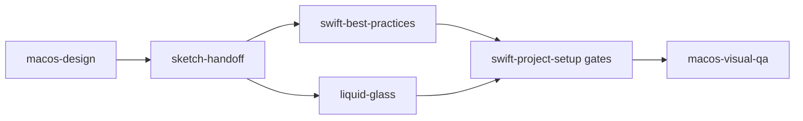
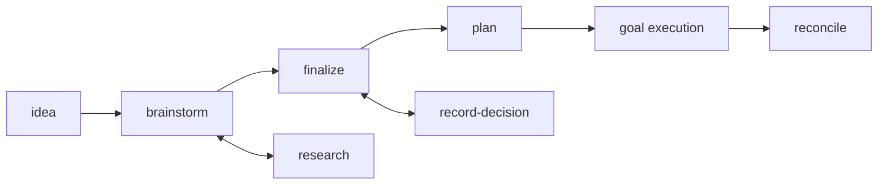

Every skill owns one responsibility. When several look like they could apply,
the boundaries below decide it.

## Rust and services

| Skill | Reach for it when |
|---|---|
| [`tailrocks-rust-project-setup`](/docs/skills/tailrocks-rust-project-setup) | The question is repository mechanics: workspace layout, lints, toolchain, dependency and CI gates. |
| [`tailrocks-rust-best-practices`](/docs/skills/tailrocks-rust-best-practices) | The question is language-level policy: ownership, API design, error and panic policy, unsafe review, tests. |
| [`tailrocks-axum-best-practices`](/docs/skills/tailrocks-axum-best-practices) | An HTTP boundary exists: routers, extractors, Tower middleware order, lifecycle, transport tests. |

Axum best practices apply only where there is an HTTP adapter. Domain logic
behind it belongs to the Rust best-practices skill.

## TypeScript and TanStack

| Skill | Reach for it when |
|---|---|
| [`tailrocks-tanstack-project-setup`](/docs/skills/tailrocks-tanstack-project-setup) | Scaffolding, migrating, or auditing the Bun-only TanStack Start baseline, its exact pins, and its CI gates. |
| [`tailrocks-typescript-best-practices`](/docs/skills/tailrocks-typescript-best-practices) | Writing or reviewing strict TypeScript and React: state modeling, runtime validation, typed failure, async ownership. |

## Native macOS

Six skills take a feature from an approved design to verified pixels.

| Skill | Owns |
|---|---|
| [`tailrocks-macos-design`](/docs/skills/tailrocks-macos-design) | Taste. Experience brief, information architecture, native component map, alternatives, scored review. Writes design artifacts, never source. |
| [`tailrocks-sketch-handoff`](/docs/skills/tailrocks-sketch-handoff) | The design file. Sketch wiring, token extraction, the symbol-to-SwiftUI map, approved exports. |
| [`tailrocks-liquid-glass`](/docs/skills/tailrocks-liquid-glass) | The material. Content-versus-functional layer split, API surface and availability, the glass acceptance gate. |
| [`tailrocks-swift-best-practices`](/docs/skills/tailrocks-swift-best-practices) | Code policy. Actor isolation, state ownership, view identity, AppKit interop boundaries, accessibility. |
| [`tailrocks-swift-project-setup`](/docs/skills/tailrocks-swift-project-setup) | The baseline. Project generation, signing, format and lint gates, test wiring, Xcode agent integration. |
| [`tailrocks-macos-visual-qa`](/docs/skills/tailrocks-macos-visual-qa) | Verification. Kill-launch-capture, window-ID capture, accessibility audits, state matrix, pixel regression. |

Never run two skills that both encode aesthetic taste. Two findings shape the
whole family: Apple's own UI kit ships **zero enabled blur effects**, so no
design file is authoritative for Liquid Glass — the operating system is. And
glass surfaces snapshot **fully transparent** from a detached view, so verifying
glass chrome requires screen-capturing the running app.

## Code quality

| Skill | Reach for it when |
|---|---|
| [`tailrocks-code-health`](/docs/skills/tailrocks-code-health) | A debt class must stop growing and become a measurable, shrink-only contract. |
| [`tailrocks-agents-md`](/docs/skills/tailrocks-agents-md) | A rule must be recorded for coding agents, or the instruction files have grown, drifted, or landed in the wrong directory. |
| [`tailrocks-simplify`](/docs/skills/tailrocks-simplify) | A pull request works and should carry less code, with behavior frozen. |
| [`tailrocks-remediate`](/docs/skills/tailrocks-remediate) | A defect is proven and the system must keep its promises while being corrected. |
| [`tailrocks-rethink`](/docs/skills/tailrocks-rethink) | The current shape itself is under review and breaking it is acceptable. |
| [`tailrocks-contribute`](/docs/skills/tailrocks-contribute) | The repository belongs to someone else. |

### simplify, remediate, or rethink

Three skills change existing code. Pick by how much the change may disturb, not
by how large it feels.

`tailrocks-simplify` disturbs nothing observable. Scope is the diff, behavior is
frozen, and the only accepted findings are removals with a counted delta.
Reach for it on a pull request that works and should be smaller.

`tailrocks-remediate` corrects a proven defect while the system keeps its
promises. `tailrocks-rethink` treats the current shape as the subject and
expects to break things.

### remediate or rethink

Both refuse to price the answer: no ROI, effort, duration, or sunk cost enters
either decision. They differ in what the decision may reach.

`tailrocks-remediate` requires a proven defect — a falsifiable expected state
and an observed contradiction. It treats compatibility promises as correctness
constraints and reaches the target through never-broken migration slices, and
it bounds the redesign to the proven defect class.

`tailrocks-rethink` accepts a reported symptom or friction. It derives the ideal
design before reading the existing one, treats internal compatibility as work
rather than a constraint, and expects breaking changes. Two guards keep it from
becoming licensed churn: it refuses a request with no failed guarantee behind
it, and it rejects a target design that adds capability instead of subtracting a
structural measure.

Use ordinary best-practice skills for routine implementation. Neither of these
is a substitute for them.

## Pull request lifecycle

Five skills run the PR lifecycle in any repository. Repo-specific behavior —
branch scheme, commit trailers, body generator, blast-radius classes, the
pre-merge worklist, merge method — comes from one optional file at the
target repository's root, `.tailrocks/pr.md`; without it the skills discover
the repository's own conventions and fall back to their defaults.

| Skill | Reach for it when |
|---|---|
| [`tailrocks-create-pr`](/docs/skills/tailrocks-create-pr) | A self-contained change needs a branch, a commit in the repo's convention, and an opened PR. |
| [`tailrocks-refresh-pr`](/docs/skills/tailrocks-refresh-pr) | An open PR's title or body no longer describes what the branch ships. |
| [`tailrocks-checkout-pr`](/docs/skills/tailrocks-checkout-pr) | The working repository must land on a PR's branch, with the tree guarded. |
| [`tailrocks-merge-pr`](/docs/skills/tailrocks-merge-pr) | A PR is merge-ready and the gates must run fail-closed before it lands. |
| [`tailrocks-pr-template`](/docs/skills/tailrocks-pr-template) | The repository needs its own `.github/PULL_REQUEST_TEMPLATE.md`, derived from its structure, gates, and merged-PR history. |

### create-pr or contribute

Both end in `gh pr create`. [`tailrocks-contribute`](/docs/skills/tailrocks-contribute)
is for repositories that belong to someone else: it adds contract recon,
hard stops, and per-contribution human approval before anything outward.
`tailrocks-create-pr` is for repositories the user works in as their own —
invoking it authorizes the push and the PR.

## Roadmap and delivery

| Skill | Reach for it when |
|---|---|
| [`tailrocks-idea`](/docs/skills/tailrocks-idea) | Capturing a raw idea as a DRAFT item without inventing missing detail. |
| [`tailrocks-brainstorm`](/docs/skills/tailrocks-brainstorm) | Shaping a DRAFT or SHAPING item through a one-question-at-a-time interview. |
| [`tailrocks-research`](/docs/skills/tailrocks-research) | A question or an item needs deep sourced research saved as a reusable topic. |
| [`tailrocks-record-decision`](/docs/skills/tailrocks-record-decision) | One decision must be recorded and propagated, including reopening stale work. |
| [`tailrocks-finalize`](/docs/skills/tailrocks-finalize) | Closing the interview and granting READY. |
| [`tailrocks-plan`](/docs/skills/tailrocks-plan) | Converting a READY item into specs, coverage, zero-context plans, and `GOAL.md`. |
| [`tailrocks-reconcile`](/docs/skills/tailrocks-reconcile) | Execution status, blockers, drift, and DONE claims need re-verifying against the repository. |

Artifacts live in `roadmap/<slug>/`, `research/<topic>/`, and `plans/<slug>/`.
Research and decision recording happen whenever they are needed; only finalize
grants READY, and plan requires READY.

Why each stage exists, what it refuses, and two features taken end to end —
a native macOS app and a TanStack feature on a Rust backend — are covered in
[the delivery pipeline guide](/docs/delivery).

Worked examples live in the repository:
[`examples/plan-package/`](https://github.com/tailrocks/tailrocks-skills/tree/main/examples/plan-package),
[`examples/macos-screen/`](https://github.com/tailrocks/tailrocks-skills/tree/main/examples/macos-screen),
and the
[pipeline walkthrough](https://github.com/tailrocks/tailrocks-skills/blob/main/docs/design/pipeline-walkthrough.md).
