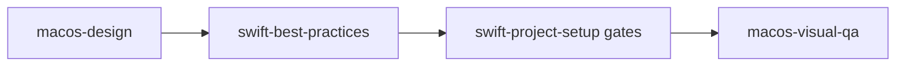
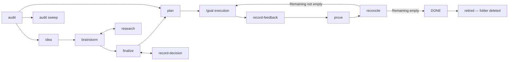

Every skill owns one responsibility. When several look like they could apply,
the boundaries below decide it.

## Invocation classes

Eleven exact-trigger policy owners may load when matching work is already in
scope: the Axum, GraphQL, gRPC, Rust, Swift, and TypeScript best-practice
skills; `tailrocks-agents-md`; `tailrocks-grilling`; and the macOS, web, and
terminal design skills. Every other skill is manual-only. Direct invocation of
a model-policy owner remains best-effort across clients.

Selection grants no mutation, tool, blessing, commit, push, external-message,
or external-system authority. It supplies policy inside the active task; it
never starts a neighboring workflow or makes a human decision.

## Rust and services

| Skill | Reach for it when |
|---|---|
| [`tailrocks-rust-project-setup`](/docs/skills/tailrocks-rust-project-setup) | A new Rust workspace needs its strict layout, toolchain, lint, dependency, and gate baseline scaffolded. |
| [`tailrocks-rust-project-audit`](/docs/skills/tailrocks-rust-project-audit) | An existing Rust workspace needs a read-only, evidence-backed baseline gap report. |
| [`tailrocks-rust-project-remediate`](/docs/skills/tailrocks-rust-project-remediate) | The user has approved exact Rust workspace baseline gaps to close in verified slices. |
| [`tailrocks-rust-best-practices`](/docs/skills/tailrocks-rust-best-practices) | New Rust behavior needs explicit ownership, API, failure, unsafe, test, and performance contracts. |
| [`tailrocks-rust-review`](/docs/skills/tailrocks-rust-review) | Rust source or a Rust diff needs a focused read-only correctness review; use `tailrocks-review-pr` for whole-PR orchestration. |
| [`tailrocks-rust-refactor`](/docs/skills/tailrocks-rust-refactor) | Rust structure must change while observable behavior and public contracts remain frozen by an oracle. |
| [`tailrocks-axum-best-practices`](/docs/skills/tailrocks-axum-best-practices) | Axum HTTP behavior must be built or changed: routers, extractors, Tower policy, lifecycle, and transport tests. |
| [`tailrocks-axum-review`](/docs/skills/tailrocks-axum-review) | Axum adapters or a diff need focused read-only review; use `tailrocks-review-pr` for whole-PR orchestration. |
| [`tailrocks-axum-refactor`](/docs/skills/tailrocks-axum-refactor) | Axum or Tower structure must change while routes, HTTP contracts, policy order, and lifecycle remain frozen. |
| [`tailrocks-graphql-best-practices`](/docs/skills/tailrocks-graphql-best-practices) | A public GraphQL API must evolve: schema design, committed SDL, breaking-change gates, Juniper server, generated web client. |
| [`tailrocks-graphql-review`](/docs/skills/tailrocks-graphql-review) | A GraphQL diff or whole public API surface needs read-only schema, server, SDL-gate, and generated-client findings. |
| [`tailrocks-grpc-best-practices`](/docs/skills/tailrocks-grpc-best-practices) | A cross-service gRPC contract must evolve: proto under Buf gates, tonic adapters, deadlines, statuses, and wire tests. |
| [`tailrocks-grpc-review`](/docs/skills/tailrocks-grpc-review) | A gRPC diff or whole service surface needs read-only proto, adapter, operations, and wire-contract findings. |

Axum best practices apply only where there is an HTTP adapter. Domain logic
behind it belongs to the Rust write, review, or refactor owner matching the task.
Axum review/refactor may therefore run beside the corresponding Rust owner when
the same changed hunk crosses both language and HTTP-adapter contracts.

### The protocol doctrine

One rule decides between the two contract skills: **GraphQL is the public
API of public backend services; gRPC is cross-service communication between
Rust services.** A browser or third party never speaks gRPC, and services
never call each other's GraphQL. UI layers — the TanStack web app and the
SwiftUI shell — are thin: business logic always stays in Rust behind these
contracts.

## TypeScript and TanStack

| Skill | Reach for it when |
|---|---|
| [`tailrocks-tanstack-project-setup`](/docs/skills/tailrocks-tanstack-project-setup) | Scaffolding, migrating, or auditing the Bun-only TanStack Start baseline, its exact pins, and its CI gates. |
| [`tailrocks-typescript-best-practices`](/docs/skills/tailrocks-typescript-best-practices) | Writing or reviewing strict TypeScript and React: state modeling, runtime validation, typed failure, async ownership. |

## Native macOS

Four skills take a feature from an approved design to verified pixels.

| Skill | Owns |
|---|---|
| [`tailrocks-macos-design`](/docs/skills/tailrocks-macos-design) | Taste, the runnable proof, and the material. Experience brief, information architecture, native component map, alternatives, scored review; then the signed-off Liquid Glass prototype under the fixed launch contract; and the Liquid Glass rules — content-versus-functional layer split, API surface and availability, the glass acceptance gate. Writes design artifacts and the prototype package, never production source. |
| [`tailrocks-swift-best-practices`](/docs/skills/tailrocks-swift-best-practices) | Code policy. Actor isolation, state ownership, view identity, AppKit interop boundaries, accessibility. |
| [`tailrocks-swift-project-setup`](/docs/skills/tailrocks-swift-project-setup) | The baseline. Project generation, signing, format and lint gates, test wiring, Xcode agent integration. |
| [`tailrocks-macos-visual-qa`](/docs/skills/tailrocks-macos-visual-qa) | Verification. Kill-launch-capture, window-ID capture, accessibility audits, state matrix, pixel regression. |

Never run two skills that both encode aesthetic taste. Two findings shape the
whole family. **No design file is authoritative for Liquid Glass; the operating
system is** — a static mock can only approximate a material that keeps adapting
to appearance, accessibility settings, and content, so the reference is a
running app, never an exported artifact. And glass surfaces snapshot **fully
transparent** from a detached view, so verifying glass chrome requires
screen-capturing that running app.

## Design and prototypes

Three platforms, one process, one design skill per medium. Whichever medium a
screen lives in, the stage
runs between READY and planning, uses the same four words, and ends with a
reference the implementation is mechanically held to — `tailrocks-plan`
refuses a screen contract that cites none.

| Stage | What happens | Who may do it |
|---|---|---|
| **design** | Author the reference on the real UI substrate, from fixture data | the agent |
| **bless** | Sign off that this is the screen, recorded with its date | **the user, never the agent** |
| **freeze** | Take the mechanical baseline the implementation is compared against | the agent |
| **audit** | Check an implementation against the blessed reference, read-only | the agent |

| Medium | Stack | design | bless | freeze |
|---|---|---|---|---|
| Terminal | Rust, ratatui, crossterm | [`tailrocks-tui-design`](/docs/skills/tailrocks-tui-design) | same | same — the golden test |
| Web | TanStack Start, React, shadcn/ui | [`tailrocks-web-design`](/docs/skills/tailrocks-web-design) | same | [`tailrocks-web-visual-qa`](/docs/skills/tailrocks-web-visual-qa) |
| macOS | Swift, SwiftUI, Liquid Glass | [`tailrocks-macos-design`](/docs/skills/tailrocks-macos-design) | same — on the running prototype | [`tailrocks-macos-visual-qa`](/docs/skills/tailrocks-macos-visual-qa) |

macOS keeps design and bless in one skill because the material only exists at
runtime: taste is decided in the design stages, and the sign-off happens on
the running Liquid Glass prototype the same skill builds. The Liquid Glass
material authority owns no separate stage — it is the rulebook the design and
prototype stages consult.

| Skill | Reach for it when |
|---|---|
| [`tailrocks-tui-design`](/docs/skills/tailrocks-tui-design) | A terminal screen needs a pinned, verifiable design before implementation: ratatui golden frames rendered from fixtures, blessed by the user, enforced by a golden test. |
| [`tailrocks-web-design`](/docs/skills/tailrocks-web-design) | A TanStack screen needs its look agreed before implementation: guarded design routes over the installed shadcn/ui components, blessed live in the browser. Captures nothing. |
| [`tailrocks-web-visual-qa`](/docs/skills/tailrocks-web-visual-qa) | A finalized web design needs its baselines frozen, or an existing visual suite needs a regress run: Playwright screenshot matrix, determinism rules, the baseline record — refused for unblessed screens. |

### One design owner per medium

Each skill rules its own medium and never another's: terminal screens are
`tailrocks-tui-design`, web screens are `tailrocks-web-design`, and macOS
windows are
[`tailrocks-macos-design`](/docs/skills/tailrocks-macos-design), whose
prototype stage is their runnable-reference producer — an HTML prototype is
never a design source for native macOS. Design skills iterate live and
capture nothing:
screenshots are frozen only after finalization, by
[`tailrocks-web-visual-qa`](/docs/skills/tailrocks-web-visual-qa) for web
screens and
[`tailrocks-macos-visual-qa`](/docs/skills/tailrocks-macos-visual-qa) for
macOS windows. The shared shape is
the same everywhere: the reference is rendered by the real UI substrate
from fixtures, the user blesses it, and a mechanical comparison holds the
implementation to it afterward.

## Code quality

| Skill | Reach for it when |
|---|---|
| [`tailrocks-code-health`](/docs/skills/tailrocks-code-health) | A debt class must stop growing and become a measurable, shrink-only contract. |
| [`tailrocks-agents-md`](/docs/skills/tailrocks-agents-md) | A rule must be recorded for coding agents, or the instruction files have grown, drifted, or landed in the wrong directory. |
| [`tailrocks-retrospect`](/docs/skills/tailrocks-retrospect) | A roadmap item has shipped and its delivery history should say which skills let it diverge from its own plan. |
| [`tailrocks-simplify`](/docs/skills/tailrocks-simplify) | A pull request works and should carry less code, with behavior frozen. |
| [`tailrocks-remediate`](/docs/skills/tailrocks-remediate) | A defect is proven and the system must keep its promises while being corrected. |
| [`tailrocks-rethink`](/docs/skills/tailrocks-rethink) | The current shape itself is under review and breaking it is acceptable. |
| [`tailrocks-contribute`](/docs/skills/tailrocks-contribute) | The repository belongs to someone else. |

### retrospect or audit

Both end in prioritized findings, and their subjects do not overlap.
[`tailrocks-audit`](/docs/skills/tailrocks-audit) reads a repository or a
branch and finds what is wrong with **the code**, seeding the result as
roadmap items or plans — it is the cold-start skill for a codebase with no
backlog yet. [`tailrocks-retrospect`](/docs/skills/tailrocks-retrospect) reads
one shipped item's delivery history and finds what is wrong with **the
skills** that produced it, proposing patches against their definitions.

Audit needs no roadmap item and produces them; retrospect needs exactly one
and produces none. If there is no item to point at, the answer is audit.

### audit or improve

Both cold-start a repository and end in plans; they differ in what the
findings become. [`tailrocks-audit`](/docs/skills/tailrocks-audit) seeds
this collection's own pipeline — findings land as DRAFT roadmap items or as
direct `roadmap/<slug>/plan/` packages, judged against the house stack, and
stay inside that repository's delivery loop.
[`tailrocks-improve`](/docs/skills/tailrocks-improve) owns the
pipeline-free lane: the same fan-out, the same evidence vetting, but the
output is a standalone `plans/` backlog of zero-context executor plans in a
repository that adopts nothing else — judged against the repository's own
contracts, and never implementing what it plans. Choose audit when the
repository runs (or should run) the roadmap pipeline; choose improve when
it does not.

### retrospect or reconcile

Both look backwards at an item, at different subjects.
[`tailrocks-reconcile`](/docs/skills/tailrocks-reconcile) re-earns the truth of
the *work*: it re-runs done criteria and corrects plan rows and the item's
status in the delivering repository. `tailrocks-retrospect` never writes
there — the item is evidence — and its subject is the *skills*, not the
work. Reconcile when the statuses are suspect; retrospect after they are
settled.

### simplify, remediate, or rethink

Three skills change existing code. Pick by how much the change may disturb, not
by how large it feels.

`tailrocks-simplify` disturbs nothing observable. Scope is the diff, behavior is
frozen, and the only accepted findings are removals with a counted delta.
Reach for it on a pull request that works and should be smaller.

`tailrocks-remediate` corrects a proven defect while the system keeps its
promises. `tailrocks-rethink` treats the current shape as the subject and
expects to break things.

### remediate or rethink

Both refuse to price the answer: no ROI, effort, duration, or sunk cost enters
either decision. They differ in what the decision may reach.

`tailrocks-remediate` requires a proven defect — a falsifiable expected state
and an observed contradiction. It treats compatibility promises as correctness
constraints and reaches the target through never-broken migration slices, and
it bounds the redesign to the proven defect class.

`tailrocks-rethink` accepts a reported symptom or friction. It derives the ideal
design before reading the existing one, treats internal compatibility as work
rather than a constraint, and expects breaking changes. Two guards keep it from
becoming licensed churn: it refuses a request with no failed guarantee behind
it, and it rejects a target design that adds capability instead of subtracting a
structural measure.

Use ordinary best-practice skills for routine implementation. Neither of these
is a substitute for them.

## Decision support

[`tailrocks-grilling`](/docs/skills/tailrocks-grilling) is the live,
conversation-only stress test before action. It retrieves lookupable facts,
presents dependency-ordered numbered frontiers with a recommendation on every
question, leaves choices to the user, and ends only after explicit confirmation
of the decision map. It writes and executes nothing.

When the deliverable becomes durable, route by artifact: persisted DRAFT or
SHAPING answers to `tailrocks-brainstorm`; READY closure to
`tailrocks-finalize`; reusable sourced topics to `tailrocks-research`; `plan/`
and `goal/` packages to `tailrocks-plan`; and screen design or blessing to the
matching macOS, web, or terminal design owner. Naming a route invokes nothing
and grants no authority.

## Skill authoring

Four skills carry the authoring laws — no new skill and no behavioral edit
without the failure observed first, and the context window is a public good —
and exactly one owns each phase of a skill's life.

Contract-breaking migration is a separately scoped operator workflow. Update
and refactor stop unchanged and name the exact delta, compatibility, and
rollback obligations. Direct migration requires explicit authorization for the
named branch and pull request; no migration-plan artifact or authoring skill
mediates it.

| Skill | Reach for it when |
|---|---|
| [`tailrocks-skill-create`](/docs/skills/tailrocks-skill-create) | Any repository needs a new skill — record durable evidence, derive target policy, scaffold deterministically from its template, and wire its supported surfaces. |
| [`tailrocks-skill-update`](/docs/skills/tailrocks-skill-update) | Existing behavior must change in place while every public-contract field and independently invokable responsibility stays fixed. |
| [`tailrocks-skill-audit`](/docs/skills/tailrocks-skill-audit) | One skill or the whole tree must be judged against the doctrine — read-only, a report with stable finding IDs under `skill-audits/`. |
| [`tailrocks-skill-refactor`](/docs/skills/tailrocks-skill-refactor) | Ownership structure must change while behavior and public contracts stay frozen. Contract-breaking work stops unchanged for separate explicit direct-migration authorization; audit remains a separate manual invocation. |

### agents-md or the authoring family

Both are meta work; they own different artifacts.
[`tailrocks-agents-md`](/docs/skills/tailrocks-agents-md) owns agent
instruction files — always-loaded rules scoped to the directory that owns
them. The authoring family owns skills — invoked behavior with descriptions,
routers, references, and non-protected evidence. The placement decision is part of
[`tailrocks-skill-create`](/docs/skills/tailrocks-skill-create)'s job: a rule
a competent agent needs on every request routes to the owning `AGENTS.md`, a
mechanically checkable rule routes to a gate, and only an observed failure
that needs invoked guidance earns a skill.

### retrospect or the authoring family

They are two halves of one loop and neither does the other's job.
[`tailrocks-retrospect`](/docs/skills/tailrocks-retrospect) reads a shipped
roadmap item's delivery history and produces evidence: which skills ran, in
what order, and which of the item's own Decisions, Must-nots, and spec IDs the
result failed to honor. It writes one record and never touches `skills/`.
[`tailrocks-skill-update`](/docs/skills/tailrocks-skill-update) owns the edit
— the router budget, the load-bearing lines, and deterministic acceptance proof — and its
iron law is that no behavioral change ships without an observed failure; a
retrospective finding is that observed failure, sourced from production
instead of from a baseline run. When the evidence says no skill owns the
behavior at all, the handoff goes to
[`tailrocks-skill-create`](/docs/skills/tailrocks-skill-create) instead.

Use retrospect when the question is *what went wrong across a delivery*. Use
the family when the question is *what should this skill say*. The whole loop —
including how a pull request in another repository becomes evidence through
`--repo`/`--pr`, and why the analysis fans out to subagents while the judgment
stays put — is documented under [self-improvement](/docs/self-improve).

### skill-audit or improve

Both audit, at different subjects.
[`tailrocks-skill-audit`](/docs/skills/tailrocks-skill-audit) judges the
**skills** — descriptions, routers, references, evidence, wiring, overlap —
against the authoring doctrine, and its report feeds
[`tailrocks-skill-refactor`](/docs/skills/tailrocks-skill-refactor).
[`tailrocks-improve`](/docs/skills/tailrocks-improve) judges the repository's
**code** and turns verified findings into executor-ready plans under `plans/`.
A repository whose product is agent skills gets its `SKILL.md` files audited
by skill-audit and its tooling by improve — the two never overlap.

## Pull request lifecycle

Six skills run the PR lifecycle in any repository. Repo-specific behavior —
branch scheme, commit trailers, body generator, blast-radius classes, the
pre-merge worklist, merge method — comes from one optional file at the
target repository's root, `.tailrocks/pr.md`; without it the skills discover
the repository's own conventions and fall back to their defaults.

| Skill | Reach for it when |
|---|---|
| [`tailrocks-create-pr`](/docs/skills/tailrocks-create-pr) | A self-contained change needs a branch, a commit in the repo's convention, and an opened PR. |
| [`tailrocks-refresh-pr`](/docs/skills/tailrocks-refresh-pr) | An open PR's title or body no longer describes what the branch ships. |
| [`tailrocks-checkout-pr`](/docs/skills/tailrocks-checkout-pr) | The working repository must land on a PR's branch, with the tree guarded. |
| [`tailrocks-review-pr`](/docs/skills/tailrocks-review-pr) | A PR, branch, or diff needs a review verdict: verified bugs, structural regressions, routed fixes. |
| [`tailrocks-merge-pr`](/docs/skills/tailrocks-merge-pr) | A PR is merge-ready and the gates must run fail-closed before it lands — including the read-only delivery-artifact check when the diff touches `roadmap/` and the documentation gate that stops an undocumented merge. |
| [`tailrocks-document`](/docs/skills/tailrocks-document) | The last content commit before a merge: the repository's own docs rewritten into the final source of truth for what the PR shipped — never a changelog page. |
| [`tailrocks-pr-template`](/docs/skills/tailrocks-pr-template) | The repository needs its own `.github/PULL_REQUEST_TEMPLATE.md`, derived from its structure, gates, and merged-PR history. |

### document or refresh-pr

Both rewrite prose about a pull request, and they own different surfaces.
[`tailrocks-refresh-pr`](/docs/skills/tailrocks-refresh-pr) reconciles the
PR's own metadata — title and body — against the current diff.
[`tailrocks-document`](/docs/skills/tailrocks-document) rewrites the
repository's documentation so it describes the system the diff creates, and
`tailrocks-merge-pr`'s documentation gate refuses a merge whose doc-worthy
commits it does not cover. Refresh describes the change to reviewers;
document describes the system to readers.

### review-pr, simplify, or remediate

[`tailrocks-review-pr`](/docs/skills/tailrocks-review-pr) produces the
verdict and never edits: every correctness finding is re-derived from the
code before it may be reported, every structural finding names its
restructure, and each finding is routed to the skill that fixes its
class. [`tailrocks-simplify`](/docs/skills/tailrocks-simplify) is one of
those routes — it removes code from the diff with behavior frozen, and it
does apply changes in its `apply` mode.
[`tailrocks-remediate`](/docs/skills/tailrocks-remediate) is another — a
review finding becomes its input when the defect is proven and its
enabling condition is architectural, so the class stops recurring instead
of the instance getting patched. Review reports; the routed skills act.

### create-pr or contribute

Both end in `gh pr create`. [`tailrocks-contribute`](/docs/skills/tailrocks-contribute)
is for repositories that belong to someone else: it adds contract recon,
hard stops, and per-contribution human approval before anything outward.
`tailrocks-create-pr` is for repositories the user works in as their own —
invoking it authorizes the push and the PR.

### audit, code-health, or review-pr

[`tailrocks-audit`](/docs/skills/tailrocks-audit) is the cold-start
entry: no idea captured yet, no PR open, just a repository or a branch
that needs a first pass to find out what is worth doing. Selected
findings go to the roadmap/plan pipeline, or straight to a
`bounded-executor` when the finding is small, certain, and low-risk to
get wrong — and to a fixer skill instead when the finding's shape says
so: `tailrocks-remediate` when the defect class will recur,
`tailrocks-rethink` when nothing failed but the shape keeps producing
near-misses, `tailrocks-simplify` for redundancy inside a diff.
[`tailrocks-code-health`](/docs/skills/tailrocks-code-health) is not a
one-off audit — it is the standing, monotonic debt gate that keeps a
named class from growing once it is wired into CI.
[`tailrocks-review-pr`](/docs/skills/tailrocks-review-pr) never runs cold:
it reviews one open PR, branch, or diff against author intent, and never
seeds roadmap items or plans. Run `tailrocks-audit` to find work, wire
`tailrocks-code-health` to keep a fixed debt class from regressing, and
run `tailrocks-review-pr` once that work becomes a PR.

## Roadmap and delivery

| Skill | Reach for it when |
|---|---|
| [`tailrocks-audit`](/docs/skills/tailrocks-audit) | Nothing is captured yet — audit a repository or branch cold and turn findings into items or plans. |
| [`tailrocks-idea`](/docs/skills/tailrocks-idea) | Capturing a raw idea as a DRAFT item without inventing missing detail. |
| [`tailrocks-brainstorm`](/docs/skills/tailrocks-brainstorm) | Shaping a DRAFT or SHAPING item through a one-question-at-a-time interview. |
| [`tailrocks-research`](/docs/skills/tailrocks-research) | A question or an item needs deep sourced research saved as a reusable topic. |
| [`tailrocks-record-decision`](/docs/skills/tailrocks-record-decision) | One decision must be recorded and propagated, including reopening stale work. |
| [`tailrocks-finalize`](/docs/skills/tailrocks-finalize) | Closing the interview and granting READY. |
| [`tailrocks-plan`](/docs/skills/tailrocks-plan) | Converting a READY item into specs, coverage, zero-context plans, and the `goal/` handoff. |
| [`tailrocks-record-feedback`](/docs/skills/tailrocks-record-feedback) | Something is wrong with what shipped and the user's own words should be on record before anyone argues with them. |
| [`tailrocks-prove`](/docs/skills/tailrocks-prove) | Whether the shipped work behaves has to be settled by running it, not by reading its status rows. |
| [`tailrocks-reconcile`](/docs/skills/tailrocks-reconcile) | Execution status, blockers, drift, and DONE claims need re-verifying against the repository, a verification round needs closing, or a finished item needs retiring off the board. |

One item, one folder: the item, its `plan/` package, its `verification/`
rounds, and its `goal/` handoff all live under `roadmap/<slug>/`, with standing
topics in `research/<topic>/`. Research and decision recording happen whenever
they are needed; only finalize grants READY, plan requires READY, and only
reconcile writes `DONE` — after a verification round with no blocking defect.
Every invocation commits into the item's single branch and pull request, marked
with its skill, which is what
[`tailrocks-retrospect`](/docs/skills/tailrocks-retrospect) reads once the item
has shipped.

### Delivered work leaves the tree

A folder under `roadmap/` is work that is **not finished**. `DONE` is a
transition, not a resting place: the same
[`tailrocks-reconcile`](/docs/skills/tailrocks-reconcile) invocation that
writes it retires the item, deleting `roadmap/<slug>/` whole — item, `plan/`,
`verification/`, `goal/`, assets — along with its index row, in two commits so
one pull request shows the item earn `DONE` and then go. When the last item
goes, `roadmap/README.md` and `roadmap/` go with it, and an empty `roadmap/` is
the healthy steady state rather than a stalled one. Standing research topics
never go: `research/<topic>/` is independent of any item.

Nothing is lost, because nothing was ever stored only there —
`git log -- roadmap/<slug>/` says what happened and
`git show <commit>^:roadmap/<slug>/README.md` reads the item as it stood.
That is also where retrospect gets its evidence after a retirement.

### reconcile or merge-pr

Only one of them writes. [`tailrocks-reconcile`](/docs/skills/tailrocks-reconcile)
owns the delivery artifacts: it earns the statuses, rewrites Remaining, and
performs the retirement.
[`tailrocks-merge-pr`](/docs/skills/tailrocks-merge-pr) owns the last
checkpoint and is read-only about all of it — when a pull request's diff
touches `roadmap/`, its machine preflight reads that diff for six
contradictions and blocks on any of them, naming the files that disagree and
routing the fix. The two that this rule creates: an item saying `DONE` while
its folder is still present, and a folder deleted while its latest
verification round still carried a blocking defect, and a retired folder with
no diff-added delivery report. It never edits, deletes,
or commits a delivery artifact — it sends you back to reconcile (or to
[`tailrocks-prove`](/docs/skills/tailrocks-prove), when what is missing is a
clean round). In a repository with no `roadmap/`, the check does nothing and
says nothing.

### record-feedback, prove, reconcile, or retrospect

Four skills act after execution and none of them overlaps.
[`tailrocks-record-feedback`](/docs/skills/tailrocks-record-feedback)
**captures**: the user's report, verbatim, one statement per defect, with no
verdict attached. [`tailrocks-prove`](/docs/skills/tailrocks-prove)
**executes and judges**: it runs the shipped work, walks the real flows,
compares the interface against the blessed reference, and returns a verdict per
statement — but it writes no status.
[`tailrocks-reconcile`](/docs/skills/tailrocks-reconcile) **writes status**: it
prunes confirmed plan rows, rewrites the item's Remaining from the blocking
defects, is the only skill that may set `DONE` — and, in the same invocation,
retires the item it just certified.
[`tailrocks-retrospect`](/docs/skills/tailrocks-retrospect) **patches skills**:
it takes what diverged and proposes changes to the skill definitions that let
it through, never touching the item. It runs after the item shipped, so its
evidence usually comes out of history rather than the tree — it finds the
retiring commit and reads every artifact from that commit's parent.

Capture before judging is the load-bearing order: a complaint an agent has
already dismissed never gets executed against.

Why each stage exists, what it refuses, and two features taken end to end —
a native macOS app and a TanStack feature on a Rust backend — are covered in
[the delivery pipeline guide](/docs/delivery).

Worked examples live in the repository:
[`examples/item-folder/`](https://github.com/tailrocks/tailrocks-skills/tree/main/examples/item-folder),
[`examples/macos-screen/`](https://github.com/tailrocks/tailrocks-skills/tree/main/examples/macos-screen),
and the
[pipeline walkthrough](https://github.com/tailrocks/tailrocks-skills/blob/main/docs/design/pipeline-walkthrough.md).
