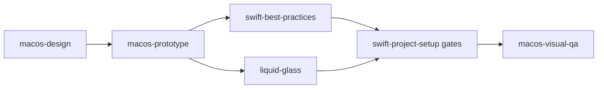
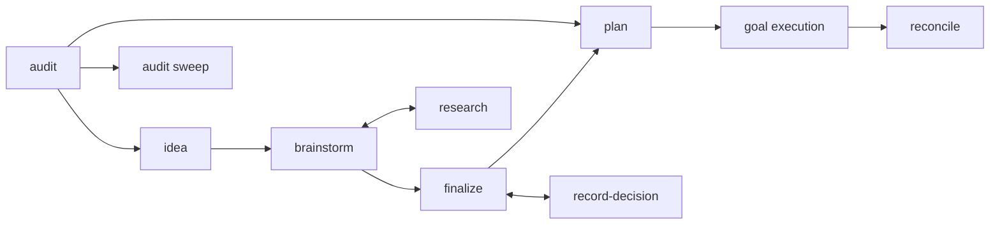

Every skill owns one responsibility. When several look like they could apply,
the boundaries below decide it.

## Rust and services

| Skill | Reach for it when |
|---|---|
| [`tailrocks-rust-project-setup`](/docs/skills/tailrocks-rust-project-setup) | The question is repository mechanics: workspace layout, lints, toolchain, dependency and CI gates. |
| [`tailrocks-rust-best-practices`](/docs/skills/tailrocks-rust-best-practices) | The question is language-level policy: ownership, API design, error and panic policy, unsafe review, tests. |
| [`tailrocks-axum-best-practices`](/docs/skills/tailrocks-axum-best-practices) | An HTTP boundary exists: routers, extractors, Tower middleware order, lifecycle, transport tests. |
| [`tailrocks-graphql-best-practices`](/docs/skills/tailrocks-graphql-best-practices) | A public backend service exposes its public API: schema design, the committed SDL contract, breaking-change gates, the typed web client. |
| [`tailrocks-grpc-best-practices`](/docs/skills/tailrocks-grpc-best-practices) | Rust services talk to each other: proto contracts under buf gates, tonic adapters, deadlines, status mapping. |

Axum best practices apply only where there is an HTTP adapter. Domain logic
behind it belongs to the Rust best-practices skill.

### The protocol doctrine

One rule decides between the two contract skills: **GraphQL is the public
API of public backend services; gRPC is cross-service communication between
Rust services.** A browser or third party never speaks gRPC, and services
never call each other's GraphQL. UI layers — the TanStack web app and the
SwiftUI shell — are thin: business logic always stays in Rust behind these
contracts.

## TypeScript and TanStack

| Skill | Reach for it when |
|---|---|
| [`tailrocks-tanstack-project-setup`](/docs/skills/tailrocks-tanstack-project-setup) | Scaffolding, migrating, or auditing the Bun-only TanStack Start baseline, its exact pins, and its CI gates. |
| [`tailrocks-typescript-best-practices`](/docs/skills/tailrocks-typescript-best-practices) | Writing or reviewing strict TypeScript and React: state modeling, runtime validation, typed failure, async ownership. |

## Native macOS

Six skills take a feature from an approved design to verified pixels.

| Skill | Owns |
|---|---|
| [`tailrocks-macos-design`](/docs/skills/tailrocks-macos-design) | Taste. Experience brief, information architecture, native component map, alternatives, scored review. Writes design artifacts, never source. |
| [`tailrocks-macos-prototype`](/docs/skills/tailrocks-macos-prototype) | The runnable proof. Builds the Liquid Glass prototype from the approved design: fixed launch contract, fixture scenarios, live sign-off, region-scoped match policy. Captures nothing; visual-qa freezes the baseline after finalization. Zero taste. |
| [`tailrocks-liquid-glass`](/docs/skills/tailrocks-liquid-glass) | The material. Content-versus-functional layer split, API surface and availability, the glass acceptance gate. |
| [`tailrocks-swift-best-practices`](/docs/skills/tailrocks-swift-best-practices) | Code policy. Actor isolation, state ownership, view identity, AppKit interop boundaries, accessibility. |
| [`tailrocks-swift-project-setup`](/docs/skills/tailrocks-swift-project-setup) | The baseline. Project generation, signing, format and lint gates, test wiring, Xcode agent integration. |
| [`tailrocks-macos-visual-qa`](/docs/skills/tailrocks-macos-visual-qa) | Verification. Kill-launch-capture, window-ID capture, accessibility audits, state matrix, pixel regression. |

Never run two skills that both encode aesthetic taste. Two findings shape the
whole family. **No design file is authoritative for Liquid Glass; the operating
system is** — a static mock can only approximate a material that keeps adapting
to appearance, accessibility settings, and content, so the reference is a
running app, never an exported artifact. And glass surfaces snapshot **fully
transparent** from a detached view, so verifying glass chrome requires
screen-capturing that running app.

## Design references

Three platforms, one process. Whichever medium a screen lives in, the stage
runs between READY and planning, uses the same four words, and ends with a
reference the implementation is mechanically held to — `tailrocks-plan`
refuses a screen contract that cites none.

| Stage | What happens | Who may do it |
|---|---|---|
| **design** | Author the reference on the real UI substrate, from fixture data | the agent |
| **bless** | Sign off that this is the screen, recorded with its date | **the user, never the agent** |
| **freeze** | Take the mechanical baseline the implementation is compared against | the agent |
| **audit** | Check an implementation against the blessed reference, read-only | the agent |

| Medium | Stack | design | bless | freeze |
|---|---|---|---|---|
| Terminal | Rust, ratatui, crossterm | [`tailrocks-tui-design`](/docs/skills/tailrocks-tui-design) | same | same — the golden test |
| Web | TanStack Start, React, shadcn/ui | [`tailrocks-web-design`](/docs/skills/tailrocks-web-design) | same | [`tailrocks-web-visual-qa`](/docs/skills/tailrocks-web-visual-qa) |
| macOS | Swift, SwiftUI, Liquid Glass | [`tailrocks-macos-design`](/docs/skills/tailrocks-macos-design) | [`tailrocks-macos-prototype`](/docs/skills/tailrocks-macos-prototype) | [`tailrocks-macos-visual-qa`](/docs/skills/tailrocks-macos-visual-qa) |

macOS splits design from bless because the material only exists at runtime:
taste is decided in the design skill, and the sign-off happens on a running
Liquid Glass prototype. [`tailrocks-liquid-glass`](/docs/skills/tailrocks-liquid-glass)
owns no stage — it is the material authority the macOS skills consult.

| Skill | Reach for it when |
|---|---|
| [`tailrocks-tui-design`](/docs/skills/tailrocks-tui-design) | A terminal screen needs a pinned, verifiable design before implementation: ratatui golden frames rendered from fixtures, blessed by the user, enforced by a golden test. |
| [`tailrocks-web-design`](/docs/skills/tailrocks-web-design) | A TanStack screen needs its look agreed before implementation: guarded design routes over the installed shadcn/ui components, blessed live in the browser. Captures nothing. |
| [`tailrocks-web-visual-qa`](/docs/skills/tailrocks-web-visual-qa) | A finalized web design needs its baselines frozen, or an existing visual suite needs a regress run: Playwright screenshot matrix, determinism rules, the baseline record — refused for unblessed screens. |

### One design owner per medium

Each skill rules its own medium and never another's: terminal screens are
`tailrocks-tui-design`, web screens are `tailrocks-web-design`, and macOS
windows keep their taste owner
([`tailrocks-macos-design`](/docs/skills/tailrocks-macos-design)) with
[`tailrocks-macos-prototype`](/docs/skills/tailrocks-macos-prototype) as
their runnable-reference producer — an HTML prototype is never a design
source for native macOS. Design skills iterate live and capture nothing:
screenshots are frozen only after finalization, by
[`tailrocks-web-visual-qa`](/docs/skills/tailrocks-web-visual-qa) for web
screens and
[`tailrocks-macos-visual-qa`](/docs/skills/tailrocks-macos-visual-qa) for
macOS windows. The shared shape is
the same everywhere: the reference is rendered by the real UI substrate
from fixtures, the user blesses it, and a mechanical comparison holds the
implementation to it afterward.

## Code quality

| Skill | Reach for it when |
|---|---|
| [`tailrocks-code-health`](/docs/skills/tailrocks-code-health) | A debt class must stop growing and become a measurable, shrink-only contract. |
| [`tailrocks-agents-md`](/docs/skills/tailrocks-agents-md) | A rule must be recorded for coding agents, or the instruction files have grown, drifted, or landed in the wrong directory. |
| [`tailrocks-skill-author`](/docs/skills/tailrocks-skill-author) | A skill must be created, updated, or audited — with the failure observed first and eval cases written to hold it. |
| [`tailrocks-simplify`](/docs/skills/tailrocks-simplify) | A pull request works and should carry less code, with behavior frozen. |
| [`tailrocks-remediate`](/docs/skills/tailrocks-remediate) | A defect is proven and the system must keep its promises while being corrected. |
| [`tailrocks-rethink`](/docs/skills/tailrocks-rethink) | The current shape itself is under review and breaking it is acceptable. |
| [`tailrocks-contribute`](/docs/skills/tailrocks-contribute) | The repository belongs to someone else. |

### agents-md or skill-author

Both are meta skills; they own different artifacts.
[`tailrocks-agents-md`](/docs/skills/tailrocks-agents-md) owns agent
instruction files — always-loaded rules scoped to the directory that owns
them. [`tailrocks-skill-author`](/docs/skills/tailrocks-skill-author) owns
skills — invoked behavior with descriptions, routers, references, and
evals. The placement decision is part of skill-author's job: a rule a
competent agent needs on every request routes to the owning `AGENTS.md`, a
mechanically checkable rule routes to a gate, and only an observed failure
that needs invoked guidance earns a skill.

### simplify, remediate, or rethink

Three skills change existing code. Pick by how much the change may disturb, not
by how large it feels.

`tailrocks-simplify` disturbs nothing observable. Scope is the diff, behavior is
frozen, and the only accepted findings are removals with a counted delta.
Reach for it on a pull request that works and should be smaller.

`tailrocks-remediate` corrects a proven defect while the system keeps its
promises. `tailrocks-rethink` treats the current shape as the subject and
expects to break things.

### remediate or rethink

Both refuse to price the answer: no ROI, effort, duration, or sunk cost enters
either decision. They differ in what the decision may reach.

`tailrocks-remediate` requires a proven defect — a falsifiable expected state
and an observed contradiction. It treats compatibility promises as correctness
constraints and reaches the target through never-broken migration slices, and
it bounds the redesign to the proven defect class.

`tailrocks-rethink` accepts a reported symptom or friction. It derives the ideal
design before reading the existing one, treats internal compatibility as work
rather than a constraint, and expects breaking changes. Two guards keep it from
becoming licensed churn: it refuses a request with no failed guarantee behind
it, and it rejects a target design that adds capability instead of subtracting a
structural measure.

Use ordinary best-practice skills for routine implementation. Neither of these
is a substitute for them.

## Pull request lifecycle

Six skills run the PR lifecycle in any repository. Repo-specific behavior —
branch scheme, commit trailers, body generator, blast-radius classes, the
pre-merge worklist, merge method — comes from one optional file at the
target repository's root, `.tailrocks/pr.md`; without it the skills discover
the repository's own conventions and fall back to their defaults.

| Skill | Reach for it when |
|---|---|
| [`tailrocks-create-pr`](/docs/skills/tailrocks-create-pr) | A self-contained change needs a branch, a commit in the repo's convention, and an opened PR. |
| [`tailrocks-refresh-pr`](/docs/skills/tailrocks-refresh-pr) | An open PR's title or body no longer describes what the branch ships. |
| [`tailrocks-checkout-pr`](/docs/skills/tailrocks-checkout-pr) | The working repository must land on a PR's branch, with the tree guarded. |
| [`tailrocks-review-pr`](/docs/skills/tailrocks-review-pr) | A PR, branch, or diff needs a review verdict: verified bugs, structural regressions, routed fixes. |
| [`tailrocks-merge-pr`](/docs/skills/tailrocks-merge-pr) | A PR is merge-ready and the gates must run fail-closed before it lands. |
| [`tailrocks-pr-template`](/docs/skills/tailrocks-pr-template) | The repository needs its own `.github/PULL_REQUEST_TEMPLATE.md`, derived from its structure, gates, and merged-PR history. |

### review-pr, simplify, or remediate

[`tailrocks-review-pr`](/docs/skills/tailrocks-review-pr) produces the
verdict and never edits: every correctness finding is re-derived from the
code before it may be reported, every structural finding names its
restructure, and each finding is routed to the skill that fixes its
class. [`tailrocks-simplify`](/docs/skills/tailrocks-simplify) is one of
those routes — it removes code from the diff with behavior frozen, and it
does apply changes in its `apply` mode.
[`tailrocks-remediate`](/docs/skills/tailrocks-remediate) is another — a
review finding becomes its input when the defect is proven and its
enabling condition is architectural, so the class stops recurring instead
of the instance getting patched. Review reports; the routed skills act.

### create-pr or contribute

Both end in `gh pr create`. [`tailrocks-contribute`](/docs/skills/tailrocks-contribute)
is for repositories that belong to someone else: it adds contract recon,
hard stops, and per-contribution human approval before anything outward.
`tailrocks-create-pr` is for repositories the user works in as their own —
invoking it authorizes the push and the PR.

### audit, code-health, or review-pr

[`tailrocks-audit`](/docs/skills/tailrocks-audit) is the cold-start
entry: no idea captured yet, no PR open, just a repository or a branch
that needs a first pass to find out what is worth doing. Selected
findings go to the roadmap/plan pipeline, or straight to a
`bounded-executor` when the finding is small, certain, and low-risk to
get wrong — and to a fixer skill instead when the finding's shape says
so: `tailrocks-remediate` when the defect class will recur,
`tailrocks-rethink` when nothing failed but the shape keeps producing
near-misses, `tailrocks-simplify` for redundancy inside a diff.
[`tailrocks-code-health`](/docs/skills/tailrocks-code-health) is not a
one-off audit — it is the standing, monotonic debt gate that keeps a
named class from growing once it is wired into CI.
[`tailrocks-review-pr`](/docs/skills/tailrocks-review-pr) never runs cold:
it reviews one open PR, branch, or diff against author intent, and never
seeds roadmap items or plans. Run `tailrocks-audit` to find work, wire
`tailrocks-code-health` to keep a fixed debt class from regressing, and
run `tailrocks-review-pr` once that work becomes a PR.

## Roadmap and delivery

| Skill | Reach for it when |
|---|---|
| [`tailrocks-audit`](/docs/skills/tailrocks-audit) | Nothing is captured yet — audit a repository or branch cold and turn findings into items or plans. |
| [`tailrocks-idea`](/docs/skills/tailrocks-idea) | Capturing a raw idea as a DRAFT item without inventing missing detail. |
| [`tailrocks-brainstorm`](/docs/skills/tailrocks-brainstorm) | Shaping a DRAFT or SHAPING item through a one-question-at-a-time interview. |
| [`tailrocks-research`](/docs/skills/tailrocks-research) | A question or an item needs deep sourced research saved as a reusable topic. |
| [`tailrocks-record-decision`](/docs/skills/tailrocks-record-decision) | One decision must be recorded and propagated, including reopening stale work. |
| [`tailrocks-finalize`](/docs/skills/tailrocks-finalize) | Closing the interview and granting READY. |
| [`tailrocks-plan`](/docs/skills/tailrocks-plan) | Converting a READY item into specs, coverage, zero-context plans, and `GOAL.md`. |
| [`tailrocks-reconcile`](/docs/skills/tailrocks-reconcile) | Execution status, blockers, drift, and DONE claims need re-verifying against the repository. |

Artifacts live in `roadmap/<slug>/`, `research/<topic>/`, and `plans/<slug>/`.
Research and decision recording happen whenever they are needed; only finalize
grants READY, and plan requires READY.

Why each stage exists, what it refuses, and two features taken end to end —
a native macOS app and a TanStack feature on a Rust backend — are covered in
[the delivery pipeline guide](/docs/delivery).

Worked examples live in the repository:
[`examples/plan-package/`](https://github.com/tailrocks/tailrocks-skills/tree/main/examples/plan-package),
[`examples/macos-screen/`](https://github.com/tailrocks/tailrocks-skills/tree/main/examples/macos-screen),
and the
[pipeline walkthrough](https://github.com/tailrocks/tailrocks-skills/blob/main/docs/design/pipeline-walkthrough.md).
