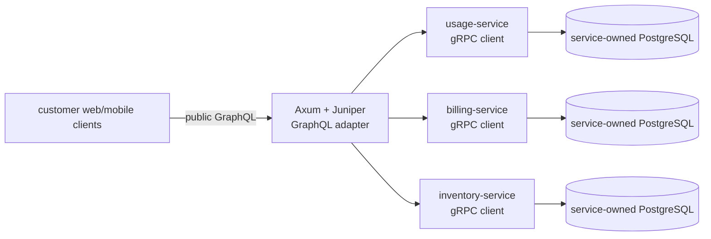

## Scenario

**CloudLedger API** gives customer administrators a usage and billing view:
current-period usage, reservation charges, invoice status, and a paginated
event summary. The API is public to authenticated customers and partners. The
source systems remain internal Rust services.



The protocol split is non-negotiable:

- GraphQL is the public API surface.
- gRPC is used only for calls between Rust services.
- Juniper types and generated prost types stay in adapters. Domain crates do
  not become GraphQL or protobuf crates.
- The GraphQL resolver layer translates typed internal results into the public
  schema; it does not expose an internal `.proto` message verbatim.

There is no product screen in this item. A development-only GraphiQL or schema
explorer is not a claimed customer surface, so the design stage is skipped.

## 1. Capture — `tailrocks-idea`

<Invoke
  skill="tailrocks-idea"
  args="a public CloudLedger GraphQL API for customer usage, invoice status, and reservation charge summaries backed by internal Rust services"
/>

The command creates `roadmap/cloudledger-graphql/` as `DRAFT`, registers its
index row, and opens the single item branch and draft PR. It does not decide
the GraphQL schema, authorization model, internal service calls, or pagination.

If a read-only review had already proven a public API defect, such as a
resolver leaking another tenant's usage, the verified finding would enter via
`tailrocks-seed-roadmap` instead. Seed and idea are both capture boundaries;
neither implements.

## 2. Shape public behavior — `tailrocks-brainstorm`

<Invoke skill="tailrocks-brainstorm" args="cloudledger-graphql" />

The interview resolves questions that an API implementation must not guess:

- Is the customer identity always derived from the token, or can an admin
  select an account explicitly?
- Are usage totals eventually consistent, and how is the as-of time exposed?
- Does a missing invoice return `null`, a typed field error, or a top-level
  error?
- Are event connections cursor-based, and what is the maximum page size?
- What happens when one internal gRPC service is unavailable while another
  field is available?
- Which fields are public, partner-only, deprecated, or never exposed?
- Are mutations in scope, or is this release query-only?

“GraphQL should expose whatever the gRPC service returns” is rejected as an
unshaped shortcut. The public schema is a product contract with its own names,
nullability, authorization, error, and deprecation behavior.

## 3. Research — `tailrocks-research`

<Invoke
  skill="tailrocks-research"
  args="cloudledger-graphql: determine the repository-approved Juniper-on-Axum layout, request context, typed errors, subscriptions or streaming policy, and current supported API surface"
/>

<Invoke
  skill="tailrocks-research"
  args="cloudledger-graphql: determine public GraphQL schema evolution, SDL snapshot, breaking-change, deprecation, persisted-operation, depth, and complexity-gate requirements"
/>

<Invoke
  skill="tailrocks-research"
  args="cloudledger-graphql: determine internal gRPC fan-out, deadline propagation, partial failure, batching, and N+1 avoidance patterns for the referenced Rust services"
/>

The resulting topics carry primary sources or repository `file:line` evidence.
Research can compare field-level errors with request failure, data-loader
strategies, or persisted operations. It cannot decide whether customers may
see a disputed field.

## 4. Make the public choices explicit — `tailrocks-record-decision`

<Invoke
  skill="tailrocks-record-decision"
  args="cloudledger-graphql: customer identity comes only from authenticated request context; an account id argument may narrow access but never broaden it, because tenant isolation is a public API invariant"
/>

<Invoke
  skill="tailrocks-graphql-review"
  args="review the proposed public schema boundary read-only before the product decision is recorded; identify whether the field shape would expose internal gRPC types"
/>

The second invocation is a stack review, not a product decision. After its
evidence, record choices one at a time:

<Invoke
  skill="tailrocks-record-decision"
  args="cloudledger-graphql: the first release is query-only and exposes usage totals, invoice status, and reservation charges through stable customer vocabulary; internal service names and IDs are not public fields"
/>

<Invoke
  skill="tailrocks-record-decision"
  args="cloudledger-graphql: a gRPC dependency timeout returns a typed retryable field error where the schema permits partial data, and every outbound call carries the remaining request deadline"
/>

Record-decision propagates these choices into the schema contract, authorization
must-nots, resolver behavior, operation limits, and plan rows. A later decision
that makes a field public reopens the item and stales the affected frozen plan;
it cannot silently mutate a committed SDL snapshot.

## 5. Finalize a service with no screens — `tailrocks-finalize`

<Invoke skill="tailrocks-finalize" args="cloudledger-graphql" />

The readiness interview confirms the public entry points and observable
contract:

- authenticated query with a valid tenant;
- denied cross-tenant account selection;
- empty usage period and missing invoice behavior;
- cursor pagination and maximum page size;
- partial data when one internal service times out;
- stable typed errors and retry classification;
- introspection, persisted-operation, and schema exposure policy;
- deprecation and removal policy for future fields;
- health and readiness behavior for the Axum process and gRPC dependencies.

No visual screen is claimed. Finalize grants READY only after the schema
behavior and open questions are closed; it does not write a GraphQL resolver or
declare an SDL snapshot correct.

## 6. Package the boundary — `tailrocks-plan`

<Invoke skill="tailrocks-plan" args="cloudledger-graphql with --deep" />

The plan makes the public/internal seam executable:

| Slice | Complete path | Main owners |
|---|---|---|
| 001 | Rust workspace, Axum process, GraphQL test harness, gRPC test clients, and positive gates | `tailrocks-rust-project-setup`, `tailrocks-axum-best-practices` |
| 002 | Typed gRPC clients for usage, billing, and inventory with deadlines, status mapping, health, and wire tests | `tailrocks-grpc-best-practices` |
| 003 | Juniper schema, request context, auth boundary, typed public errors, and resolver-to-domain mapping | `tailrocks-graphql-best-practices`, `tailrocks-rust-best-practices` |
| 004 | Batched fan-out/data loading, partial dependency failure, pagination, and operation limits | GraphQL, gRPC, and Rust owners |
| 005 | SDL snapshot, breaking-change gate, deprecation metadata, persisted operations, and generated client types if a web client consumes it | `tailrocks-graphql-best-practices` |
| 006 | Wire-level GraphQL queries, tenant isolation, gRPC deadline tests, readiness, and public contract verification | GraphQL, Axum, and gRPC owners |

The spec has separate registries for public GraphQL entry points and internal
gRPC calls. It requires every public field to cite its product decision and
every resolver to name its internal dependency without copying generated
types into the domain. The command-proof table proves that the SDL and breaking
gate actually inspected a non-empty schema and a real baseline.

Because the service has no visual surface, the item goes directly from READY
to plan. A future customer dashboard would be a separate screen-bearing item
or a linked feature that must run the web design stage.

## 7. Execute the handoff

```text
Follow roadmap/cloudledger-graphql/goal/START.md
```

The executor invokes the stack owners inside each plan slice:

<Invoke skill="tailrocks-graphql-best-practices" args="implement the public Juniper schema on Axum with typed context, tenant-safe resolvers, stable errors, limits, SDL snapshot, and breaking-change gates" />

<Invoke skill="tailrocks-grpc-best-practices" args="implement deadline-bearing tonic clients for usage, billing, and inventory; keep prost types at adapters and map canonical status codes" />

<Invoke skill="tailrocks-axum-best-practices" args="wire the GraphQL HTTP boundary with typed state, ordered Tower policy, request limits, tracing, health, and graceful shutdown" />

<Invoke skill="tailrocks-rust-best-practices" args="implement the public application service and domain mapping with typed failure, no protocol leakage, and bounded fan-out" />

The resolver does not call a database owned by another service and does not
invent a second HTTP API for service-to-service data. It calls the internal
gRPC contracts, translates results into the public schema, and propagates
deadlines. The public SDL and internal `.proto` files evolve under different
compatibility gates.

## 8. Consumer report — `tailrocks-record-feedback`

Partner and customer clients exercise the API:

<Invoke skill="tailrocks-record-feedback" args="cloudledger-graphql" />

```text
verification/01-feedback.md

U1  "The usage query returned another account's total when I changed the
    accountId argument while keeping my token."
U2  "When billing timed out, the whole query failed even though usage data was
    available and the schema says the invoice field may be unavailable."
U3  "The next-page cursor repeated the last event from the previous page."
```

The capture keeps the exact query shape, token fixture identity, request ID,
and expected result if supplied. It does not claim a tenant leak, resolver
policy bug, or pagination algorithm.

## 9. Prove the public contract — `tailrocks-prove`

<Invoke skill="tailrocks-prove" args="cloudledger-graphql with --deep" />

Prove executes the actual public endpoint and internal calls in a safe local
environment:

- valid and invalid tenant queries;
- account narrowing and cross-tenant rejection;
- usage, invoice, and reservation fields with one gRPC dependency unavailable;
- deadline propagation and retryable versus terminal errors;
- cursor pagination and maximum page size;
- persisted-operation acceptance and unknown-operation rejection;
- SDL snapshot and breaking-change checks against the committed baseline;
- health/readiness and graceful shutdown;
- every plan criterion and gate, with positive unit counts.

Possible round results:

- `U1 — CONFIRMED`: resolver trusts a caller-supplied account ID over context;
  the authorization decision is `VIOLATED` and blocks the round.
- `U2 — CONFIRMED`: the resolver turns a field-level dependency error into a
  top-level request failure, contradicting the recorded partial-data choice.
- `U3 — REFUTED`: the bound cursor test returns non-overlapping IDs; the user
  report may describe an older build, which the report records without hiding
  it.
- SDL gate — `VACUOUS`: a selector pointed at an empty schema fixture, so the
  zero inspected fields make the criterion stale.

Prove reports runtime evidence only. It never edits the schema, changes a
status, or marks a public contract safe because a resolver test passed.

## 10. Reconcile and retire — `tailrocks-reconcile`

<Invoke skill="tailrocks-reconcile" args="cloudledger-graphql" />

Reconcile re-earns every row, folds the newest verification report into
`Remaining`, and routes the correct back-edge:

```text
The public resolver can widen tenant access through accountId.
The partial-data contract is not preserved when billing exceeds its deadline.
The SDL compatibility check inspected zero schema fields.
```

The first two statements reopen execution or route a product correction through
record-decision. The third routes to plan because a frozen gate/fixture is
defective. No reconcile pass edits a frozen plan or suppresses a public API
finding.

After a clean verification round, all rows terminal, the goal gate passing, and
`Remaining` empty, reconcile commits `DONE` and immediately retires the item:

```text
delivery/cloudledger-graphql.md  final verified report
roadmap/cloudledger-graphql/     deleted whole
roadmap/README.md                row removed
```

## The protocol boundary in one sentence

Customers speak Juniper GraphQL to the public Axum adapter; Rust services speak
gRPC to one another; resolvers translate between contracts, and neither protocol
is allowed to replace the other.
