The delivery family turns product intent into an executable contract, then turns
execution back into evidence. It exists because a successful build is not proof
that the right behavior shipped: an agent can fill an unanswered product
question with a guess, pass a vacuous test, or leave a finished roadmap folder
claiming a state nobody re-earned.

Ten skills own ten narrow transitions. They are manual-only and must be named
explicitly. Selection grants no implementation, merge, credential, or external
authority beyond the active task.

## The whole flow

```mermaid
flowchart LR
  verified["verified finding or approved standalone plan"] --> seed["tailrocks-seed-roadmap"]
  idea["raw product idea"] --> capture["tailrocks-idea"]
  seed --> draft["DRAFT"]
  capture --> draft
  draft --> brainstorm["tailrocks-brainstorm\nSHAPING"]
  brainstorm <--> research["tailrocks-research\nreusable facts"]
  brainstorm <--> decision["tailrocks-record-decision\nuser choices"]
  brainstorm --> finalize["tailrocks-finalize\nREADY"]
  decision --> finalize
  research --> finalize
  finalize --> design["optional design stage\nblessed reference"]
  design --> plan["tailrocks-plan\nPLANNED + goal/"]
  finalize --> plan
  plan --> execute["goal/START.md\nIN EXECUTION"]
  execute --> feedback["tailrocks-record-feedback\nuser words"]
  feedback --> prove["tailrocks-prove\nverification report"]
  prove --> reconcile["tailrocks-reconcile\nre-earn truth"]
  reconcile -->|open work| execute
  reconcile -->|decision or fact gap| decision
  reconcile -->|research gap| research
  reconcile -->|four retirement conditions pass| done["DONE, then retired\nREPORT.md → delivery/<slug>.md"]
```



There are two entry paths:

- `tailrocks-idea` captures a raw idea. It creates a new DRAFT item and leaves
  unknowns empty so brainstorming can expose them.
- `tailrocks-seed-roadmap` accepts exactly one already-verified finding or
  approved standalone plan. It is the bridge from read-only discovery or
  `plans/` into delivery. It does not approve evidence or implement the fix.

After capture, the main line is:

1. `tailrocks-brainstorm` expands the shape through a live interview.
2. `tailrocks-research` answers lookupable factual questions and stores reusable
   sourced topics. It can run whenever facts are missing.
3. `tailrocks-record-decision` records one choice the user made and propagates
   its consequences. It can reopen work whose intent changed.
4. `tailrocks-finalize` closes screens, flows, must-nots, quality, and open
   questions. It is the only skill that can grant `READY`.
5. A medium design skill runs after READY when a screen has a visual surface:
   `tailrocks-macos-design`, `tailrocks-web-design`, or
   `tailrocks-tui-design`. The user blesses the running reference; the agent
   never blesses its own design.
6. `tailrocks-plan` converts READY intent into a traceable package and a goal
   handoff. It never implements.
7. An executor follows `goal/START.md`, one vertical plan slice at a time.
8. `tailrocks-record-feedback` captures what a user says went wrong.
9. `tailrocks-prove` executes every claimed surface and writes a verification
   report. It never fixes or changes status.
10. `tailrocks-reconcile` re-runs row criteria, rewrites `Remaining`, sets the
    status reality supports, and retires only a fully verified item.

## The ten owners

| Skill | Owns | Writes | Refuses / next hand-off |
|---|---|---|---|
| [`tailrocks-seed-roadmap`](/docs/skills/tailrocks-seed-roadmap) | The evidence-to-delivery boundary | One DRAFT item and index row | Unverified findings, implementation, a second item or PR; next `tailrocks-brainstorm` |
| [`tailrocks-idea`](/docs/skills/tailrocks-idea) | Raw capture | `roadmap/<slug>/README.md` and its index row | Interviewing, research, planning, invented detail; next `tailrocks-brainstorm` |
| [`tailrocks-brainstorm`](/docs/skills/tailrocks-brainstorm) | Divergent shaping | Decisions, vocabulary, flows, screens, must-nots, open questions | Granting READY, deciding for the user, writing code; next research, decision, or finalize |
| [`tailrocks-research`](/docs/skills/tailrocks-research) | Sourced facts and alternatives | Vetted `research/<topic>/` chapters and links | Product choices and one-lookup questions; next decision or finalize |
| [`tailrocks-record-decision`](/docs/skills/tailrocks-record-decision) | One explicit user choice | Dated decision plus propagated changes and stale row markers | Choosing for the user or silently deleting contradicted intent; next brainstorm, finalize, or re-plan |
| [`tailrocks-finalize`](/docs/skills/tailrocks-finalize) | Readiness closure | Confirmed schematic screens, closed flows, and READY | Planning, sizing, answering for the user; next design if visual, otherwise plan |
| [`tailrocks-plan`](/docs/skills/tailrocks-plan) | Executor package | `plan/`, `goal/`, coverage, spec, slices, command proofs, and `PLANNED` | Implementing, planning before READY, pixel truth without a blessed reference; next `goal/START.md` |
| [`tailrocks-record-feedback`](/docs/skills/tailrocks-record-feedback) | User-observed defects | One `verification/NN-feedback.md` with verbatim statements | Diagnosis, judgment, fixing, changing status; next prove |
| [`tailrocks-prove`](/docs/skills/tailrocks-prove) | Runtime evidence | One `verification/NN-report.md` with machine evidence and verdicts | Fixing, status writes, passing unexecuted surfaces; next reconcile |
| [`tailrocks-reconcile`](/docs/skills/tailrocks-reconcile) | Truth synchronization and retirement | Row statuses, `Remaining`, `REPORT.md`, status/index, and retirement | Editing frozen plans or claiming DONE from plan rows alone; next resume, research, decision, re-plan, or retirement |

The key separations are intentional:

- Research reports what the world says. Record-decision records what the
  product owner chooses.
- Finalize grants READY. Plan requires READY.
- Record-feedback records a complaint. Prove executes it and judges it.
- Prove reports evidence. Reconcile changes status.
- Plan files are frozen. A changed requirement goes through
  `tailrocks-record-decision`, marks affected rows stale, and requires a new
  plan package.

## Status machine

An item status is a machine-backed claim about the next safe operation, not a
progress label.

| Status | Meaning | Owner |
|---|---|---|
| `DRAFT` | Captured, but not shaped | `tailrocks-idea` or `tailrocks-seed-roadmap` |
| `SHAPING` | Interview and evidence work is open | `tailrocks-brainstorm`, `tailrocks-research`, or `tailrocks-record-decision` |
| `READY` | Screens, flows, decisions, must-nots, quality, and open questions pass the readiness gate | `tailrocks-finalize` only |
| `PLANNED` | `plan/` and `goal/` are complete, cold-reviewed, and fingerprinted | `tailrocks-plan` |
| `IN EXECUTION` | The executor has started or reconciliation found open work | executor protocol or `tailrocks-reconcile` |
| `DONE` | Every row is terminal, the goal gate passed now, the newest verification round has no blocking defect, and `Remaining` is empty | `tailrocks-reconcile` only; immediately followed by retirement |
| `PARKED (reason; was: STATUS)` | User-owned pause with the previous status preserved | explicit user decision through `tailrocks-record-decision` |

`DONE` is deliberately short-lived. Reconcile writes it in one commit and
retires the item in a second commit during the same invocation. A roadmap folder
left in the tree is unfinished work, even if its header says DONE.

## One item, one folder

Everything that can drift about an unfinished item lives below one path:

```text
roadmap/<slug>/
  README.md              intent, decisions, screens, status, Remaining, Run
  REPORT.md              current verified-accomplishment ledger
  plan/
    README.md            manifest and writable row statuses
    001-<slice>.md       one frozen zero-context plan per slice
    spec/                frozen requirements, screen contracts, decisions
    coverage.md          frozen traceability ledger
    research-gaps.json   planning-time evidence and command-gap manifest
  verification/
    NN-feedback.md       user words, no verdict
    NN-report.md         executed evidence and verdicts
  goal/
    START.md             frozen gates, goal condition, kickoff
    RESUME.md            frozen resume prompt
    check.sh             frozen structural and gate proof
```

Frozen content is fingerprinted by `goal/check.sh`: plan files, `plan/spec/`,
`coverage.md`, `goal/`, and the decisions snapshot cannot be edited to match
what shipped. `README.md`, the manifest row statuses, `REPORT.md`, and
verification rounds are writable because the loop must move them. The item's
live Decisions section is checked against `plan/spec/decisions.md`; a legitimate
decision change therefore produces `decisions-drift` until a re-plan stamps the
new ground.

No parallel item tree exists. Standing factual research lives separately in
`research/<topic>/` because one topic may inform many items. Research stays
after an item retires; item-local plans, evidence, and the item folder do not.

## The delivery Git contract

The first item-capture skill opens branch `roadmap/<slug>` and one draft pull
request. Every later delivery skill writes only its owned artifact paths into
that same lane, commits once with a `Tailrocks-Skill: <name>` trailer, and
updates the PR status line when appropriate. No delivery skill opens a second
PR. The commit series is the item history; artifacts do not grow a Log section.

`tailrocks-research` without a linked item owns a separate
`research/<topic-slug>` lane. Research linked to an item uses the item's lane.
The delivery skills do not merge the PR; the pull-request family performs the
final read-only delivery-artifact checkpoint.

## What plan actually hands the executor

`tailrocks-plan` is not a task list. It creates a contract that a fresh executor
can follow without this conversation:

- `coverage.md` assigns IDs to every capability, screen, flow, must-not,
  entry-point, reference, assumption, and open research question.
- `plan/spec/` holds OpenSpec-style requirements with scenarios, screen
  contracts, the must-not registry, entry points, deferrals, and a verbatim
  decisions snapshot.
- `plan/README.md` contains ordered vertical tracer-bullet slices. Each slice
  crosses the layers it touches and is independently verifiable. Greenfield
  work starts with a baseline slice that proves task runner, build, test, and
  lint commands before feature slices rely on them.
- Every slice has one zero-context plan written and cold-reviewed independently.
  Its done criteria must prove executed work, not only an exit code.
- `goal/START.md` and `goal/RESUME.md` hand the executor the file path, not a
  pasted prompt. Every gate line has the form `<command> ||| <proof>`; the
  proof must show a positive unit count. `check.sh` blocks on dirty trees,
  plan drift, nonterminal rows, failed gates, unproven gates, and vacuous gates.

The executor follows:

```text
Follow roadmap/<slug>/goal/START.md
```

After interruption or a verification round that reopens work:

```text
Follow roadmap/<slug>/goal/RESUME.md
```

## The verification loop

Execution ending with `TAILROCKS GOAL: PASS` proves only that the frozen package
and its gates were accepted. It does not prove the product behaves. The loop is:

1. `tailrocks-record-feedback` records the user's exact words as `U1`, `U2`, …
   and asks only for missing reproduction mechanics.
2. `tailrocks-prove` binds one SHA, inventories every entry point, builds in an
   isolated disposable checkout, executes each surface through the capability
   driver, checks every recorded decision, and audits every done criterion and
   gate for `PROVEN`, `VACUOUS`, or `FAILED` evidence. A surface that could not
   run is `NOT EXECUTED`, never pass.
3. Prove independently refutes both defects and clean verdicts. It writes one
   report and changes no source, plan row, or status.
4. `tailrocks-reconcile` runs the row criteria again, resets abandoned claims,
   retests blockers and assumptions, drift-checks TODO rows, prunes only by
   terminal status, and rewrites `Remaining` as observable open statements.
5. A clean round routes back to execution only when something remains. A
   decision gap routes to record-decision; a fact gap routes to research; a
   frozen plan defect routes to plan.

## Retirement gate

Reconcile retires only when all four conditions are evidenced in the current
pass:

1. every plan row is terminal;
2. `sh roadmap/<slug>/goal/check.sh` passes now;
3. the newest verification report has no blocking defect and no feedback
   statement remains unverified;
4. `## Remaining` is empty because the pass disproved or closed every statement.

The first commit writes `DONE` and the final `REPORT.md`. The second moves that
report to `delivery/<slug>.md`, deletes the whole `roadmap/<slug>/` folder, and
removes its index row. If it was the last item, `roadmap/` and its index go too.
The report survives; standing `research/` topics survive; the unfinished item
does not.

```sh
git log --format='%h %ad %s' --date=short -- roadmap/<slug>/
git show <retiring-commit>^:roadmap/<slug>/README.md
git show <retiring-commit>^:roadmap/<slug>/verification/NN-report.md
```

## Design stage: when a screen exists

`tailrocks-finalize` confirms schematic intent. It does not create pixel truth.
Between READY and planning, the relevant medium owner creates a runnable
reference from typed fixtures on the real substrate:

| Medium | Runnable reference | Bless / freeze | Independent review / audit |
|---|---|---|---|
| macOS | SwiftUI prototype with real Liquid Glass | User signs off on the running app; `tailrocks-macos-visual-baseline` freezes it | `tailrocks-macos-design-review`, `tailrocks-macos-visual-regression` |
| Web | Guarded TanStack Start `/design/<screen>/<state>` routes using shipped components | User blesses in the browser; `tailrocks-web-visual-baseline` freezes it | `tailrocks-web-design-audit`, `tailrocks-web-visual-regression` |
| Terminal | Gallery crate rendering the application's own ratatui view functions | User blesses golden frames; the gallery golden test freezes them | `tailrocks-tui-design-audit` |

No design-tool file is authoritative. A screen with a visual surface and no
blessed reference stops planning. A service with no visual surface skips this
stage and goes directly from READY to plan.

## Four worked scenarios

Each example uses the same ten-owner pipeline but puts risk in a different
place:

- [Native macOS app](/docs/delivery/macos-app) — a SwiftUI/Liquid Glass shell
  over a Rust application core, with a proven FFI boundary and a live visual
  baseline.
- [TanStack Start feature](/docs/delivery/tanstack-feature) — a shadcn/ui
  browser feature backed by strict TypeScript and an Axum HTTP/WebSocket
  service.
- [Internal Rust microservice](/docs/delivery/rust-backend) — a reservation
  service with tonic/prost gRPC, PostgreSQL through the house pool, and
  Schemalane database migrations; no design stage.
- [Public Juniper GraphQL backend](/docs/delivery/graphql-backend) — a public
  GraphQL schema on Axum whose resolvers call internal Rust gRPC services; no
  protocol-role crossover and no design stage.

The examples deliberately show both kinds of unknown. “Which API does the
platform expose?” goes to research. “Should a reservation expire after ten
minutes?” goes to the user through record-decision. The pipeline never makes
the second kind of choice silently.
