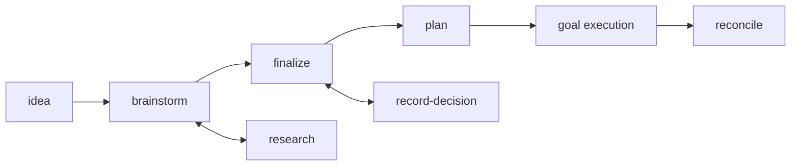

An agent will happily build something from a one-line request. The problem is
never that it refuses — it is that it fills every gap you left with a guess,
and you find out which guesses were wrong after the code exists.

This pipeline exists to move those guesses forward in time, into artifacts you
can read and correct while correcting is cheap. Each skill owns one transition,
writes one kind of artifact, and refuses the work that belongs to its
neighbours.

## The shape



Straight line for the stages. The two below hang off it: research answers
questions that have answers in the world, record-decision captures answers only
you can give. Both run whenever they are needed, at any stage.

## Status is the contract

An item's status is not a label. It is a claim about what is safe to do next,
and exactly one skill may set each value.

| Status | Means | Set by |
|---|---|---|
| `DRAFT` | Raw capture, nothing shaped | `tailrocks-idea` |
| `SHAPING` | Being shaped; open questions remain | `tailrocks-brainstorm`, `tailrocks-research`, `tailrocks-record-decision` |
| `READY` | No open decision-type questions; fit for planning | `tailrocks-finalize`, and nothing else |
| `PLANNED` | `plans/<slug>/` exists with a `GOAL.md` | `tailrocks-plan` |
| `IN EXECUTION` | An executor started the plans | the executor protocol |
| `DONE` | Every plan row done and the goal condition met | the executor protocol |
| `PARKED (reason; was: STATUS)` | Deliberately paused | you, through `tailrocks-record-decision` |

The single most useful rule in the whole pipeline: **only finalize grants
READY, and plan requires READY.** That one gate is what stops an agent
implementing a feature whose behavior nobody has decided yet.

## What each skill owns

| Skill | Owns | Refuses | Writes |
|---|---|---|---|
| [`tailrocks-idea`](/docs/skills/tailrocks-idea) | Capture | Interviewing, researching, planning | `roadmap/<slug>/README.md` in DRAFT, index row |
| [`tailrocks-brainstorm`](/docs/skills/tailrocks-brainstorm) | Expansion | Granting READY; running without a human | Decisions, Vocabulary, Screens, Flows, Must-not |
| [`tailrocks-research`](/docs/skills/tailrocks-research) | Facts | Deciding anything; questions one lookup answers | `research/<topic>/`, reusable and indexed |
| [`tailrocks-record-decision`](/docs/skills/tailrocks-record-decision) | One decision | Deciding on your behalf | The dated decision, plus everything it invalidates |
| [`tailrocks-finalize`](/docs/skills/tailrocks-finalize) | Readiness | Shaping a raw DRAFT; running without a human | READY, or a list of what still blocks it |
| [`tailrocks-plan`](/docs/skills/tailrocks-plan) | Packaging | Implementing; planning an unshaped item | `plans/<slug>/` — ledger, spec, slices, `GOAL.md` |
| [`tailrocks-reconcile`](/docs/skills/tailrocks-reconcile) | Truth | Writing or refreshing plans | Evidence-backed statuses, nothing else |

### Capture without inventing

`tailrocks-idea` writes down what you said and leaves every other section
visibly empty. That emptiness is the point: it is the list of everything nobody
has decided, and it is what the next two skills work through.

```text
Use tailrocks-idea: let people replay a recorded session frame by frame.
```

### Shape by interrogation

`tailrocks-brainstorm` asks one question at a time, always with a recommended
answer, and writes each answer into the item the moment it resolves. It looks
up anything lookup-able itself rather than asking you. Add `--batch` for
numbered rounds when you would rather answer five at once.

```text
Use tailrocks-brainstorm on session-replay.
```

### Separate facts from choices

The distinction the pipeline is built around:

- **A question with an answer in the world** — what the codec supports, what the
  standard mandates, what the platform allows — goes to `tailrocks-research`.
  It writes a sourced, reusable topic under `research/`, linked to the item and
  to any other item that needs the same fact later.
- **A question with no answer until someone chooses** — what the product should
  do, what trade-off is acceptable — goes to you, and the answer comes back
  through `tailrocks-record-decision`.

Confusing the two is the most common way a shaping session stalls. An agent
that "decides" a product question has invented a requirement; an agent that
asks you what a specification already says is wasting your attention.

```text
Use tailrocks-research on session-replay: how do browsers throttle timers in
background tabs, and what does that mean for playback accuracy?

Use tailrocks-record-decision on session-replay: replay is read-only and can
never mutate the recorded session, because a corrupted recording is
unrecoverable evidence.
```

Record-decision earns its place at the far end of the pipeline too. Change your
mind about a PLANNED or DONE item and it does not merely edit a paragraph: it
walks the item, reopens it to SHAPING, and marks every affected plan row
`STALE` so nothing downstream is executed against an intent that no longer
holds.

### Earn READY, do not declare it

`tailrocks-finalize` runs the closing interview: every screen confirmed as a
schematic mockup, the primary flow walked end to end, and every open question
resolved, deferred with a reason, or reclassified as researchable. READY is
granted only when the whole readiness checklist passes — and it is the only
skill that can grant it.

```text
Use tailrocks-finalize on session-replay.
```

### Package for an executor who was not there

`tailrocks-plan` is the largest step, and the one that makes agent execution
predictable. It produces:

- **`coverage.md`** — every screen, capability, flow, must-not, reference,
  assumption, and open question gets an ID (`S#`, `F#`, `W#`, `N#`, `B#`, `D#`,
  `R#`, `A#`, `Q#`). Nothing in the item is silently dropped.
- **`spec/`** — requirements in OpenSpec grammar with scenarios, screen
  contracts per mockup, and a must-not registry.
- **A sliced manifest** — vertical tracer-bullet slices, each a complete path
  through every layer it touches, sized to one fresh executor session. In a
  greenfield chain, slice 001 stands up the verification baseline — task runner,
  build, test, lint all green on an empty skeleton — before any feature slice,
  so later slices can rely on commands that already exist.
- **One zero-context plan per row**, each written by its own subagent and then
  read by a fresh-context reviewer who has only that plan and the repository.
  If the reviewer cannot execute it without asking a question, it is not done.
- **`GOAL.md`** — a machine-checkable goal condition, a kickoff prompt, and a
  resume prompt, all copy-pasteable.

```text
Use tailrocks-plan on session-replay with --deep.
```

`--deep` adds a completeness critic that reslices until a round surfaces
nothing load-bearing. Worth it for anything you will not be watching.

### Trust nothing after a stall

When a goal loop finishes, stalls, or the repository moves underneath it,
`tailrocks-reconcile` re-runs each DONE row's own done criteria rather than
believing the status, resets rows abandoned by dead sessions, retests BLOCKED
reasons and `A#` assumptions, and drift-checks TODO plans against HEAD. It
writes statuses and nothing else.

```text
Use tailrocks-reconcile on session-replay.
```

## Where the stack skills plug in

The delivery skills decide **what** and **in what order**. They never encode how
to write Swift, Rust, or TypeScript — that is what the stack skills are for, and
mixing the two would put language policy in a roadmap item where nobody looks
for it.

They meet in two places:

1. **During shaping**, a design skill produces the artifacts the item points at.
   `tailrocks-macos-design` writes the experience brief and native component
   map; the roadmap item's Screens section references them rather than
   re-describing them.
2. **During planning**, `tailrocks-plan` names the stack skill each slice must
   be executed under, and its verification research produces the exact gate
   commands. The executor then invokes that skill while implementing the slice.

Two worked examples follow the whole route:

- [A native macOS app](/docs/delivery/macos-app) — Rust core, SwiftUI and
  Liquid Glass interface, six macOS skills and two Rust skills across seven
  delivery stages.
- [A TanStack feature with a Rust backend](/docs/delivery/tanstack-feature) —
  one feature of an existing product, TypeScript in the browser, Axum behind it.

## Which skill now?

| You have | Reach for |
|---|---|
| A thought you do not want to lose | `tailrocks-idea` |
| A DRAFT and half an hour | `tailrocks-brainstorm` |
| A question with a factual answer | `tailrocks-research` |
| An answer only you could give | `tailrocks-record-decision` |
| A shaped item and no open questions | `tailrocks-finalize` |
| READY, and no intention of babysitting the build | `tailrocks-plan` |
| A loop that stopped, or a repository that moved | `tailrocks-reconcile` |

## Common mistakes

- **Planning a SHAPING item.** The plan will be built on guesses, and the guesses
  will be invisible because they will read like requirements. Finalize first.
- **Skipping finalization because "it's obvious".** Unresolved decisions cannot
  become assumptions. What is obvious to you is a coin flip to the executor.
- **Hand-editing a stale plan.** Record the change through
  `tailrocks-record-decision`, then re-run `tailrocks-plan`. Editing by hand
  leaves the ledger, the spec, and the plan disagreeing.
- **Resuming an interrupted loop on trust.** Reconcile first. A row that says
  DONE after a dead session is a claim, not evidence.
- **Treating PARKED as terminal.** It records what it was paused from
  (`was: STATUS`) and resumes explicitly through record-decision.
- **Asking one skill to do its neighbour's job.** Brainstorm cannot grant READY,
  research cannot decide, plan cannot implement, reconcile cannot re-plan. Each
  refusal is load-bearing.
