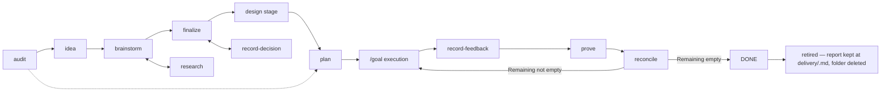

An agent will happily build something from a one-line request. The problem is
never that it refuses — it is that it fills every gap you left with a guess,
and you find out which guesses were wrong after the code exists.

This pipeline exists to move those guesses forward in time, into artifacts you
can read and correct while correcting is cheap. Each skill owns one transition,
writes one kind of artifact, and refuses the work that belongs to its
neighbours.

Every invocation on this page is written for the client you pick here, and the
choice follows you across the documentation.

## The shape



A line up to execution, and a loop after it. The two below hang off the line:
research answers questions that have answers in the world, record-decision
captures answers only you can give. Both run whenever they are needed, at any
stage.

The loop is the part most pipelines are missing. An executor that ran out of
plan rows has proven it did the work, not that the work behaves — so what
shipped gets used, what the user hit gets captured verbatim, an agent executes
the thing and judges it, and whatever is still wrong comes back as remaining
work. `DONE` is on the far side of a round that found nothing blocking.

And it is the far side of the board too. `DONE` is a transition, not a
resting place: the same reconcile invocation that writes it deletes the
item's folder and its index row. The healthy steady state of `roadmap/` is
empty — [delivered work leaves the tree](#delivered-work-leaves-the-tree).

Audit sits before the line rather than on it. You reach for it when there is no
idea to capture yet — a repository you inherited, a branch about to become a
pull request — and it seeds the line at one of two points: a DRAFT item when
the finding still has an open product question, or a `roadmap/<slug>/plan/`
package directly when it does not (the dotted edge).

## One item, one folder

Everything about an item lives under `roadmap/<slug>/` — the item itself, the
plan package, every verification round, the goal handoff. There is no parallel
tree to keep in step:

```text
roadmap/<slug>/
  README.md              the item — intent, decisions, status        writable
  REPORT.md              verified-accomplishment ledger              writable
  plan/
    README.md            manifest: one row per plan, with status      writable
    001-<name>.md ...    zero-context plans                           FROZEN
    spec/                requirements, screen contracts, must-nots,
                         decisions.md (the item's Decisions,
                         snapshotted at planning time)                FROZEN
    coverage.md          the traceability ledger                      FROZEN
  verification/
    NN-feedback.md       what the user reported, verbatim             writable
    NN-report.md         what execution proved                        writable
  goal/
    START.md             the kickoff prompt an executor is handed     FROZEN
    RESUME.md            the resume prompt                            FROZEN
    check.sh             the machine gate                             FROZEN
```

**Frozen means fingerprinted.** `goal/check.sh` hashes every FROZEN file and
returns `BLOCKED plan-drift` when one changes, so the contract an executor was
handed cannot be edited to match what shipped. Everything the loop must move —
the item, the manifest's status rows, each verification round — sits outside
that hash by design. Re-planning is how a frozen file changes; editing it is
not. The item's Decisions stay writable, so they are fingerprinted by proxy:
`spec/decisions.md` snapshots them at planning time, and `check.sh` answers
`BLOCKED decisions-drift` when the live section no longer matches. A decision
is still changeable at any time through `tailrocks-record-decision` — but
never silently: the gate fires until a re-plan re-stamps the snapshot.

**One item, one branch, one pull request.** `tailrocks-idea` opens
`roadmap/<slug>` and its draft PR at capture, and every later skill commits
into that same lane under a `Tailrocks-Skill` trailer naming it. No artifact
carries a history section: the commit series is the history.

## Delivered work leaves the tree

A folder under `roadmap/` is work that is **not finished**. When an item is
genuinely complete — every plan row terminal, the goal condition passing, the
latest verification round carrying no blocking defect, and `## Remaining`
empty — `tailrocks-reconcile` writes `DONE` and then retires the item:
`roadmap/<slug>/` is deleted whole, item, `plan/`, `verification/`, `goal/`,
and assets alike, and its index row goes with it. One artifact stays in the
tree: `REPORT.md`, the ledger of what the rounds proved, moves to
`delivery/<slug>.md` in the retiring commit — and `delivery/` is never
deleted, so "what did this pipeline ship, proven" always has a live answer.
Two commits in one
invocation, so a reviewer sees the item reach `DONE` and then be retired in
the same pull request. When the last item goes, `roadmap/README.md` and
`roadmap/` go too — an index of nothing is a leftover, not a board.

Nothing is lost, because nothing was ever stored only in the tree:

```sh
git log --format='%h %ad %s' --date=short -- roadmap/<slug>/   # what happened
git show <commit>^:roadmap/<slug>/README.md                    # the item as it stood
```

The reason is the one that removed the item's Log section. An item that stays
after its work shipped is a document nobody updates and everybody
half-trusts — the state that let one real delivery read
`BLOCKED — only release remains` while four of its capabilities were pending
and its pull request headlined them as delivered.

[`tailrocks-merge-pr`](/docs/skills/tailrocks-merge-pr) holds the line at the
merge: it refuses a pull request whose item says `DONE` while the folder is
still present, and refuses one whose folder was deleted while its latest
verification round still carried a blocking defect. The gate is read-only —
merge-pr never writes a delivery artifact; it reports which one is wrong and
sends you back to reconcile.

## Status is the contract

An item's status is not a label. It is a claim about what is safe to do next,
and exactly one skill may set each value.

| Status                         | Means                                                                                                                                                                         | Set by                                                                    |
| ------------------------------ | ----------------------------------------------------------------------------------------------------------------------------------------------------------------------------- | ------------------------------------------------------------------------- |
| `DRAFT`                        | Raw capture, nothing shaped                                                                                                                                                   | `tailrocks-idea`                                                          |
| `SHAPING`                      | Being shaped; open questions remain                                                                                                                                           | `tailrocks-brainstorm`, `tailrocks-research`, `tailrocks-record-decision` |
| `READY`                        | No open decision-type questions; fit for planning                                                                                                                             | `tailrocks-finalize`, and nothing else                                    |
| `PLANNED`                      | `roadmap/<slug>/plan/` and `goal/` exist                                                                                                                                      | `tailrocks-plan`                                                          |
| `IN EXECUTION`                 | An executor started the plans                                                                                                                                                 | the executor protocol, and `tailrocks-reconcile` when truing up           |
| `DONE`                         | Every plan row terminal, the goal condition met, **and the last verification round found no blocking defect**. Terminal and short-lived: the same invocation retires the item | `tailrocks-reconcile`, and nothing else                                   |
| `PARKED (reason; was: STATUS)` | Deliberately paused                                                                                                                                                           | you, through `tailrocks-record-decision`                                  |

The single most useful rule in the whole pipeline: **only finalize grants
READY, and plan requires READY.** That one gate is what stops an agent
implementing a feature whose behavior nobody has decided yet.

The rule at the other end is its mirror: **`DONE` is never claimed from plan
rows.** An executor that finished every row reports a `TAILROCKS GOAL: PASS`
and stops; it is `tailrocks-reconcile`, reading a verification round that found
no blocking defect, that writes the status — and then deletes the folder it
just certified.

Its companion covers the interface: **plan requires a blessed design
reference for every screen with a visual surface**, produced in the
[design stage](#the-design-stage) between READY and planning. Behavior
decided, pixels undecided is the other way an implementer ends up guessing.

## What each skill owns

| Skill                                                                 | Owns                          | Refuses                                         | Writes                                                                                                                                                                              |
| --------------------------------------------------------------------- | ----------------------------- | ----------------------------------------------- | ----------------------------------------------------------------------------------------------------------------------------------------------------------------------------------- |
| [`tailrocks-audit`](/docs/skills/tailrocks-audit)                     | Cold start                    | Editing source; reporting an unverified finding | DRAFT items pre-filled with evidence, or `roadmap/<slug>/plan/` directly                                                                                                            |
| [`tailrocks-idea`](/docs/skills/tailrocks-idea)                       | Capture                       | Interviewing, researching, planning             | `roadmap/<slug>/README.md` in DRAFT, index row                                                                                                                                      |
| [`tailrocks-brainstorm`](/docs/skills/tailrocks-brainstorm)           | Expansion                     | Granting READY; running without a human         | Decisions, Vocabulary, Screens, Flows, Must-not                                                                                                                                     |
| [`tailrocks-research`](/docs/skills/tailrocks-research)               | Facts                         | Deciding anything; questions one lookup answers | `research/<topic>/`, reusable and indexed                                                                                                                                           |
| [`tailrocks-record-decision`](/docs/skills/tailrocks-record-decision) | One decision                  | Deciding on your behalf                         | The dated decision, plus everything it invalidates                                                                                                                                  |
| [`tailrocks-finalize`](/docs/skills/tailrocks-finalize)               | Readiness                     | Shaping a raw DRAFT; running without a human    | READY, or a list of what still blocks it                                                                                                                                            |
| [`tailrocks-plan`](/docs/skills/tailrocks-plan)                       | Packaging                     | Implementing; planning an unshaped item         | `roadmap/<slug>/plan/` and `goal/` — ledger, spec, slices, START/RESUME, `check.sh`                                                                                                 |
| [`tailrocks-record-feedback`](/docs/skills/tailrocks-record-feedback) | Capture of what shipped wrong | Judging, investigating, or fixing a report      | `verification/NN-feedback.md` — the user's words, one statement per defect                                                                                                          |
| [`tailrocks-prove`](/docs/skills/tailrocks-prove)                     | Execution as evidence         | Writing status; fixing what it finds            | `verification/NN-report.md` — a verdict per statement, per recorded decision, and per plan row                                                                                      |
| [`tailrocks-reconcile`](/docs/skills/tailrocks-reconcile)             | Truth, and retirement         | Writing or refreshing plans                     | Evidence-backed statuses, the item's Remaining, its `REPORT.md` — and, on `DONE`, the report's move to `delivery/<slug>.md` and the deletion of `roadmap/<slug>/` and its index row |

### Find the work before there is a backlog

Every other skill on this page assumes you already know what you want. When you
do not — a repository you inherited, a quarter with no plan, a branch you are
about to open a pull request from — `tailrocks-audit` fans out one subagent per
category, then re-opens every candidate's cited `file:line` itself before the
finding is allowed onto the table. Subagents over-report; the re-derivation is
what makes the output worth reading, and every dropped candidate is reported
with its reason so it does not resurface next run.

Its lanes are addressable one at a time — `security`, `perf`, `ux`, `tui`,
`liquid-glass`, `agent-legibility` — and `--deep` is a modifier rather than a
mode, so it composes with any of them. The taste lanes carry no taste of their
own: `ux` uses `tailrocks-web-design-audit` to judge against
`tailrocks-web-design`'s blessed screens, `tui`
against `tailrocks-tui-design`'s golden frames, and `liquid-glass` against
`tailrocks-macos-design`'s acceptance gate. Blessing-dependent checks skip
where nothing is blessed; objective defects still run wherever that interface
ships.

<Invoke skill="tailrocks-audit" args="security --deep" />

Two modes sit outside the fan-out. `ask <question>` runs recon plus one targeted
investigation under the same citation discipline, and answers rather than
forcing an artifact. `execute <slug>` hands a `roadmap/<slug>/plan/` package — from a
PLANNED item, or seeded directly with no parent item — to a `bounded-executor`
in a throwaway worktree, then reviews the diff on the `frontier-judgment` route
against the plan's own done criteria. The plan is the product, the diff is a
proposal, and merging stays your call.

### Capture without inventing

`tailrocks-idea` writes down what you said and leaves every other section
visibly empty. That emptiness is the point: it is the list of everything nobody
has decided, and it is what the next two skills work through.

<Invoke skill="tailrocks-idea" args="let people replay a recorded session frame by frame" />

### Shape by interrogation

`tailrocks-brainstorm` asks one question at a time, always with a recommended
answer, and writes each answer into the item the moment it resolves. It looks
up anything lookup-able itself rather than asking you. Add `--batch` for
numbered rounds when you would rather answer five at once. When it closes
with open research questions, it does not leave a vague blob: it emits a
research agenda — grouped, pasteable `tailrocks-research` invocations with
one-line briefs — and any question that cannot be stated precisely becomes a
graduation condition instead, so a fact never silently turns into an
executor's guess.

<Invoke skill="tailrocks-brainstorm" args="session-replay" />

### Separate facts from choices

The distinction the pipeline is built around:

- **A question with an answer in the world** — what the codec supports, what the
  standard mandates, what the platform allows — goes to `tailrocks-research`.
  It writes a sourced, reusable topic under `research/`, linked to the item and
  to any other item that needs the same fact later.
- **A question with no answer until someone chooses** — what the product should
  do, what trade-off is acceptable — goes to you, and the answer comes back
  through `tailrocks-record-decision`.

Confusing the two is the most common way a shaping session stalls. An agent
that "decides" a product question has invented a requirement; an agent that
asks you what a specification already says is wasting your attention.

<Invoke
  skill="tailrocks-research"
  args="session-replay: how do browsers throttle timers in background tabs, and what does that mean for playback accuracy?"
/>

<Invoke
  skill="tailrocks-record-decision"
  args="session-replay: replay is read-only and can never mutate the recorded session, because a corrupted recording is unrecoverable evidence"
/>

Record-decision earns its place at the far end of the pipeline too. Change your
mind about a PLANNED or DONE item and it does not merely edit a paragraph: it
walks the item, reopens it to SHAPING, and marks every affected plan row
`STALE` so nothing downstream is executed against an intent that no longer
holds. The re-plan regenerates `goal/` last and re-stamps the fingerprint — a
frozen file is never patched into agreement.

### Earn READY, do not declare it

`tailrocks-finalize` runs the closing interview: every screen confirmed as a
schematic mockup, the primary flow walked end to end, and every open question
resolved, deferred with a reason, or reclassified as researchable. READY is
granted only when the whole readiness checklist passes — and it is the only
skill that can grant it.

<Invoke skill="tailrocks-finalize" args="session-replay" />

### Package for an executor who was not there

`tailrocks-plan` is the largest step, and the one that makes agent execution
predictable. It produces:

- **`coverage.md`** — every screen, capability, flow, must-not, reference,
  assumption, and open question gets an ID (`S#`, `F#`, `W#`, `N#`, `B#`, `D#`,
  `R#`, `A#`, `Q#`). Nothing in the item is silently dropped.
- **`spec/`** — requirements in OpenSpec grammar with scenarios, screen
  contracts per mockup, a must-not registry, and the item's Decisions
  snapshotted verbatim into `spec/decisions.md` — so a decision that moves
  under the plan trips `check.sh` as `decisions-drift` instead of silently
  rewriting the contract's ground.
- **A sliced manifest** — vertical tracer-bullet slices, each a complete path
  through every layer it touches, sized to one fresh executor session. In a
  greenfield chain, slice 001 stands up the verification baseline — task runner,
  build, test, lint all green on an empty skeleton — before any feature slice,
  so later slices can rely on commands that already exist.
- **One zero-context plan per row**, each written by its own subagent and then
  read by a fresh-context reviewer who has only that plan and the repository.
  If the reviewer cannot execute it without asking a question, it is not done.
- **`goal/`** — `START.md` with the gates block, the machine-checkable goal
  condition, and the kickoff prompt; `RESUME.md` for any interruption; and
  `check.sh`, the gate that hashes the frozen contract, refuses a nonterminal
  row, and refuses a gate that proved nothing.
- **The item's `## Run` section** — the pasteable start and resume blocks,
  written into the item README itself and refreshed on every re-plan, so the
  operator never opens the goal package to find the invocation. A PLANNED
  item with an empty `## Run` is a planning defect.

<Invoke skill="tailrocks-plan" args="session-replay with --deep" />

`--deep` adds a completeness critic that reslices until a round surfaces
nothing load-bearing. Worth it for anything you will not be watching.

### Hand the contract over, do not paste it

An executor is pointed at the file rather than fed a block — and it does not
have to find the file: the item's own `## Run` section carries both
invocations, pasteable as-is:

```text
/goal Follow roadmap/session-replay/goal/START.md
```

After a stall, a dead session, or a verification round that put work back on
the board, the same move with `goal/RESUME.md`.

A host that can run parallel executor sessions may work plans with disjoint
in-scope path sets concurrently — each in its own git worktree off the item
branch, the manifest's status rows written by the orchestrating session
alone, worktrees merged back one at a time with done criteria and gates
re-run. Planning keeps slice scopes disjoint wherever the design allows for
exactly this; unavoidable overlaps are recorded in the hub as forced
sequences. Sequential execution remains the default and is always correct.

Every line in `START.md`'s gates block is `<command> ||| <proof>`. The command
has to exit 0 and the proof has to print how many units it executed — tests
run, targets built, files checked. That second half exists because
`cargo test -p typo` exits 0 having run nothing, and a gate that cannot tell
"everything passed" from "nothing ran" is not a gate. `check.sh` returns
`BLOCKED gate-vacuous` when a proof prints zero and `BLOCKED gate-unproven`
when the `|||` is missing.

### Find out what it is actually like to use

`TAILROCKS GOAL: PASS` says the rows are terminal, the frozen contract is
unedited, and every gate both succeeded and executed work. It says nothing
about whether the thing is any good, so the loop does not end there.

`tailrocks-record-feedback` writes down what you hit while using it, before
anything argues with it: your words verbatim, one statement per defect
(`U1`, `U2`, …), the reproduction as given. It does not investigate, judge, or
fix — a report the agent has already dismissed never gets executed against, and
"it just doesn't work" is a real datum.

<Invoke skill="tailrocks-record-feedback" args="session-replay" />

`tailrocks-prove` is the half that judges, and it judges by **executing**. It
fans out subagents that launch the entry point, walk the real flows, drive the
real interface, and compare the shipped screens against the blessed design
reference. Every verdict cites a command that ran in this session and the
output line that decided it; a surface it could not run is reported
`NOT EXECUTED` with the obstacle, never as passing. One agent checks every
recorded decision — `HELD`, `VIOLATED`, or `NOT VERIFIABLE` — and a violated
decision blocks the round like a blocking defect, because the artifact broke
a choice you made and nobody re-opened. It also audits the item's
own proofs — a done criterion or gate that certified a row without exercising
it comes back `VACUOUS`, which is usually the reason the defect shipped.

<Invoke skill="tailrocks-prove" args="session-replay" />

It writes no status: blocking defects route to `tailrocks-reconcile`, and any
finding that a _skill_ let the divergence through routes to
[`tailrocks-retrospect`](/docs/skills/tailrocks-retrospect).

### Trust nothing after a stall, and close the round

When a goal loop finishes, stalls, or the repository moves underneath it,
`tailrocks-reconcile` re-runs each DONE row's own done criteria rather than
believing the status, resets rows abandoned by dead sessions, retests BLOCKED
reasons and `A#` assumptions, and drift-checks TODO plans against HEAD.

It is also what closes a verification round: it prunes the rows the round
confirmed, rewrites the item's **Remaining** — what is not done yet, as
observable statements — from the blocking defects, moves what the round
proved into `REPORT.md` with its evidence, and writes the status a round
earned. What execution cannot close gets tagged instead of dropped:
`(needs-decision: …)` routes to `tailrocks-record-decision`,
`(needs-research: …)` to `tailrocks-research`. A round with a blocking defect
sends the item back to `IN EXECUTION` with that defect as the remaining work;
a round with none is the only way to `DONE`. Every close-out names the
back-edge explicitly — resume, re-plan, record-decision, brainstorm, or
research — so you always know the next command.

<Invoke skill="tailrocks-reconcile" args="session-replay" />

Then back to execution with `goal/RESUME.md`, and around again until Remaining
is empty.

### Retire the item in the same breath

The one round that ends differently is the last one. When reconcile writes
`DONE`, it commits that status and then, in a second commit in the same
invocation, deletes `roadmap/session-replay/` whole and removes its index
row:

```text
commit 1  ~ roadmap/session-replay/README.md   Status: DONE, Remaining empty
          ~ roadmap/README.md                  DONE
commit 2  - roadmap/session-replay/            item, plan/, verification/, goal/
          ~ roadmap/README.md                  row removed
```

Two commits rather than one because the pull request has to show both: that
the item earned `DONE` on evidence, and that the folder then went. One
squashed commit would show only an absence, and an absence is what a
mistaken deletion looks like too.

If that was the board's last row, `roadmap/README.md` and `roadmap/` go with
it. An empty `roadmap/` is not a pipeline that stalled — it is a pipeline
with nothing outstanding, which is the state you are aiming at.

## Where the stack skills plug in

The delivery skills decide **what** and **in what order**. They never encode how
to write Swift, Rust, or TypeScript — that is what the stack skills are for, and
mixing the two would put language policy in a roadmap item where nobody looks
for it.

They meet in two places: the design stage, and planning.

### The design stage

Between READY and planning — and this is where interfaces get prototyped.
`tailrocks-finalize` grants READY on schematic mockups: layout intent, never
pixel truth. The medium's design skill then builds the interface for real, on
the real UI substrate, from fixture data — that running artifact **is** the
prototype, and after you bless it, it is the reference the implementation is
measured against. `tailrocks-plan` refuses a screen contract that cites none.

One skill per medium, one owner per stage — each platform prototypes in its
own skill:

| Medium                      | Prototype built as                                                         | design                   | bless                                                  | freeze                                   |
| --------------------------- | -------------------------------------------------------------------------- | ------------------------ | ------------------------------------------------------ | ---------------------------------------- |
| Terminal (Rust, ratatui)    | A gallery crate rendering the application's own view functions             | `tailrocks-tui-design`   | `tailrocks-tui-design`                                 | `tailrocks-tui-design` — the golden test |
| Web (TanStack, shadcn/ui)   | Guarded `/design/...` routes in the real app, blessed live in the browser  | `tailrocks-web-design`   | `tailrocks-web-design`                                 | `tailrocks-web-visual-qa`                |
| macOS (Swift, Liquid Glass) | A running Liquid Glass prototype app — the material only exists at runtime | `tailrocks-macos-design` | `tailrocks-macos-design` — sign-off on the running app | `tailrocks-macos-visual-qa`              |

**Design** authors the prototype on the real substrate from fixtures. **Bless**
is the user's recorded sign-off; an agent never blesses its own output.
**Freeze** takes the mechanical baseline. **Audit** checks an implementation
against the blessed reference. The prototype is real code on the real
substrate — never a design-tool file — so the view layer lifts into
production verbatim, and "matches the design" is a mechanical check from then
on. On macOS the Liquid Glass material authority lives inside
`tailrocks-macos-design` — it is the rulebook the design and prototype stages
consult, not a stage of its own.

An item whose screens have no visual surface skips the stage and goes straight
to planning. An item that skips it with screens that do have one stops at
`tailrocks-plan`, which names the screens and the skill rather than guessing
pixels on the implementer's behalf.

### Planning

`tailrocks-plan` names the stack skill each slice must be executed under, and
its verification research produces the exact gate commands — with the proof
expression that says how many units each one ran. The executor then invokes
that skill while implementing the slice, and `tailrocks-prove` invokes the
medium's verification skill afterwards to hold the shipped interface to the
blessed reference.

Three worked examples follow the whole route:

- [A native macOS app](/docs/delivery/macos-app) — Rust core, SwiftUI and
  Liquid Glass interface, the macOS and Rust skills across the whole delivery
  loop.
- [A TanStack feature with a Rust backend](/docs/delivery/tanstack-feature) —
  one feature of an existing product, TypeScript in the browser, Axum behind it.
- [A Rust service end to end](/docs/delivery/rust-backend) — gRPC between
  services, GraphQL as the public API, and the stage that correctly never
  runs: design, because no screen exists.

## Which skill now?

| You have                                                                                            | Reach for                   |
| --------------------------------------------------------------------------------------------------- | --------------------------- |
| A repository and no backlog, or a branch about to become a PR                                       | `tailrocks-audit`           |
| A thought you do not want to lose                                                                   | `tailrocks-idea`            |
| A DRAFT and half an hour                                                                            | `tailrocks-brainstorm`      |
| A question with a factual answer                                                                    | `tailrocks-research`        |
| An answer only you could give                                                                       | `tailrocks-record-decision` |
| A shaped item and no open questions                                                                 | `tailrocks-finalize`        |
| READY, and no intention of babysitting the build                                                    | `tailrocks-plan`            |
| Something wrong with what shipped, in your own words                                                | `tailrocks-record-feedback` |
| A need to know whether it actually works, not whether it built                                      | `tailrocks-prove`           |
| A loop that stopped, a repository that moved, a round to close, or an item that is finally finished | `tailrocks-reconcile`       |

## Common mistakes

- **Planning a SHAPING item.** The plan will be built on guesses, and the guesses
  will be invisible because they will read like requirements. Finalize first.
- **Skipping finalization because "it's obvious".** Unresolved decisions cannot
  become assumptions. What is obvious to you is a coin flip to the executor.
- **Hand-editing a stale plan.** Record the change through
  `tailrocks-record-decision`, then re-run `tailrocks-plan`. Editing by hand
  leaves the ledger, the spec, and the plan disagreeing — and `check.sh` will
  say so, because a FROZEN file that moved is `plan-drift`.
- **Reading `PASS` as done.** The gate proves the rows are terminal, the
  contract is unedited, and every gate executed work. Behavior is proven by a
  verification round, and only reconcile writes `DONE`.
- **Filing feedback as a diagnosis.** Capture what you saw in your own words.
  A complaint that arrives pre-explained sends the verification round after the
  explanation instead of after the defect.
- **Resuming an interrupted loop on trust.** Reconcile first. A row that says
  DONE after a dead session is a claim, not evidence.
- **Keeping a DONE folder "for reference".** It has no reader and no writer,
  so it decays into a document everybody half-trusts. Retire it and read
  `git log -- roadmap/<slug>/` when you need it; `tailrocks-merge-pr` refuses
  the merge that would leave it behind.
- **Deleting a folder to make the board look finished.** Retirement is what
  `DONE` earns, not how it is claimed. A folder deleted while its latest
  verification round still names a blocking defect is the same lie in the
  other direction, and the merge gate refuses that one too.
- **Treating PARKED as terminal.** It records what it was paused from
  (`was: STATUS`) and resumes explicitly through record-decision.
- **Asking one skill to do its neighbour's job.** Brainstorm cannot grant READY,
  research cannot decide, plan cannot implement, record-feedback cannot judge,
  prove cannot write a status, reconcile cannot re-plan. Each refusal is
  load-bearing.
