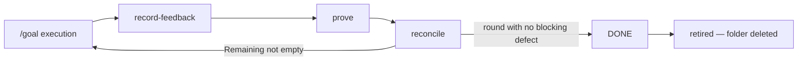

The feature: **Sift**, a macOS app that opens multi-gigabyte log files, indexes
them locally, and lets you scrub a timeline while streaming matches. Parsing,
indexing, and query live in Rust. The window, the chrome, and every pixel live
in SwiftUI with Liquid Glass.

This example is worth walking because the interesting decisions are not in
either language — they are on the boundary between them, and that is exactly
what an agent guesses wrong when you hand it one sentence.

Eighteen skills appear. Nine are the delivery pipeline, eight are the stack
skills it hands work to, and one — `tailrocks-retrospect` — is where the last
round's findings go.

## 1. Capture — `tailrocks-idea`

<Invoke skill="tailrocks-idea" args="a macOS app that opens huge log files fast and lets you scrub a timeline of matches" />

It derives the slug `log-explorer`, writes the item in DRAFT, and leaves
Screens, Flows, Decisions, Must-not, and Quality bar visibly empty.

```text
+ roadmap/log-explorer/README.md   Status: DRAFT
~ roadmap/README.md                index row
```

It also opens the item's lane: the branch `roadmap/log-explorer` and a draft
pull request. Every later delivery skill commits into that same branch and that
same pull request, each commit carrying a `Tailrocks-Skill` trailer naming the
skill that wrote it — which is why no artifact on this page keeps a history
section of its own. The commits are the history.

Resist the urge to fill those sections yourself. Their emptiness is the agenda
for the next step, and anything you write here bypasses the interview that
would have tested it.

## 2. Shape — `tailrocks-brainstorm`

<Invoke skill="tailrocks-brainstorm" args="log-explorer" />

One question at a time, each with a recommendation. The ones that matter for a
two-language app surface early:

- What is "fast"? A number, or the requirement is untestable.
- Does the app ever write to the log file it opened?
- Is an index persisted between launches, or rebuilt each time?
- What happens when the file grows while open — tail it, or freeze the view?
- Does a query run while the index is still building, or wait?

Each answer lands in the item as it resolves. Two categories fall out of this
conversation, and the pipeline routes them differently.

**The split that makes the rest work.** "Should the app tail a growing file?" is
a **decision** — nothing in the world answers it. "Can Swift observe a Rust
stream without blocking the main actor?" is **research** — it has an answer, and
guessing it wrongly costs a rewrite.

## 3. Establish facts — `tailrocks-research`

<Invoke skill="tailrocks-research" args="log-explorer: what are the current options for calling Rust from Swift, and how does each one handle streaming and cancellation?" />

Parallel investigators write vetted chapters into `research/rust-swift-ffi/`,
each claim carrying a primary source or a `file:line`. The topic is registered
in the research index and linked back to the item — and it stays reusable, so
the next macOS app that needs the same answer extends the topic rather than
re-deriving it.

A second topic is worth its own run before any design work:

<Invoke skill="tailrocks-research" args="log-explorer: what does Liquid Glass require of a document-style macOS window, and what is the deployment-target floor for the APIs we would use?" />

```text
+ research/rust-swift-ffi/README.md, 01-*.md …
+ research/liquid-glass-window-chrome/…
~ roadmap/log-explorer/README.md   Research links
```

Status stays SHAPING throughout. Research never advances an item — it only
removes reasons it cannot advance.

## 4. Decide the boundary — `tailrocks-record-decision`

With the FFI research in hand, the shape of the app is now a choice rather than
a guess:

<Invoke skill="tailrocks-record-decision" args="log-explorer: Rust owns parsing, indexing, and query; Swift owns rendering and input only. The interface is a typed snapshot the UI polls, never a callback into Swift, because a callback across the boundary would put Rust threads on the main actor." />

The skill validates it against settled ground, dates it with its reason,
propagates it through the item, and writes the corresponding entries into
Must-not. That reason field matters more than it looks: six weeks later it is
the difference between a constraint and a mystery.

A second one belongs here too, and it is the kind an agent will otherwise decide
for you:

<Invoke skill="tailrocks-record-decision" args="log-explorer: the app opens log files read-only and never writes to them, because a corrupted log is unrecoverable evidence" />

## 5. Design the interface — `tailrocks-macos-design`

Before finalize can confirm screens, the screens have to exist as something
better than a sentence.

<Invoke skill="tailrocks-macos-design" args="design the log explorer. Stop for my alternative selection." />

It produces the experience brief, the information architecture, and the native
component map that classifies every region `NATIVE`, `NATIVE-COMPOSED`, or
`CUSTOM` — then offers structurally different alternatives and stops. The scored
rubric with its hard failures is what keeps "looks fine" from being the
acceptance standard.

The design artifacts live outside the roadmap item; the item's Screens section
points at them. One source per fact.

**One taste authority.** Never run a second skill that also encodes aesthetic
judgement over the same screens. Two owners produce inconsistency between
features rather than an error you can see.

## 6. Prove it runs — `tailrocks-macos-design`'s prototype stage

The approved design is still a document, and no document is authoritative for
Liquid Glass — the operating system is. So before finalize and plan treat these
screens as settled, the design has to exist as something that runs.

<Invoke skill="tailrocks-macos-design" args="prototype log-explorer: build the prototype from the approved design and walk every scenario with me" />

It scaffolds a small SwiftPM executable beside the design artifacts, rendering
the design's own fixture scenarios and nothing else — no parser, no index, no
file I/O. Every prototype answers the same five launch arguments
(`--tr-scenario`, `--tr-appearance`, `--tr-window`, `--tr-reduce`,
`--tr-backdrop`), so a harness can drive this feature's states without knowing
anything about this feature.

Three properties of the stage carry its weight:

- **It is reviewed running, never as images.** You launch it — or the agent
  drives the scenarios in front of you — and judge the real material live. A
  screenshot taken mid-iteration is churn, re-shot on every tweak; this skill
  captures nothing during design and declines when asked to.
- **It encodes no taste.** The prototype reproduces the approved brief, the
  component map, and the contract for every `CUSTOM` region. A gap or
  contradiction found while building it is a design finding that routes back to
  `tailrocks-macos-design`, never something the prototype settles on its own.
- **You sign it off, not the agent.** Every scenario, both appearances, the
  declared sizes — walked live — and then `SIGNOFF.md` records the date and
  the revision of the design artifacts it approved. Until that row is filled
  the prototype binds nobody and the item is still SHAPING ground.

The view layer is production code and it is committed: it lifts verbatim into
the real app at slice 004, and it stays afterwards, because discarding it
forfeits the contract the real app inherits and the ability to ever re-capture
the baseline. `Regions.md` falls out of the same run — every region from the
component map with its class, its match mode, and its budget, custom and content
regions pixel-budgeted, native regions checked structurally, because
pixel-matching a native control rewards a hand-drawn fake over the correct
dynamic one.

```text
+ Design/Prototypes/LogExplorer/Package.swift
+ Design/Prototypes/LogExplorer/Sources/LogExplorerProto/…
+ Design/Prototypes/LogExplorer/Regions.md
+ Design/Prototypes/LogExplorer/SIGNOFF.md
~ roadmap/log-explorer/README.md   Screens: Design pointer per screen
```

After finalization, `tailrocks-macos-visual-qa` drives this same package through
the launch contract and freezes the baseline the implementation is held to.
That is the only capture in the whole stage, and it happens once the design has
stopped moving.

## 7. Earn READY — `tailrocks-finalize`

<Invoke skill="tailrocks-finalize" args="log-explorer" />

The closing interview walks the primary flow — open a file, watch the index
build, run a query mid-build, scrub the timeline — and confirms each screen
against the running prototype its `Design:` line points at, rather than against
a paragraph. Every remaining open question is resolved, deferred with a reason,
or reclassified as researchable.

Expect it to refuse the first time. Typical blockers on this item: no stated
number for "fast", no decided behavior for a query issued against a half-built
index, no answer for what the window shows when the file is unreadable. Those
are three bugs you did not write.

```text
~ roadmap/log-explorer/README.md   Status: READY
```

## 8. Package — `tailrocks-plan`

<Invoke skill="tailrocks-plan" args="log-explorer with --deep" />

This is where the two-language shape stops being a risk. The plan step:

- builds `coverage.md`, giving every screen, capability, flow, must-not,
  assumption, and open question an ID, so nothing in the item goes missing;
- closes gaps with more research — including the exact build, test, and lint
  commands for **both** toolchains, proven rather than assumed;
- writes the spec with screen contracts per mockup and a must-not registry that
  carries the read-only rule and the main-actor rule as enforceable entries;
- slices the work vertically.

The slice list is the part worth studying:

| Slice | What it stands up | Executed under |
|---|---|---|
| — | Not a slice: the signed-off prototype and its `Regions.md`, standing before READY | `tailrocks-macos-design` |
| 001 | Verification baseline: workspace, empty Rust crate, empty app target, Rust-core bridge lane, one task runner, all gates green | `tailrocks-rust-project-setup`, `tailrocks-swift-project-setup`, `tailrocks-swift-rust-core-setup` |
| 002 | Tracer bullet: Rust returns a hardcoded snapshot, Swift renders it, gates still green | `tailrocks-rust-best-practices`, `tailrocks-swift-best-practices` |
| 003 | Real parser and index behind the same snapshot type | `tailrocks-rust-best-practices` |
| 004 | Timeline and results surface: the prototype's view layer over real snapshots, with its Liquid Glass chrome | `tailrocks-macos-design`, `tailrocks-swift-best-practices` |
| 005 | Query during index build, cancellation, error states | both language skills |
| 006 | Rendered verification against the prototype baseline, across appearance and accessibility states | `tailrocks-macos-visual-qa` |

The first row is not a slice. The prototype was signed off before the item
reached READY, so no plan row builds it — it appears in the manifest as what
slice 004 lifts and what slice 006 is measured against.

Two things in that table are not decoration.

**Slice 001 exists because gates cannot be assumed.** A greenfield chain stands
up the task runner, build, test, and lint on an empty skeleton before any
feature work, so every later slice — and every gate in `goal/START.md` — can
reference commands that already pass. In a two-language repository this is the
slice that decides one task runner drives both toolchains, which is why the goal
condition can be a single script.

Passing is not enough on its own. Every gate line is written
`<command> ||| <proof>`, where the proof prints how many units the command
executed:

```text
mise run test  ||| mise run test 2>&1 | grep -Eo '[0-9]+ tests? (run|passed)'
mise run build ||| ls -1 target/release/libsift_core.a .build/release/Sift | wc -l
```

`goal/check.sh` runs the command, then runs the proof and reads the number out
of it: zero is `BLOCKED gate-vacuous`, and a line with no `|||` at all is
`BLOCKED gate-unproven`. One runner fronting two toolchains is exactly where a
test gate exits 0 because it resolved no target on one side, so the gate has to
say how many tests it ran, not only that nothing failed.

**Slice 002 is a tracer bullet, not a layer.** It cuts a complete path through
Rust, the boundary, and SwiftUI while doing almost nothing, so the riskiest
thing in the project — the FFI seam — is proven in the first hour rather than
the last week.

Each plan is written by its own subagent, then read by a fresh-context reviewer
holding only that plan and the repository. Anything the reviewer has to ask
about is a gap in the plan, not a gap in the reviewer.

One item, one folder: the package lands inside `roadmap/log-explorer/` beside
the item, not in a parallel tree. Everything under `plan/` except the manifest
hub, and everything under `goal/`, is frozen — `check.sh` hashes the plans, the
spec, the ledger, and the goal package into the fingerprint the hub carries, and
answers `BLOCKED plan-drift` when one of them changes. What the loop has to move
— the item, the manifest's status rows, each verification round — sits outside
that hash by design.

```text
+ roadmap/log-explorer/plan/coverage.md
+ roadmap/log-explorer/plan/spec/
+ roadmap/log-explorer/plan/README.md      manifest + executor protocol
+ roadmap/log-explorer/plan/001-*.md … 006-*.md
+ roadmap/log-explorer/goal/START.md       gates, goal condition, kickoff prompt
+ roadmap/log-explorer/goal/RESUME.md      resume prompt
+ roadmap/log-explorer/goal/check.sh       the machine gate
~ roadmap/log-explorer/README.md           Status: PLANNED
```

## 9. Execute

The handoff is a file, not a paste. Point your agent's goal execution at it:

```text
/goal Follow roadmap/log-explorer/goal/START.md
```

`START.md` carries the gates, the machine-checkable goal condition, and the
kickoff prompt, so the executor works one plan per iteration, runs every
verification, and commits status writes with the work. After any interruption —
a dead session, a context reset, a week away — the resume prompt has the same
shape:

```text
/goal Follow roadmap/log-explorer/goal/RESUME.md
```

The machine gate is `sh roadmap/log-explorer/goal/check.sh`, run on a clean tree
before any DONE flip and again as the iteration's last act. It answers in one
line: `PASS` with the SHA, or `BLOCKED` naming what stopped it — a dirty tree, a
row that never reached a terminal status, a gate that failed, a gate that proved
nothing, or `plan-drift`, which means the contract the executor was handed no
longer hashes to the fingerprint in the hub.

The stack skills are invoked *inside* execution, named by the slice. Slice 003
is Rust, so the executor works under the Rust skills:

<Invoke skill="tailrocks-rust-review" args="review crates/sift-core: ownership across the index, error and panic policy, and the unsafe boundary. Do not edit." />

Slice 004 is the interface, and it starts from code that already exists: the
prototype's view layer, lifted verbatim. Two skills own different halves of what
happens next — code policy and the material:

<Invoke skill="tailrocks-swift-best-practices" args="implement the timeline view model: actor isolation for the snapshot poller, state ownership, and work kept out of body" />

<Invoke skill="tailrocks-macos-design-review" args="acceptance: review the toolbar and sidebar chrome for layer split and availability. Do not edit." />

Slice 006 proves it:

<Invoke skill="tailrocks-macos-visual-qa" args="verify the timeline screen in light, dark, inactive, and increased-contrast states" />

That last one is not optional decoration. Glass surfaces snapshot fully
transparent from a detached view, so capturing the running app by window ID is
the only verification that means anything for the chrome. It compares against
the baseline frozen from the prototype, region by region as `Regions.md`
declared: custom regions to a pixel budget, native regions through the
accessibility tree instead.

## 10. Report what shipped — `tailrocks-record-feedback`

The loop finishes green. Then you open a real 9 GB nginx access log on your own
machine, and two things are wrong that no gate noticed.

<Invoke skill="tailrocks-record-feedback" args="log-explorer" />

It writes down what you said — your words, one statement per defect — and asks
only for the mechanics a verifier needs to stand where you stood: which file,
which window, which build.

```text
+ roadmap/log-explorer/verification/01-feedback.md

  U1  "I typed a query while the index bar was still moving and got an
       empty list back. Nothing said it was still building."
  U2  "The timeline toolbar goes flat grey the moment the window loses
       focus, and the tick marks go with it."
```

Nothing here investigates, judges, or fixes. A statement that later turns out to
be wrong is recorded anyway, because the fact that you believed it is evidence
about the work — and a defect the agent has already talked itself out of is one
nothing ever executes against. U1 aims straight at a behavior finalize decided
in section 7; U2 is glass chrome, which slice 006 was supposed to have covered.

## 11. Prove it — `tailrocks-prove`

<Invoke skill="tailrocks-prove" args="log-explorer" />

A green suite is a claim about the code paths somebody thought to test. It is
not a claim that the app runs. This skill builds from the bound SHA with the
repository's own commands, then fans out one subagent per surface and starts the
binary: open a file, index it, query mid-build, scrub the timeline, resize the
window, switch appearance. Every verdict cites a command that ran in this
session and the output line that decided it, and a surface that could not be
executed is reported `NOT EXECUTED` with its reason rather than as passing.

The window is judged against the baseline `tailrocks-macos-visual-qa` froze from
the signed-off prototype, captured by window ID from the running app, region by
region as `Regions.md` declared. Then the round audits the item's own proofs,
judging each done criterion and each `goal/START.md` gate by what it executed
rather than by what it exited.

That audit is where U2 stops being a mystery:

- **U1 — CONFIRMED.** A query issued against a half-built index returns an empty
  result set with no partial-state affordance, against the screen contract in
  the spec. Blocking.
- **U2 — WIDER.** Real, and larger than reported: the toolbar and the sidebar
  both fall back to opaque fill in every inactive window, not only on the
  timeline screen. Blocking.
- **Slice 006's inactive-window check — VACUOUS.** It exited 0 having compared
  nothing: the capture matched no window ID, so the comparison ran over an empty
  set. A check that cannot tell "every region matched" from "nothing was
  captured" is how U2 shipped.

```text
+ roadmap/log-explorer/verification/01-report.md   Verdict: BLOCKED
```

Every finding survives one pass that tries to break it before it is written
down, and every surface reported clean gets one attempt to fail the way you
described it. Then the round hands off in two directions and writes no status of
its own: `tailrocks-reconcile` turns it into status and remaining work, and
`tailrocks-retrospect` turns the vacuous check into a proposed patch against the
skill that wrote it — a gate that proves nothing is a skill's fault, not this
item's.

## 12. Reconcile — `tailrocks-reconcile`

<Invoke skill="tailrocks-reconcile" args="log-explorer" />

Run it when the loop finishes, when it stalls, before any resume, and after
every verification round. It re-runs each DONE row's own criteria instead of
trusting the row, resets rows abandoned by dead sessions, retests BLOCKED
reasons and `A#` assumptions, and drift-checks TODO plans against HEAD. A row
whose criteria exit 0 having executed nothing goes back to TODO with its plan
marked `STALE`: the done criterion is the defect, and only `tailrocks-plan` may
rewrite one.

On this item the assumption most likely to fall over is a platform one — an
availability floor that the research topic recorded and a later toolchain update
moved. Reconcile is what turns that from a silent wrong build into a `STALE` row
with a reason.

Then it folds round 01 into the item. The two confirmed defects become the
item's `## Remaining` as observable statements — a query against a building
index says it is building; an inactive window keeps its glass — the item returns
to IN EXECUTION, and the roadmap index's Remaining column carries the count. The
plan rows the round proved are pruned; the rows it broke are reopened. DONE is
reachable only from a round that found no blocking defect, and reconcile is the
only skill that may write it.

So execution is not a line that ends at reconcile. It is a loop that closes:
execute, report what shipped, prove it, reconcile, and back into execution until
Remaining is empty.



The next pass resumes with `/goal Follow roadmap/log-explorer/goal/RESUME.md`,
works the reopened rows, and comes back through feedback and prove again.

## 13. Retire the item — `tailrocks-reconcile`

Round 02 goes the other way. The index-building state now says so in the
window instead of reporting an empty result, the inactive window keeps its
glass, `tailrocks-prove` walks both surfaces against the blessed prototype
sign-off and the frozen captures and finds nothing blocking, and every hub
row is terminal with `goal/check.sh` green in the session.

<Invoke skill="tailrocks-reconcile" args="log-explorer" />

That invocation does two things, and commits them separately. First it writes
the status the evidence earned — `DONE`, with `## Remaining` empty. Then it
retires the item: `roadmap/log-explorer/` is deleted whole, and the index row
goes with it.

```text
commit 1  ~ roadmap/log-explorer/README.md   Status: DONE, Remaining empty
          ~ roadmap/README.md                DONE
commit 2  - roadmap/log-explorer/            README.md, plan/, verification/, goal/
          ~ roadmap/README.md                row removed
```

Everything goes: the item, the coverage ledger, the spec, six zero-context
plans, both verification rounds, and the goal package whose fingerprint kept
them honest. If `log-explorer` was the board's last row, `roadmap/README.md`
and `roadmap/` go with it — an index of nothing is a leftover, not a board.

That deletion is not a loss of the record, because the record was never the
folder — it was the commit series that built it, each commit carrying the
`Tailrocks-Skill` trailer of the skill that wrote it:

```sh
git log --format='%h %ad %s' --date=short -- roadmap/log-explorer/
git show <commit>^:roadmap/log-explorer/README.md
git show <commit>^:roadmap/log-explorer/verification/02-report.md
```

The `git show` lines are how you read any artifact exactly as it stood at any
point in the item's life, including the moment it was retired.
`tailrocks-retrospect` reads that same history to ask which skills let the two
round-01 defects through.

The rule behind it: a folder under `roadmap/` is work that is **not
finished**. Sift is finished, so it has no folder.
[`tailrocks-merge-pr`](/docs/skills/tailrocks-merge-pr) enforces both halves
of that at the merge — a `DONE` item whose folder is still present is
refused, and so is a folder deleted while its latest round still names a
blocking defect.

## 14. When the intent changes

Rewind to the middle of execution. You decide the app should tail growing files
after all. Do not edit the plan: it is fingerprinted, so a hand-edit reads as
`plan-drift` at the next gate rather than as a change of mind.

<Invoke skill="tailrocks-record-decision" args="log-explorer: the app tails a growing file and appends to the index incrementally, because operators watch live deployments" />

That reopens the item to SHAPING, marks the affected plan rows `STALE`, and
leaves everything else intact. Finalize again, then re-run `tailrocks-plan`: it
refreshes the stale rows against the updated item, keeps numbering monotonic,
records the spec delta, and regenerates `goal/` last — re-stamping the frozen
contract fingerprint in the hub so `check.sh` measures the refreshed contract
instead of the one it replaced.

The same route handles a falsified assumption. The executor names the failed
`A#`, record-decision propagates it, the plans that leaned on it go `STALE`, and
plan refreshes them. No hand-editing, no drift between ledger, spec, and plan.

## What the pipeline bought

Look at what was decided before a line of code existed: the FFI shape, the
main-actor rule, the read-only guarantee, the index persistence model, a number
for "fast", and the behavior of a query against a half-built index. Every one of
them is something an agent would otherwise have picked silently — and four of
them are expensive to change once the seam is built.

And look at what the repository carries afterwards: a shipped app, and no
roadmap folder. Every decision, every plan, and both verification rounds are
still recoverable by SHA — they simply stopped being a document that has to be
kept true. That is the trade the pipeline makes at both ends. It pays for the
decisions up front, and it refuses to pay rent on them after they ship.
