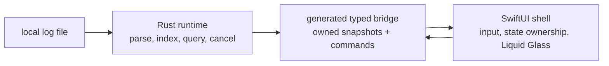

## Scenario

**Sift** is a native macOS incident-response app. An operator opens a multi-
gigabyte log file, watches a local index build, searches while indexing is in
progress, and scrubs matching events on a timeline.

The boundary is fixed before implementation:



Rust owns parsing, indexing, query execution, cancellation, and product
decisions. Swift owns the platform shell, rendering, keyboard/mouse input,
window lifecycle, and narrow Apple capability adapters. Swift does not become a
second business-logic implementation. The app opens files read-only.

This is a greenfield item, so the risk is the Rust/Swift boundary and the fact
that Liquid Glass must be judged in a running macOS window. The example uses
`tailrocks-idea`; a verified implementation finding would enter through
`tailrocks-seed-roadmap` instead.

## 1. Capture — `tailrocks-idea`

<Invoke
  skill="tailrocks-idea"
  args="a native macOS app that opens huge log files, indexes them locally, and lets an operator search and scrub matches"
/>

The capture command derives `log-explorer`, creates only the item and index
row, and leaves decisions, flows, screens, must-nots, and quality visibly
empty:

```text
roadmap/log-explorer/README.md   Status: DRAFT
roadmap/README.md                one index row
```

It also opens branch `roadmap/log-explorer` and one draft PR. No design,
source, `plan/`, or `goal/` file belongs in this step.

## 2. Shape — `tailrocks-brainstorm`

<Invoke skill="tailrocks-brainstorm" args="log-explorer" />

The live interview turns the sentence into decisions the executor can use. It
asks one question at a time and gives a recommendation, for example:

- What does “fast” mean for a 10 GB file: first results, full index, or both?
- Is the opened file ever modified by Sift?
- Can a query return partial matches while the index is still building?
- Does a changed file tail live, restart indexing, or remain a snapshot?
- What does the window show when the file is unreadable or the index is
  cancelled?

Answers are written to the item immediately. `SHAPING` is not permission to
plan; it says unresolved product choices remain.

## 3. Facts versus choices — `tailrocks-research` and `tailrocks-record-decision`

The boundary produces both kinds of unknown.

Research the factual ones:

<Invoke
  skill="tailrocks-research"
  args="log-explorer: compare the repository-approved Rust-to-Swift bridge options for typed snapshots, streaming, cancellation, ownership, and release packaging"
/>

<Invoke
  skill="tailrocks-research"
  args="log-explorer: determine the current macOS Liquid Glass window APIs, availability floor, accessibility behavior, and running-app capture constraints"
/>

Investigators write sourced, vetted chapters under reusable topics such as
`research/rust-swift-bridge/` and `research/liquid-glass-window/`. Research can
report trade-offs; it cannot choose the bridge or the deployment target.

Record choices only after the facts are available:

<Invoke
  skill="tailrocks-record-decision"
  args="log-explorer: Rust owns parsing, indexing, query, and cancellation; Swift owns rendering and input. Cross the boundary with typed snapshots and commands, never callbacks into Swift from worker threads, because UI actor ownership must remain explicit."
/>

<Invoke
  skill="tailrocks-record-decision"
  args="log-explorer: Sift opens log files read-only and indexes a snapshot; it does not mutate or tail a file after open, because incident evidence must remain reproducible."
/>

The skill dates each decision with its reason, propagates it into capabilities,
flows, screens, vocabulary, quality, and must-nots, and records any new open
question. If this decision arrives after planning, affected rows become
`STALE`, the item reopens, and `tailrocks-plan` must re-stamp the package.

## 4. Earn readiness — `tailrocks-finalize`

`tailrocks-finalize` is the only owner of `READY`. It does not require a
pixel-perfect design yet. It confirms schematic screen intent and walks the
primary flow with the user:

<Invoke skill="tailrocks-finalize" args="log-explorer" />

The item must now say what the operator sees in these states:

1. no file open;
2. file selected and indexing;
3. partial results while indexing;
4. query cancelled;
5. query failed or file unreadable;
6. results scrubbed on the timeline;
7. inactive window, dark appearance, increased contrast, and reduced motion.

If “query during indexing” or an error state is still a guess, finalize leaves
the item `SHAPING` and records the gap. It does not grant READY because the
feature sounds obvious.

## 5. Design and bless the running macOS reference

Now the medium design stage runs between READY and planning:

<Invoke skill="tailrocks-macos-design" args="design and prototype log-explorer from the finalized screen states; offer structurally different directions and stop for user selection and live sign-off" />

<Invoke skill="tailrocks-macos-design-review" args="acceptance review of the running log-explorer prototype across the signed-off state matrix; report only, do not bless or edit" />

The design owner creates a real SwiftUI prototype from fixtures, classifies
regions as `NATIVE`, `NATIVE-COMPOSED`, or `CUSTOM`, and makes Liquid Glass
decisions on the running app. The user blesses the live prototype; an agent
cannot bless its own output. A screenshot may document a decision, but it is
not the reference.

The independent design review may return a preliminary or acceptance verdict,
but it never blesses the prototype, captures a baseline, or changes production
source. User sign-off remains the authority that lets the baseline owner freeze
the reference.

The blessed package records:

- the sidebar, toolbar, timeline, results, progress, and error surfaces;
- fixture scenarios for every state above and both appearances;
- the fixed launch contract used by visual verification;
- region match policy: native regions structural, custom regions budgeted;
- accessibility and reduced-motion expectations.

Then freeze the reference:

<Invoke skill="tailrocks-macos-visual-baseline" args="freeze the complete signed-off log-explorer state matrix from the running prototype" />

The baseline is not another design opinion. It is the mechanical input for
later regression checks.

## 6. Package — `tailrocks-plan`

<Invoke skill="tailrocks-plan" args="log-explorer with --deep" />

Planning consumes the finalized item, research, decisions, and blessed
prototype. It builds `coverage.md`, an OpenSpec-style spec, zero-context plans,
the manifest, and the frozen `goal/` handoff. A reasonable slice manifest is:

| Slice | Complete path | Main owners |
|---|---|---|
| 001 | Empty Rust workspace, Swift app target, generated bridge lane, task runner, build/test/lint proofs | `tailrocks-rust-project-setup`, `tailrocks-swift-project-setup`, `tailrocks-swift-rust-core-setup` |
| 002 | Hard-coded Rust snapshot crosses the bridge and renders in the SwiftUI shell | `tailrocks-rust-best-practices`, `tailrocks-swift-best-practices`, `tailrocks-swift-rust-core-boundary` |
| 003 | Real parser and cancellable index produce typed progress and failure | `tailrocks-rust-best-practices`, `tailrocks-swift-rust-core-boundary` |
| 004 | Blessed timeline/results view is lifted over real snapshots and input | `tailrocks-swift-best-practices`, `tailrocks-macos-design` |
| 005 | Query-during-index, cancellation, unreadable-file, accessibility, and lifecycle behavior | Rust and Swift owners; narrow AppKit bridges only where required |
| 006 | Running-window visual and accessibility verification across the signed-off matrix | `tailrocks-macos-visual-regression`, `tailrocks-macos-visual-qa` |

Slice 002 is the tracer bullet. It proves actor isolation, generated types,
snapshot ownership, and a visible frame before a multi-gigabyte parser hides a
boundary defect. Slice 001 proves the commands before any later gate depends on
them. Every gate in `goal/START.md` includes a positive count proof, not only an
exit code.

The item becomes `PLANNED` only after the plans pass fresh-context review and
the package fingerprint is stamped:

```text
roadmap/log-explorer/plan/coverage.md
roadmap/log-explorer/plan/spec/README.md
roadmap/log-explorer/plan/001-*.md … 006-*.md
roadmap/log-explorer/goal/START.md
roadmap/log-explorer/goal/RESUME.md
roadmap/log-explorer/goal/check.sh
```

## 7. Execute the handoff

```text
Follow roadmap/log-explorer/goal/START.md
```

The executor invokes stack owners inside each slice. For example:

<Invoke skill="tailrocks-swift-rust-core-boundary" args="implement the typed snapshot and command boundary for the index tracer bullet; keep Swift a thin platform shell and Rust the application runtime" />

<Invoke skill="tailrocks-rust-best-practices" args="implement cancellable log indexing with typed failure, bounded memory, and no panic on untrusted file input" />

<Invoke skill="tailrocks-swift-best-practices" args="implement the SwiftUI state owner for progress, results, cancellation, and error states; keep work out of body and isolate UI effects" />

<Invoke skill="tailrocks-macos-visual-regression" args="compare the running Sift window against the blessed baseline for light, dark, inactive, increased-contrast, and reduced-motion states" />

The executor uses `goal/RESUME.md` after interruption. It does not edit frozen
plans to make a failing implementation appear compliant.

## 8. Field report — `tailrocks-record-feedback`

After using a 9 GB access log, the operator reports:

<Invoke skill="tailrocks-record-feedback" args="log-explorer" />

```text
verification/01-feedback.md

U1  "I searched while the index bar was moving and got an empty list. The app
    did not say whether there were no matches or the index was incomplete."
U2  "The timeline turns flat grey when the window loses focus and the tick
    marks disappear."
```

The skill preserves those words, adds the file/window/build mechanics needed by
a verifier, and attaches no cause, severity, verdict, or fix.

## 9. Runtime proof — `tailrocks-prove`

<Invoke skill="tailrocks-prove" args="log-explorer with --deep" />

Prove binds one commit, builds in a clean disposable checkout, inventories the
window and its flows, launches the real app, and drives the state matrix. It
also audits every plan criterion and gate for vacuity.

The round might find:

- `U1 — CONFIRMED`: the query adapter returns an empty result while indexing
  and the Swift view has no partial-state indicator. The report cites the
  decisive runtime line and the screen contract.
- `U2 — WIDER`: the inactive Liquid Glass toolbar loses both material and
  timeline tick marks, so the defect covers more than the reported toolbar.
- visual gate — `VACUOUS`: the visual selector ran zero cases after a tag
  rename. Exit 0 is not enough; the zero count makes the plan criterion stale.
- decision lane — `HELD` or `VIOLATED`: the app is checked against read-only
  file behavior and the Rust/Swift ownership decision independently.

Prove writes only `verification/01-report.md`. It never changes the item to
`DONE` and never edits source.

## 10. Close, loop, retire — `tailrocks-reconcile`

<Invoke skill="tailrocks-reconcile" args="log-explorer with --deep" />

Reconcile re-runs completed row criteria, marks the visual row `STALE` if its
gate was vacuous, and rewrites `## Remaining` as observable statements:

```text
The index-in-progress state does not distinguish incomplete results from zero matches.
Inactive-window chrome does not preserve the blessed timeline affordance.
```

The item returns to `IN EXECUTION`; the executor follows `goal/RESUME.md`, fixes
the approved slices, and the feedback/prove/reconcile round repeats. If a
resulting fix requires choosing between partial and delayed search, the item
routes to `tailrocks-record-decision`; if a platform fact changed, it routes to
`tailrocks-research`.

On a clean round, reconcile proves the four retirement conditions, commits
`DONE`, then commits the retirement:

```text
delivery/log-explorer.md       final REPORT.md
roadmap/log-explorer/          deleted whole
roadmap/README.md              row removed
```

The design baseline remains available as a product-owned reference, and the
item's complete history remains recoverable through Git. The Rust core and
SwiftUI shell are delivered together, but neither layer silently owns the
other's responsibility.
