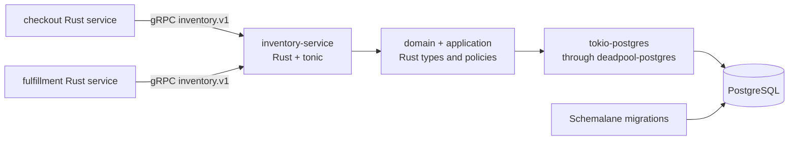

## Scenario

**Inventory Reservation** is an internal service for a commerce platform. The
checkout and fulfillment services ask it to reserve stock, release an
abandoned reservation, and read the current reservation state. It is not a
public API and has no screen.



The service owns reservation invariants and persistence. The `.proto` contract
owns the cross-service wire shape. Generated tonic/prost types stop at the
adapter seam; domain crates do not import them. PostgreSQL is the persistent
storage layer, reached through `tokio-postgres` pooled by `deadpool-postgres`.
`schemalane` (Schemalane) owns the repository's versioned database migration lane.

This is the correct place to show that the design stage is skipped: gRPC
methods and operational surfaces are real entry points, but they are not
visual screens.

## 1. Capture — `tailrocks-idea`

<Invoke
  skill="tailrocks-idea"
  args="an internal inventory reservation service so checkout can reserve stock atomically and fulfillment can release it safely"
/>

The item is created as `roadmap/inventory-reservation/` with `DRAFT` status,
one index row, branch `roadmap/inventory-reservation`, and one draft PR. The
capture deliberately does not choose the reservation TTL, transaction
isolation, proto fields, or migration strategy.

If an existing verified incident had already demonstrated overselling, the
equivalent entry would be `tailrocks-seed-roadmap`; seed accepts that evidence
and creates one DRAFT item, while idea captures a new request.

## 2. Shape the contract — `tailrocks-brainstorm`

<Invoke skill="tailrocks-brainstorm" args="inventory-reservation" />

The interview asks the product and service owners questions such as:

- Is a reservation for one SKU quantity or an order aggregate?
- What happens when stock is insufficient: typed rejection, partial reserve,
  or waitlist?
- How long does a reservation live, and who releases it?
- Are retries safe if the client times out after the database commit?
- Is stock visibility strongly consistent for checkout?
- Which service is allowed to adjust stock, and which is read-only?
- Does a failed migration block startup, or does the service fail closed?

The answers become capabilities, must-nots, flows, and open questions in the
item. A requirement such as “never oversell” is not enough on its own; the
item also needs the observable behavior for a duplicate request, a timeout,
and a database outage.

## 3. Research facts — `tailrocks-research`

<Invoke
  skill="tailrocks-research"
  args="inventory-reservation: determine the repository-approved PostgreSQL transaction, locking, pooling, and idempotency patterns for stock reservation"
/>

<Invoke
  skill="tailrocks-research"
  args="inventory-reservation: determine the supported Schemalane migration workflow, versioning, transactional behavior, application checks, and test-database proof contract"
/>

<Invoke
  skill="tailrocks-research"
  args="inventory-reservation: determine the gRPC compatibility, deadline, health, reflection, and version-migration requirements for the repository's Rust services"
/>

Research writes vetted, reusable chapters. The Schemalane chapter must cite the
repository's actual tool contract and exact commands; this walkthrough does
not invent a CLI spelling or pretend a migration ran. If the tool's rollback
semantics are not supported, that remains an explicit fact and the plan uses a
forward-compatible migration strategy rather than promising rollback.

Research presents options. It does not choose serializable transactions,
reservation expiry, proto versioning, or whether failed startup is fatal.

## 4. Record one decision at a time — `tailrocks-record-decision`

<Invoke
  skill="tailrocks-record-decision"
  args="inventory-reservation: ReserveStock is idempotent by caller-supplied request_id; a retry returns the original result, because a lost response must not create a second reservation"
/>

<Invoke
  skill="tailrocks-record-decision"
  args="inventory-reservation: reservations expire after 15 minutes and a background release path is authoritative, because checkout abandonment must return quantity without requiring a client callback"
/>

<Invoke
  skill="tailrocks-record-decision"
  args="inventory-reservation: database migrations are applied by the repository's Schemalane lane before the service advertises readiness; a migration failure is fail-closed"
/>

The skill validates each user decision against the linked evidence, appends its
date and reason, propagates consequences to the proto behavior, database
requirements, quality bar, and must-nots, and marks affected plan rows stale
if the item was already planned. It does not decide a TTL because an agent
thinks fifteen minutes is conventional.

## 5. Earn READY without inventing screens — `tailrocks-finalize`

<Invoke skill="tailrocks-finalize" args="inventory-reservation" />

Finalize closes the non-visual readiness checklist:

- the `ReserveStock`, `ReleaseReservation`, and `GetReservation` entry points
  have request, response, error, and deadline behavior;
- duplicate requests and client timeouts have a defined result;
- the database invariants, migration precondition, and startup behavior are
  explicit;
- health and reflection exposure are deliberate operational surfaces;
- no user-facing screens are claimed, so the Screens section is empty by
  design;
- open choices are resolved, deferred with triggers, or reclassified as
  research.

There is no macOS, web, or terminal design stage. `READY` goes directly to
planning because no visual surface exists.

## 6. Package the service — `tailrocks-plan`

<Invoke skill="tailrocks-plan" args="inventory-reservation with --deep" />

The plan must cover both the wire contract and the database contract. A
vertical slice sequence could be:

| Slice | Complete path | Main owners |
|---|---|---|
| 001 | Rust workspace, task runner, test/lint gates, ephemeral PostgreSQL harness, and empty service binary | `tailrocks-rust-project-setup`, `tailrocks-rust-best-practices` |
| 002 | Schemalane migration set creates inventory, reservation, idempotency, and release data with a positive apply/verification proof | repository migration lane plus Rust setup owner |
| 003 | Domain reserve/release policies and repository traits with unit and database-backed invariants | `tailrocks-rust-best-practices` |
| 004 | `inventory.v1` proto, tonic server/client adapters, status mapping, deadlines, health, reflection, and wire tests | `tailrocks-grpc-best-practices` |
| 005 | Idempotent reserve, expiry worker, transaction boundaries, and observability | Rust and gRPC owners |
| 006 | Cross-service client contract, migration-from-empty proof, failure injection, and operational entry-point proof | `tailrocks-grpc-best-practices`, Rust project gates |

Planning resolves the exact Schemalane commands during planning and runs each
currently runnable command once. The resulting gate line names the command and
its positive proof count. It does not leave “run migrations” as an unverified
sentence.

The spec keeps generated protobuf types at the gRPC adapter boundary, requires
deadlines on every client call, and maps domain failures to canonical gRPC
status codes. The database spec names uniqueness and ownership constraints as
observable invariants, not as comments in a migration file.

## 7. Execute the handoff

```text
Follow roadmap/inventory-reservation/goal/START.md
```

The executor runs slices under the stack owners:

<Invoke skill="tailrocks-rust-project-setup" args="establish the Rust 2024 workspace, strict gates, ephemeral PostgreSQL test lane, and service package layout" />

<Invoke skill="tailrocks-rust-best-practices" args="implement reservation domain and persistence behavior with typed failure, transaction ownership, no panic on untrusted requests, and measured query behavior" />

<Invoke skill="tailrocks-grpc-best-practices" args="implement inventory.v1 with buf lint/breaking gates, tonic adapters, canonical status mapping, deadlines, health, reflection, and wire-level contract tests" />

The migration slice uses the repository-approved Schemalane command in the
plan, applies migrations to an empty test database, verifies the expected
schema and constraints, and proves the service does not advertise readiness
before that precondition. The executor never hides a failed migration by
editing the test fixture or starting against a schema from another checkout.

## 8. Consumer report — `tailrocks-record-feedback`

Checkout and fulfillment exercise the service and report:

<Invoke skill="tailrocks-record-feedback" args="inventory-reservation" />

```text
verification/01-feedback.md

U1  "Checkout timed out after the reserve call. Retrying the same order made
    the available quantity drop twice."
U2  "The service was healthy in the probe but the first request failed after a
    fresh deploy because the reservation columns were not there yet."
```

The feedback file records the exact request ID, service build, migration
version, and reproduction if supplied. It does not conclude whether U1 is a
client bug or whether U2 is a readiness bug.

## 9. Execute every service surface — `tailrocks-prove`

<Invoke skill="tailrocks-prove" args="inventory-reservation with --deep" />

Prove binds one commit and runs:

- `ReserveStock` twice with the same request ID and once with a new ID;
- timeout and retry behavior with a real client deadline;
- release and expiry against PostgreSQL;
- `GetReservation`, health, and reflection entry points;
- the migration lane from an empty database and the startup readiness guard;
- protobuf wire compatibility and canonical status mapping;
- every plan done criterion and every gate, checking counts for vacuity.

Possible evidence:

- `U1 — CONFIRMED`: the idempotency key is recorded after the reservation row
  is inserted, so the retry creates a second reservation. The decision lane is
  `VIOLATED` as well.
- `U2 — WIDER`: readiness checks only process liveness; the service accepts
  traffic before Schemalane has applied the required version.
- migration proof — `VACUOUS`: a test command exits 0 but applies zero
  migrations because the test database was pre-seeded. The plan row is not
  proven.

The report contains machine receipts, decisive output lines, and `NOT
EXECUTED` reasons for any surface that lacked a safe isolated target. Prove
does not repair the transaction or migration.

## 10. Reconcile, re-plan when needed, retire when earned

<Invoke skill="tailrocks-reconcile" args="inventory-reservation" />

Reconcile re-runs row criteria and rewrites `Remaining` from evidence:

```text
ReserveStock is not idempotent across a lost response and retry.
Service readiness can succeed before the required Schemalane version is applied.
The migration proof does not demonstrate applying work to an empty database.
```

The first and second statements may reopen execution. The third is a frozen
plan/gate defect: reconcile marks the affected row `STALE` and routes back to
`tailrocks-plan`; it does not edit the frozen command. A changed TTL or startup
policy routes through `tailrocks-record-decision`, which also invalidates
affected plans.

When a later round proves all rows, the goal gate, the gRPC surfaces, the
database invariants, and the newest verification report, reconcile writes
`DONE` and then retires:

```text
delivery/inventory-reservation.md  final REPORT.md
roadmap/inventory-reservation/     deleted whole
roadmap/README.md                  row removed
```

## What this example skips

It skips the design family because a gRPC method, health probe, and migration
check are service surfaces, not visual screens. It does not use GraphQL because
this service is internal. A customer-facing API that exposes reservation or
inventory data belongs in the [Juniper GraphQL example](/docs/delivery/graphql-backend)
and calls this service over gRPC.
