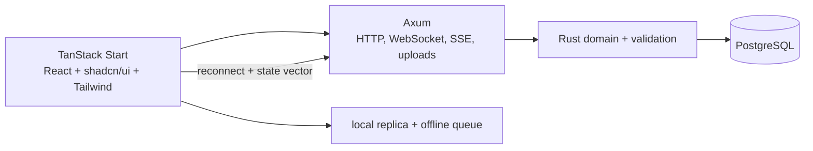

## Scenario

**FieldOps** is an enterprise inspection product. Inspectors use a browser on
unstable job-site networks to complete a checklist, attach evidence, and submit
the inspection. Supervisors watch the inspection board from a desktop browser.

The feature adds an offline-capable inspection runner and a resumable evidence
upload path:



The UI is a thin TypeScript/React shell. Rust owns inspection rules, conflict
classification, server validation, and persistence. Axum owns the HTTP
boundary, WebSocket/SSE lifecycle, body limits, and graceful shutdown. The
feature is an authenticated product surface, not an exported public API; if
this product later exposes a third-party public contract, the public API
decision belongs in the Juniper GraphQL scenario, not in an ad hoc browser
endpoint.

This walkthrough starts from a verified high-risk finding, so it demonstrates
`tailrocks-seed-roadmap`. A new feature idea with no verified evidence would
start with `tailrocks-idea` instead.

## 1. Enter delivery — `tailrocks-seed-roadmap`

A read-only repository audit has already verified this finding:

```text
F-042: the existing inspection client drops staged photo references when a
reconnect races with queue compaction; reproduction and affected paths are in
the approved evidence report.
```

Seed that one finding:

<Invoke
  skill="tailrocks-seed-roadmap"
  args="F-042 from the approved verification report"
/>

Seed checks the evidence identity, current `roadmap/`, `delivery/`, and Git
history for duplicates, then creates exactly one DRAFT item and index row. It
does not implement the queue, create `plan/`, or make a product choice. The
item lane is branch `roadmap/offline-inspection` with one draft PR.

If the request had only been “make inspections work offline,” the correct
entry would have been:

<Invoke skill="tailrocks-idea" args="make FieldOps inspections work offline with evidence that survives reconnect" />

That alternative captures intent and leaves evidence and decisions open. It
does not accept a finding as verified merely because it sounds plausible.

## 2. Shape the feature — `tailrocks-brainstorm`

<Invoke skill="tailrocks-brainstorm" args="offline-inspection" />

The interview turns a bug-shaped request into a product contract. Questions
include:

- Is the checklist editable offline, and which fields are forbidden offline?
- Is a photo reference valid before its bytes upload?
- What is the conflict rule if two devices edit the same inspection?
- Does “submitted” mean locally queued or durably accepted by the server?
- Can a supervisor issue a certificate while evidence is still pending?
- What does the inspector see when local storage is full?

The answer “a certificate must never be issued while an unresolved conflict or
pending required evidence exists” is a user decision. The fact “browser storage
eviction and background-tab scheduling differ by platform” is research. The
interview writes the former into the item and creates the latter as an open
research question.

## 3. Research facts — `tailrocks-research`

<Invoke
  skill="tailrocks-research"
  args="offline-inspection: determine browser storage durability, quota and eviction signals, background scheduling, and the repository-approved local persistence options"
/>

<Invoke
  skill="tailrocks-research"
  args="offline-inspection: compare reconnect protocols for an inspection replica, state-vector backfill, idempotent operations, resumable uploads, and event-stream gaps"
/>

Parallel investigators produce reusable, cited chapters under topics such as
`research/browser-offline-durability/` and `research/resumable-inspection-sync/`.
The topic is linked back to `roadmap/offline-inspection/`; answered factual
questions leave the open-research list, while product choices remain open.

Research does not select CRDT versus operation log, a storage eviction policy,
or a certificate rule. It presents supported directions and trade-offs.

## 4. Lock choices — `tailrocks-record-decision`

After research, the product owner records one choice per invocation:

<Invoke
  skill="tailrocks-record-decision"
  args="offline-inspection: the local replica stores an append-only operation queue and a materialized checklist snapshot; operations carry an idempotency key and are never silently discarded during compaction, because reconnect must be replayable"
/>

<Invoke
  skill="tailrocks-record-decision"
  args="offline-inspection: a certificate is blocked until all required evidence bytes are durably accepted and all conflicts are resolved by the supervisor"
/>

The skill validates each choice against settled ground, dates the reason,
propagates it through capabilities, screens, flows, quality, and must-nots, and
marks a plan row `STALE` if a later reversal invalidates it. It never chooses
between the alternatives for the owner.

## 5. Close readiness — `tailrocks-finalize`

<Invoke skill="tailrocks-finalize" args="offline-inspection" />

The closing interview confirms schematic states and walks the core flow:

1. open an inspection with network access;
2. lose the network and continue editing allowed fields;
3. stage a photo and see `pending upload`, not false “synced”;
4. regain the network and observe idempotent replay;
5. receive a conflict and send it to supervisor adjudication;
6. show a certificate blocked by conflict or pending required evidence;
7. complete adjudication and produce a certificate.

It also confirms the supervisor board, reconnect/error states, keyboard access,
small viewport behavior, and the quality bar for queue durability. A statement
such as “the board should probably show pending uploads” remains an open
decision and prevents READY until resolved, deferred with a reason, or
reclassified as research.

## 6. Design, bless, freeze — web owners

The item is now `READY`, but its schematic screens are not pixel truth. Build
the reference in the real TanStack application:

<Invoke skill="tailrocks-web-design" args="design the offline inspection runner and supervisor board from typed fixtures; include offline, reconnect, conflict, pending-upload, and certificate-blocked states" />

The design route is guarded and renders the same pure screen components that
production uses. The user blesses it live in the browser. Then freeze every
blessed state and viewport:

<Invoke skill="tailrocks-web-visual-baseline" args="freeze the signed-off offline-inspection design routes for light/dark themes and inspector/supervisor viewports" />

`tailrocks-web-design-audit` owns later read-only design review and
`tailrocks-web-visual-regression` compares the running revision against the
bound baseline. No exported design file becomes the source of truth.

## 7. Package vertical slices — `tailrocks-plan`

<Invoke skill="tailrocks-plan" args="offline-inspection with --deep" />

The plan package traces the finding, decisions, screens, flows, and must-nots
into IDs and slices:

| Slice | Complete path | Main owners |
|---|---|---|
| 001 | Existing app gates run with positive counts; conformance fixtures define an inspection operation and validation errors | `tailrocks-typescript-best-practices`, `tailrocks-rust-best-practices` |
| 002 | Offline local replica, durable queue, storage-pressure state, and inspector capture screen | `tailrocks-typescript-best-practices` plus the blessed web components |
| 003 | Axum sync endpoint, idempotent operation ingest, state-vector backfill, and typed error mapping | `tailrocks-axum-best-practices`, `tailrocks-rust-best-practices` |
| 004 | Resumable evidence resource from staged photo to durable acceptance | `tailrocks-axum-best-practices`, Rust domain owner |
| 005 | Supervisor event stream, conflict adjudication, certificate blocking, and board state | Rust and TypeScript owners |
| 006 | Browser flows, accessibility, and visual regression against the blessed routes | `tailrocks-web-visual-regression`, `tailrocks-web-design-audit` |

The slices are vertical: slice 002 provides usable local behavior before the
server exists, slice 003 adds a real reconnect path, and slice 004 proves the
evidence lifecycle rather than hiding it behind a green document-sync badge.
The plan records exact Bun/Oxc, Axum, and database gate commands only after
planning runs each available command once and records a positive proof count.

The item becomes `PLANNED` only when every requirement is covered, each plan is
cold-reviewed, and `goal/check.sh` fingerprints the frozen package.

## 8. Execute — TypeScript UI and Axum boundary

```text
Follow roadmap/offline-inspection/goal/START.md
```

Inside the goal loop, the executor uses the owners named by the slice:

<Invoke skill="tailrocks-typescript-best-practices" args="implement the offline operation queue and inspector state machine with runtime validation, exhaustive state, readonly boundaries, and typed failure" />

<Invoke skill="tailrocks-axum-best-practices" args="implement the sync WebSocket and resumable evidence resource with typed state, ordered Tower policy, body limits, deadlines, and graceful shutdown" />

<Invoke skill="tailrocks-typescript-review" args="review the local replica and reconnect path read-only for async ownership, stale writes, runtime trust, and rollback behavior" />

The browser components stay strict TypeScript 7 with React, TanStack Start,
shadcn/ui, Tailwind v4, Bun, and Oxc. The backend owns authoritative
validation. Client validation is for immediate feedback, never permission to
skip the Rust boundary.

## 9. User report — `tailrocks-record-feedback`

After two weeks in the field:

<Invoke skill="tailrocks-record-feedback" args="offline-inspection" />

```text
verification/01-feedback.md

U1  "The board said the tablet was synced while eight photos still said pending
    upload after the inspector came out of the basement."
U2  "Dyer signed off with a fire door conflict still showing on the other
    tablet, and the certificate printed anyway."
```

The report keeps the operator's words and adds only mechanics such as device,
inspection fixture, network transition, and build SHA. It does not call U1 a
badge bug or U2 a race; that judgment belongs to prove.

## 10. Execute and judge — `tailrocks-prove`

<Invoke skill="tailrocks-prove" args="offline-inspection with --deep" />

Prove builds the bound commit in an isolated checkout and drives every claimed
surface: offline capture, queue restart, reconnect replay, upload resume,
supervisor stream, conflict adjudication, certificate gating, accessibility,
and the frozen visual matrix.

A strong report could say:

- `U1 — WIDER`: the board reports document synchronization only; pending
  evidence has no state at all, so any device with unsent evidence appears
  synced.
- `U2 — CONFIRMED`: certificate generation checks the local replica instead of
  server-ingested conflict state.
- visual gate — `VACUOUS`: the Playwright project selected zero tests after a
  tag rename, so the passing command proves nothing.
- decision lane — `VIOLATED`: the certificate path breaks the explicit
  “required evidence and conflicts” decision.

Every verdict cites a command and decisive output line. A route that cannot run
because a credential or device is unavailable is `NOT EXECUTED`, not green.

## 11. Reconcile and repeat — `tailrocks-reconcile`

<Invoke skill="tailrocks-reconcile" args="offline-inspection" />

Reconcile re-runs completed plan criteria, marks the vacuous visual row stale,
folds the report into `Remaining`, and returns the item to `IN EXECUTION`:

```text
The supervisor board does not expose pending evidence state.
The certificate path can issue while a server conflict remains unresolved.
The visual gate does not prove that any visual test ran.
```

The next run follows `goal/RESUME.md`. A product conflict routes to
record-decision; an expired browser-storage assumption routes to research; a
frozen command or screen contract routes to plan. Reconcile never patches the
plan or dismisses a user statement.

When a later round proves every slice, gate, surface, and decision, reconcile
writes `DONE`, then retires the item in the same invocation:

```text
delivery/offline-inspection.md   final verified report
roadmap/offline-inspection/      deleted whole
roadmap/README.md                row removed
```

The web design baseline, reusable research topics, and Git commit history stay
available. The delivered item does not remain as a stale board record.

## Why this flow differs from macOS

The macOS example front-loads FFI and runtime material risk. This feature
front-loads offline durability, reconnect semantics, and evidence state. Both
still require the same ten delivery owners, the same READY and PLANNED gates,
the same executed proof, and the same evidence-backed retirement.
