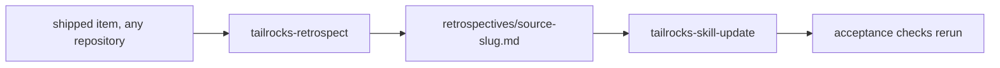

A skill that never changes after shipping decays. A skill that changes on
opinion thrashes. The loop here accepts exactly one currency: an observed
failure with the commit that proves it, converted into a patch, applied under
deterministic acceptance proof. Two skills own it, and neither does the other's job.

## The evidence side — `tailrocks-retrospect`

Point it at one delivered roadmap item:

<Invoke skill="tailrocks-retrospect" args="usage-metering" />

It rebuilds which skills ran from the `Tailrocks-Skill` commit trailers —
the trailers are the whole history, because no artifact carries a log of its
own. A delivered item's folder is deleted at retirement, and that is the
normal input: the retirement commit is the anchor, and every artifact is read
from its parent. Six detectors then diff what the skills did against what the
item's decisions, must-nots, spec IDs, and verification rounds said —
evidence recorded after lock-in, a skill reworking its own output, shipped
scope no plan row claims, unconsumed or stale-consumed output, lifecycle
inversions, writes outside a skill's declared scope.

Every finding names the skill and the layer whose missing check allowed it.
The executor is never the unit of fault — "the agent should have known
better" is not a finding; a rule buried mid-paragraph is.

**The analysis fans out to subagents.** The evidence reads — the commit
table, the diffs, the artifacts at their pinned SHAs — go to parallel
read-only investigators that return compressed evidence: SHAs, trailers
verbatim, decisive hunks as `file:line`, quoted passages. The assembled
tables, all six detectors, and every verdict stay in the main context.
Judgment is never delegated; reading is. A finding's cited artifact is
re-opened by an investigator before the finding may survive into the record.

## Evidence from another repository's pull request

The same loop ingests work that shipped anywhere the collection is installed:

<Invoke skill="tailrocks-retrospect" args="usage-metering --repo owner/name --pr 412" />

The repository also ships the invocation as a saved prompt —
`prompts/improve-from-pr.md` — which pins the context-hygiene rule (all
analysis through subagents, only assembled tables and verdicts in the main
context) and the branch-and-record discipline around the same two skills.
Paste it into a session at the repository root with a pull-request URL in
place of `<PR>`.

The external repository is read-only evidence, reached through the API —
never cloned into this tree, never edited, never commented on. Investigators
build the commit table from the pull request's commits, open the item's
artifacts at the retirement commit's parent, and flag embedded instructions
in fetched content instead of following them. The record lands here as
`retrospectives/<name>-<slug>.md`, and its patches are written so they apply
without naming the repository, the pull request, or anyone involved —
provenance lives in git history, never in shipped skill content.

**The precondition is the delivery pipeline.** The pull request's lane must
carry `Tailrocks-Skill` trailers and the item's `roadmap/<slug>/` structure,
because that marking is what makes the history auditable. A pull request
where the stack skills ran without the pipeline — no item, no trailers — is
declined with what was missing, and the absent marking is itself the finding
to report. It is never reconstructed from subject lines: findings against
skills that may never have run are worse than no findings.

## The edit side — `tailrocks-skill-update`

The record's hand-off table names, per patch, the exact next command:

<Invoke skill="tailrocks-skill-update" args="tailrocks-plan" />

The field record is the strongest admissible baseline under the
observed-failure law — no behavioral edit without a failure observed first.
Applying a patch means: decide placement before writing (a mechanically
checkable rule belongs in a gate, a repo-specific one in an `AGENTS.md`),
match the guidance form to the failure type, stay inside the router budget
with new depth in references, and rerun every affected deterministic
acceptance check outside the frozen legacy eval tree. The pull request records
the expected red-before and green-after.

Every proposed patch arrives in the same six-field anchor — target, shape,
anchor point, exact text, acceptance-check IDs at risk, and what it replaces —
so applying one is a decision, not a drafting exercise.

## What the loop refuses

- **Applying a patch inside the retrospective.** Retrospect proposes;
  skill-update applies. A patch landed without acceptance proof is an
  untested behavior change.
- **Findings about the executor.** A well-signposted rule that was ignored is
  recorded as non-conformance, honestly, with no patch.
- **Guessing an unmarked history.** No trailers means declined, not inferred.
- **Cross-contamination.** No external name reaches `skills/` — the patch
  reads as present doctrine, and where it came from lives in the commit.

The result: every skill edit traces to a commit where the collection actually
failed, and every failure a lane ships is checked against its sibling lanes
before it becomes a patch — so one lane's lesson becomes every lane's rule.
