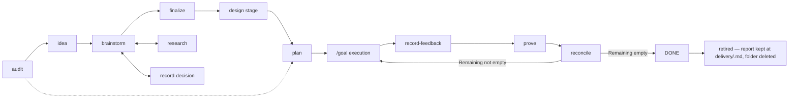

# Delivery Pipeline Walkthrough

One feature, `goal-live-status`, from raw thought through execution to a
verification round that sends work back — and, once a round comes back clean,
off the board entirely. Invocations below are agent-neutral: explicitly invoke
the named skill.

Everything the item produces lives in one folder, `roadmap/<slug>/`, and the
whole life of the item is one branch and one pull request. No delivery skill
opens a second one. That folder is work in progress by definition: when the
work is finished, the folder is deleted and git carries the record.



## 0. Cold start with tailrocks-audit (only when there is no thought yet)

This walkthrough begins with a raw thought, so it skips step 0. Start here
instead when the input is a repository rather than an idea: invoke
tailrocks-audit — bare, or scoped to one lane (`security`, `perf`, `ux`,
`tui`, `liquid-glass`, `agent-legibility`), or as `branch` before a pull
request, with `deep` composing over any of them. It fans out category
subagents, re-derives every candidate from its cited `file:line`, and
prioritizes the survivors. Selected findings that still carry an open product
question enter at step 1 as pre-filled DRAFT items; findings that carry none
skip to step 6 as `roadmap/<slug>/plan/` packages written directly on the base
branch.

```text
+ roadmap/<slug>/README.md   Status: DRAFT, pre-filled with audit evidence
+ roadmap/<slug>/plan/       for findings with no open question
~ roadmap/README.md          index rows
```

## 1. Capture with tailrocks-idea

Invoke tailrocks-idea with: “Show live status for running goal loops.”
It derives `goal-live-status`, copies the item shape, preserves only stated
intent, and leaves unknown sections visibly empty. It also opens the item's
branch, `roadmap/goal-live-status`, and its draft pull request — the single
lane every later skill commits into.

```text
+ roadmap/goal-live-status/README.md  Status: DRAFT
~ roadmap/README.md                   new index row
```

Status: DRAFT. Example:
[`roadmap item`](../../examples/item-folder/roadmap/goal-live-status/README.md).

## 2. Shape with tailrocks-brainstorm

Invoke tailrocks-brainstorm for `goal-live-status`. The skill sets SHAPING,
looks up answerable facts, then asks one decision question at a time with a
recommendation. Answers immediately update Decisions, Vocabulary, screens,
flows, and must-nots.

```text
~ roadmap/goal-live-status/README.md  Status: SHAPING; Decisions/Vocabulary
~ roadmap/README.md                   SHAPING
```

Status: SHAPING.

## 3. Establish facts with tailrocks-research

Invoke tailrocks-research for the status-snapshot IPC question and link it to
the item. Independent investigators cite primary sources or `file:line`;
the orchestrator vets every citation and registers the reusable topic.

```text
+ research/goal-status-ipc/README.md
+ research/goal-status-ipc/01-status-sources.md
~ research/README.md
~ roadmap/goal-live-status/README.md  bidirectional link
```

Status stays SHAPING. Example:
[`research topic`](../../examples/item-folder/research/goal-status-ipc/).

## 4. Record one decision with tailrocks-record-decision

Invoke tailrocks-record-decision with: “The viewer reads snapshots only; it
never controls execution.” The skill checks settled ground, records the dated
reason, propagates the choice, and adds the must-not.

```text
~ roadmap/goal-live-status/README.md  decision + propagated constraints
~ roadmap/README.md                   matching status
```

Status stays SHAPING. If this reversed a PLANNED item, it would return to
SHAPING and affected plan rows would become STALE.

## 5. Earn READY with tailrocks-finalize

Invoke tailrocks-finalize for the item. The closing interview confirms
schematic screens, walks the primary flow, and resolves, defers with reason,
or reclassifies every open question. Only the complete readiness checklist
grants READY.

```text
~ roadmap/goal-live-status/README.md  Status: READY; no open decisions
~ roadmap/README.md                   READY
```

Status: READY.

## 6. Bless the screens in the medium's own skill

Between READY and planning. This item's surface is a terminal UI, so invoke
tailrocks-tui-design: it renders each screen and state through the
application's own view functions in a gallery crate, the user blesses each
frame, and the golden test freezes it. Each screen's `Design:` line then points
at the manifest section instead of re-describing it, and tailrocks-plan refuses
a screen contract that cites none.

```text
+ crates/status-gallery/…              gallery crate, frames, MANIFEST.md
~ roadmap/goal-live-status/README.md   Screens: Design pointer per screen
```

Web screens take the same stage in tailrocks-web-design, macOS windows in
tailrocks-macos-design, whose prototype stage turns the approved design into
the running, signed-off Liquid Glass build. An item
whose screens have no visual surface skips it. Status stays READY.

## 7. Package with tailrocks-plan

Invoke tailrocks-plan for `goal-live-status`. It inventories every normative
statement, closes research gaps, writes OpenSpec-grammar requirements, slices
the manifest baseline-first, writes and cold-reviews one zero-context plan per
row, then writes the goal package and stamps the frozen contract fingerprint.

```text
+ roadmap/goal-live-status/plan/coverage.md
+ roadmap/goal-live-status/plan/spec/          incl. decisions.md snapshot, FROZEN
+ roadmap/goal-live-status/plan/README.md      manifest hub, writable
+ roadmap/goal-live-status/plan/001-*.md ...   FROZEN
+ roadmap/goal-live-status/goal/START.md       FROZEN
+ roadmap/goal-live-status/goal/RESUME.md      FROZEN
+ roadmap/goal-live-status/goal/check.sh       FROZEN
~ roadmap/goal-live-status/README.md           Status: PLANNED; Plan link; ## Run blocks
```

The ledger includes `B#` quality statements; the must-not registry has plan
backlinks. The fingerprint in the hub covers every FROZEN file, so the contract
an executor was handed cannot later be edited to match what shipped —
re-planning is how a frozen file changes. The item's `## Decisions` section
stays writable, so planning snapshots it verbatim into `spec/decisions.md`:
`check.sh` answers `BLOCKED decisions-drift` when the live section moves under
the snapshot, and only a re-plan re-stamps it. The item's `## Run` section now
carries the pasteable start and resume blocks, so the operator never opens the
goal package to find the invocation. Status: PLANNED. Worked
[`ledger`](../../examples/item-folder/roadmap/goal-live-status/plan/coverage.md),
[`spec`](../../examples/item-folder/roadmap/goal-live-status/plan/spec/),
[`hub`](../../examples/item-folder/roadmap/goal-live-status/plan/README.md),
and
[`goal package`](../../examples/item-folder/roadmap/goal-live-status/goal/START.md).

## 8. Execute through the goal loop

The operator hands the executor the start file, not a pasted block:

```text
/goal Follow roadmap/goal-live-status/goal/START.md
```

`START.md` carries the gates block, the machine-checkable goal condition, and
the kickoff prompt. Each gate line is `<command> ||| <proof>`: the command must
exit 0 and the proof must print how many units it executed, so
`goal/check.sh` can return `BLOCKED gate-vacuous` for a suite that ran nothing
and `BLOCKED gate-unproven` for a line with no proof at all.

The first slice sets item and index to IN EXECUTION. Hub rows move TODO → IN
PROGRESS → DONE. When every row is terminal and the final line reads
`TAILROCKS GOAL: PASS`, execution stops there and names tailrocks-prove. The
executor never writes the item's DONE status: a `PASS` proves the work ran, not
that it behaves.

After an interruption, resume with
`/goal Follow roadmap/goal-live-status/goal/RESUME.md`.

## 9. Capture what the user hit with tailrocks-record-feedback

Invoke tailrocks-record-feedback for `goal-live-status` after using the thing.
It writes the user's words verbatim as one statement per defect (`U1`, `U2`, …)
with the reproduction as given, and nothing else — no diagnosis, no severity
the user did not assign, no fix.

```text
+ roadmap/goal-live-status/verification/01-feedback.md
```

Worked
[`feedback round`](../../examples/item-folder/roadmap/goal-live-status/verification/01-feedback.md).

## 10. Prove it with tailrocks-prove

Invoke tailrocks-prove for `goal-live-status`. It fans out subagents that
**execute** the shipped work — launch the entry point, walk the real flows,
drive the real interface, compare the shipped screens against the blessed
design reference — and returns a verdict per `U#` statement plus what execution
proved per plan row.

```text
+ roadmap/goal-live-status/verification/01-report.md   Verdict: BLOCKED
```

It writes no status. Its evidence goes two ways: blocking defects to
tailrocks-reconcile, and anything that says a *skill* let the divergence
through to tailrocks-retrospect. Worked
[`verification report`](../../examples/item-folder/roadmap/goal-live-status/verification/01-report.md).

## 11. Reconcile the round with tailrocks-reconcile

Invoke tailrocks-reconcile for `goal-live-status`. It re-runs every DONE
criterion, resets abandoned IN PROGRESS rows, retests BLOCKED reasons and `A#`
assumptions, drift-checks TODO plans, marks stale plans explicitly — and reads
the round's report: it prunes rows the round confirmed, rewrites the item's
Remaining from the blocking defects, records what the round proved into
`REPORT.md`, and sets the item's status.

```text
~ roadmap/goal-live-status/plan/README.md  evidence-backed statuses
~ roadmap/goal-live-status/README.md       Status + Remaining
~ roadmap/goal-live-status/REPORT.md       what the round proved, kept
~ roadmap/README.md                        Remaining count
```

No plan or source file changes. A round with a blocking defect returns the item
to IN EXECUTION with that defect standing as the remaining work; `DONE` is
written only here, and only after a round found none. Resume from step 8 and
iterate until Remaining is empty.

## 12. Retire the item with tailrocks-reconcile

The round that finds nothing blocking does not stop at a status. Four
conditions have to hold, each evidenced in that same session: every hub row
terminal, `goal/check.sh` passing, the newest verification round naming no
blocking defect, and `## Remaining` empty. Then the same invocation that wrote
`DONE` retires the item.

Two commits, one invocation:

```text
commit 1  ~ roadmap/goal-live-status/README.md  Status: DONE, Remaining empty
          ~ roadmap/goal-live-status/REPORT.md  final: DONE, nothing unproven
          ~ roadmap/README.md                   DONE
          Tailrocks-Skill: tailrocks-reconcile

commit 2  > delivery/goal-live-status.md        REPORT.md moved — proof kept
          - roadmap/goal-live-status/           README.md, plan/, verification/, goal/
          ~ roadmap/README.md                   row removed
          Tailrocks-Skill: tailrocks-reconcile
```

The split is the point. One squashed commit would show only an absence, which
is indistinguishable from a mistaken deletion; two show the item earning `DONE`
on evidence and then being retired, both in the pull request the item has had
since capture. The deletion is whole — no file is kept back inside the folder,
and a folder half
emptied is the drift the rule exists to prevent. One artifact leaves the
folder before it goes: `REPORT.md` moves to `delivery/goal-live-status.md`,
so what the rounds proved stays in the tree after the item is archaeology;
`delivery/` is never deleted. If `goal-live-status` was the
last row, `roadmap/README.md` and `roadmap/` go with it. `research/` is
untouched: topics are standing artifacts, not item artifacts.

Nothing is lost, because nothing was ever stored only in the tree:

```sh
git log --format='%h %ad %s' --date=short -- roadmap/goal-live-status/
git log --diff-filter=D -- roadmap/goal-live-status/     # the retiring commit
git ls-tree -r --name-only <retirement>^ -- roadmap/goal-live-status/
git show <retirement>^:roadmap/goal-live-status/README.md
```

Those last three are how tailrocks-retrospect reads a retired item: find the
retiring commit, enumerate what it removed, and read each artifact from its
parent.

`tailrocks-merge-pr` is the checkpoint, and it writes nothing. When a pull
request's diff touches `roadmap/`, its delivery-artifact check reads the diff
and blocks on a contradiction rather than fixing one — an item saying `DONE`
while `roadmap/<slug>/` still exists in the merge result, a folder deleted
while its newest round still carried a blocking defect, a manifest that
disagrees with its round, a `DONE` with no round at all, or an index and a tree
that disagree. Each finding names the files and routes to the skill that
resolves it, in the same pull request. A sixth blocks retirement that deletes
the item folder without adding its surviving `delivery/<slug>.md` report.

## 13. Re-plan after changed intent

Invoke tailrocks-record-decision on the PLANNED or IN EXECUTION item. A
material intent change returns it to SHAPING and marks affected rows STALE.
Shape and finalize again as needed, then invoke tailrocks-plan: it refreshes
stale rows, records spec deltas, keeps numbering monotonic, and regenerates
`goal/` last so the fingerprint matches the refreshed contract.

A falsified assumption follows the same owned route: executor names failed
`A#` → record-decision propagates → leaning plans STALE → plan refreshes.

## Common mistakes

- Planning a SHAPING item: finalize must earn READY first.
- Planning a screen with no blessed design reference: the design stage sits
  between READY and planning for exactly that reason.
- Skipping finalization: unresolved decisions cannot become assumptions.
- Editing a FROZEN file by hand: `check.sh` returns `plan-drift`, and the fix
  is a re-plan, not a re-stamped fingerprint.
- Reading `TAILROCKS GOAL: PASS` as DONE: it proves the work ran and the
  contract is unedited. Behavior is proven by a verification round.
- Trusting an interrupted loop: reconcile before resume.
- Treating PARKED as terminal: explicit resume restores its recorded `was:`
  state through tailrocks-record-decision.
- Leaving a `DONE` folder on the board: `DONE` is a transition, not a resting
  place, and merge-pr blocks the merge that would ship it.
- Deleting a folder to declare the work done: retirement is what a clean round
  earns, and deletion is the one edit that destroys the evidence which would
  have contradicted it.
- Retiring by hand: reconcile owns the deletion and the index row together, in
  two commits; merge-pr only reports.
